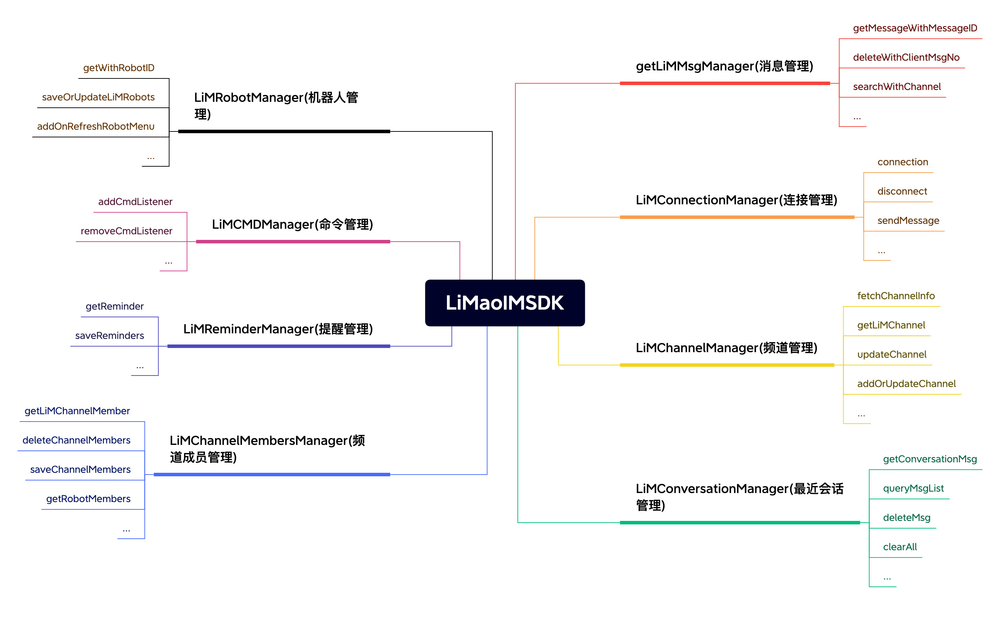
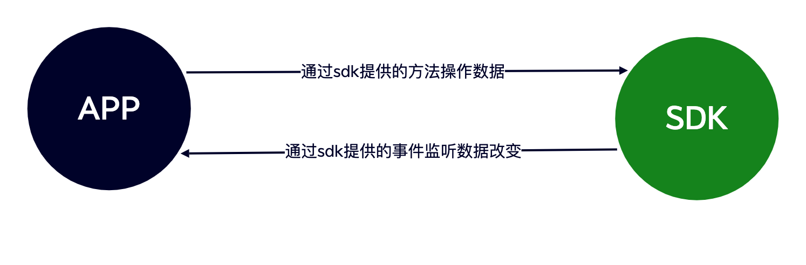

## 入门

### 设计理念

为了让开发者更快更方便的使用 SDK，狸猫 SDK 提供了一个唯一的入口来访问 SDK 中的所有功能。就像书籍的目录一样可以通过目录查找对应的内容。如连接 IM `LiMaoIM.getInstance().getLiMConnectionManager().connection()`

### 架构介绍

 SDK 常用功能介绍

```java
// 消息管理器
// 负责消息的增删改查、新消息监听、刷新消息监听、消息入库、发送消息回执监听、监听同步某个聊天数据等
LiMaoIM.getInstance().getLiMMsgManager()

// 连接管理
// 负责IM的连接、断开、退出登录、监听连接状态、监听获取连接IP等
LiMaoIM.getInstance().getLiMConnectionManager()

// 频道管理
// 可获取Channel的信息，刷新Channel缓存，监听Channel更改[置顶、免打扰、禁言]、搜索Channel等
LiMaoIM.getInstance().getLiMChannelManager()

// 最近会话管理
// 获取最近聊天记录、刷新最近会话[新增聊天、红点改变]、监听移除某个会话、监听同步最近会话等
LiMaoIM.getInstance().getLiMConversationManager()

// 频道成员管理
// 获取Channel成员列表、设置成员备注、保存修改成员数据、监听刷新成员和移除成员等
LiMaoIM.getInstance().getLiMChannelMembersManager()

// 提醒管理
// 获取某个会话的提醒如：[有人@我] [入群申请] 等。还可自定义提醒项，如像 红包未领取，转账和语音未读 等
LiMaoIM.getInstance().getLiMReminderManager()

// 命令管理
// 负责监听服务器下发的命令消息
LiMaoIM.getInstance().getLiMCMDManager()

// 机器人管理
// 可以获取机器人菜单、同步机器人菜单，查询菜单等
LiMaoIM.getInstance().getLiMRobotManager()
```

## 集成

#### 通过 aar 文件集成

1、在项目主模块新建 Module，命名为`MyLibs`

2、在模块`MyLibs`中新建文件夹，命名为`im`然后将`aar`文件添加到该文件夹中

3、在`im`文件夹中新建`build.gradle`文件并在该文件填入以下代码

```java
configurations.maybeCreate("default")
artifacts.add("default", file('limaoim-release.aar'))
```

4、在主项目的`settings.gradle`中添加`

```java
include ':MyLibs:im'`
```

5、在主模块中引入`aar`文件，并 sync project 即可完成

```java
api project(path: ':MyLibs:im')
```

### SDK 与 APP 交互原则

 sdk 与 app 交互流程就是 app 调用 sdk 提供的方法，sdk 处理完数据后通过事件将数据回掉给 app。如发送消息流程：app 调用发送消息方法，sdk 将入库后的消息 push 给 app

```java
// 发送消息
LiMaoIM.getInstance().getLiMMsgManager().sendMessag(textContent,channelID,channelType)
// 监听入库返回
LiMaoIM.getInstance().getLiMMsgManager().addOnSendMsgCallback("key", new ISendMsgCallBackListener() {
            @Override
            public void onInsertMsg(LiMMsg liMMsg) {
                // 可以在这里将保存在数据库的消息`liMMsg`展示在UI上
                // ...
            }
        });
```

## 基础使用

使用之前需要明白[什么是频道](/unifying#什么是频道)

### 初始化

在 Application 的 onCreate 方法中初始化 SDK

```java
 /**
  * 初始化SDK
  * @param context 上下文一般给Application
  * @param uid 登录用户ID（业务服务端在IM通讯端登记了的uid））
  * @param token 登录用户token（业务服务端在IM通讯端登记了的token）
  */
LiMaoIM.getInstance().initIM(context, uid, token);
```

监听获取连接服务器 IP 和 Port 的事件

```java
LiMaoIM.getInstance().getLiMConnectionManager().addOnGetIpAndPortListener(new IGetIpAndPort() {
            @Override
            public void getIP(IGetSocketIpAndPortListener iGetSocketIpAndPortListener) {
                // 返回 IM通信端的IP 和 IM通信端的TCP端口
                // 分布式可调用接口获取IP和Port后返回
                iGetSocketIpAndPortListener.onGetSocketIpAndPort("48.135.49.152",6666);
            }
        });
```

### 连接与断开

###### 连接与断开 IM

```java
// 连接IM
LiMaoIM.getInstance().getLiMConnectionManager().connection();

// 断开IM
// isLogout: true：SDK将不再进行重连 false：SDK保持重连机制
LiMaoIM.getInstance().getLiMConnectionManager().disconnect(isLogout);
```

##### 连接监听

```java
 LiMaoIM.getInstance().getLiMConnectionManager().addOnConnectionStatusListener("key", new IConnectionStatus() {
            @Override
            public void onStatus(int status, String reason) {
                if(status == LiMConnectStatus.success){
                  // 连接成功
                }
            }
        });
```

### 在线消息收发

##### 发送消息

```java
/**
 * 发送消息 (发送并保存消息)
 @param liMMessageContent 消息正文
 @param channelID 投递的频道ID（个人频道，群频道，客服频道等等）
 @param channelType 投递的频道类型（个人频道，群频道，客服频道等等）
 */
LiMaoIM.getInstance().getLiMMsgManager().sendMessage(liMMessageContent,channelID, channelType);
```

```java
// 例如给用户A发送文本消息

// 构建文本消息正文
LiMTextContent content = new LiMTextContent("你好，我是文本消息");
// 发送消息给用户A
LiMaoSendMsgUtils.getInstance().sendMessage(content,"A",LiMChannelType.PERSONAL);
```

##### 发送消息返回

```java
LiMaoIM.getInstance().getLiMMsgManager().addOnSendMsgCallback("key", new ISendMsgCallBackListener() {
            @Override
            public void onInsertMsg(LiMMsg liMMsg) {
                // 可以在这里将保存在数据库的消息`liMMsg`展示在UI上
                // ...
            }
        });
```

##### 收到新消息监听

```java
LiMaoIM.getInstance().getLiMMsgManager().addOnNewMsgListener("key", new INewMsgListener() {
            @Override
            public void newMsg(List<LiMMsg> list) {
                // list:接收到的消息
            }
        });
```

##### 刷新消息监听

在 sdk 更新过消息时，如：消息发送状态，有人点赞消息，消息已读回执，消息撤回等，sdk 都将回掉以下事件。

```java
 LiMaoIM.getInstance().getLiMMsgManager().addOnRefreshMsgListener("key", new IRefreshMsg() {
            @Override
            public void onRefresh(LiMMsg liMMsg, boolean isEnd) {
                // liMMsg：刷新的消息对象
                // isEnd：为了避免频繁刷新UI导致卡顿，当isEnd为true时在刷新UI
            }
        });
```

##### 消息类核心属性

```java
public class LiMMsg implements Parcelable {
  // 服务器消息ID(全局唯一，无序)
  public String messageID;
  // 本地唯一ID
  public String clientMsgNO;
  // 消息时间10位时间戳
  public long timestamp;
  // 消息来源发送者
  public String fromUID;
  // 聊天频道ID
  public String channelID;
  // 聊天频道类型
  public byte channelType;
  // 消息正文
  public LiMMessageContent baseContentMsgModel;
  // 消息头
  public LiMMsgHeader header;
  // 本地扩展字段
  public HashMap localExtraMap;
  // 远程扩展
  public LiMMsgExtra remoteExtra;
  ...
}
```

##### 消息正文核心属性

```java
public class LiMMessageContent implements Parcelable {
  // 消息内容类型
  public int type;
  // 消息中的@提醒信息
  public LiMMentionInfo mentionInfo;
  // 消息回复对象
  public LiMReply reply;
  // 编码消息 上层需实现该方法并编码
  public JSONObject encodeMsg() {
      return new JSONObject();
  }
  // 解码消息 上层需实现该方法并解码
  public LiMMessageContent decodeMsg(JSONObject jsonObject) {
      return this;
  }
  ...
}
```

### 离线消息接收

因为狸猫 IM 是支持消息永久存储，所以会产生海量的离线消息。对此我们采用了按需拉取的机制，如 10 个会话一个会话 10 万条消息，狸猫 IM 不会把这个 10\*10 万=100 万条消息都拉取到本地。 而是采用拉取这 10 个会话的信息和对应的最新 20 条消息，也就是实际只拉取了 200 条消息 相对 100 万条消息来说大大提高了离线拉取速度。用户点进对应的会话才会去按需拉取这个会话的消息。 这些机制 SDK 内部都已做好了封装，使用者其实不需要关心。使用者只需要关心最近会话的变化和监听获取数据的回掉即可。

##### 监听同步最近会话

```java
LiMaoIM.getInstance().getLiMConversationManager().addOnSyncConversationListener(new ISyncConversationChat() {
            @Override
            public void syncConversationChat(String last_msg_seqs, int msg_count, long version, ISyncConversationChatBack iSyncConversationChatBack) {
                /**
                * 同步会话
                *
                * @param last_msg_seqs     最近会话列表msg_seq集合
                * @param msg_count         会话里面消息同步数量
                * @param version           最大版本号
                * @param iSyncConvChatBack 回调
                */
                // 请求接口后可通过 iSyncConvChatBack 回掉给sdk
            }
        });
```

当进入某个聊天时，如果本地没有该聊天记录需同步服务器聊天记录。这时需监听同步某个会话的聊天记录

##### 监听同步某个频道的消息

```java
LiMaoIM.getInstance().getLiMMsgManager().addOnSyncChannelMsgListener(new ISyncChannelMsgListener() {
            @Override
            public void syncChannelMsgs(String channelID, byte channelType, long minMessageSeq, long maxMessageSeq, int limit, boolean reverse,  ISyncChannelMsgBack iSyncChannelMsgBack) {
                /**
                * 同步某个频道的消息
                *
                * @param channelID           频道ID
                * @param channelType         频道类型
                * @param minMessageSeq       最小messageSeq
                * @param maxMessageSeq       最大messageSeq
                * @param limit               获取条数
                * @param reverse             true：从maxMessageSeq往前获取。false：从minMessageSeq往后获取。
                * @param iSyncChannelMsgBack 请求返回
                */
            }
        });
```

当在聊天页面中时用户可以上拉下拉，或者搜索查看聊天数据，对此狸猫 sdk 提供了如下方法

##### 查看某个频道的聊天信息

```java
/**
  * 查询或同步某个频道消息
  *
  * @param channelId                频道ID
  * @param channelType              频道类型
  * @param oldestOrderSeq           最后一次消息大orderSeq 第一次进入聊天传入0
  * @param contain                  是否包含 oldestOrderSeq 这条消息
  * @param dropDown                 是否下拉
  * @param aroundMsgOrderSeq        查询此消息附近消息 如 aroundMsgOrderSeq=20 返回数据则是 [16,17,19,20,21,22,23,24,25]
  * @param limit                    每次获取数量
  * @param iGetOrSyncHistoryMsgBack 请求返还
  */
public void getOrSyncHistoryMessages(String channelId, byte channelType, long oldestOrderSeq, boolean contain, boolean dropDown, int limit, long aroundMsgOrderSeq, final IGetOrSyncHistoryMsgBack iGetOrSyncHistoryMsgBack) {

}
```

### 文本消息

```java
public class LiMTextContent extends LiMMessageContent {
   public LiMTextContent(String content) {
        this.content = content;
   }
}
```

### 图片消息

```java
public class LiMImageContent extends LiMMediaMessageContent {
  public int width; // 宽度
  public int height; // 高度
  public LiMImageContent(String localPath) {
        this.localPath = localPath;
  }
}
```

### 语音消息

```java
public class LiMVoiceContent extends LiMMediaMessageContent {
    public int timeTrad; // 语音时长
    public String waveform; // 音频波浪数据 （可选参数）

    public LiMVoiceContent(String localPath, int timeTrad) {
        this.type = LiMMsgContentType.LIMAO_VOICE;
        this.timeTrad = timeTrad;
        this.localPath = localPath;
    }
}
```

### 小视频消息

```java
public class LiMVideoContent extends LiMMediaMessageContent {
    public String cover; // 封面网络地址
    public String coverLocalPath; // 封面本地地址
    public long size; // 视频大小
    public int width; // 封面宽度
    public int height; // 封面高度
    public long second; //视频时长
}
```

### CMD 消息

CMD(命令)消息只能是服务器下发客户端进行解析

```java
public class LiMCMD {
    // 命令类型
    public String cmdKey;
    // 命令参数
    public JSONObject paramJsonObject;

    public LiMCMD(String cmdKey, JSONObject paramJsonObject) {
        this.cmdKey = cmdKey;
        this.paramJsonObject = paramJsonObject;
    }
}
```

- <font color='#999' size=2>SDK 内置 cmd 类型 可通过 `LiMCMDKeys` 查看</font>

### 最近会话

在同步完最近会话或者修改过最近会话内容时，sdk 会将更新或新增的最近会话 push 给 UI。app 需监听以下方法

##### 监听最近会话刷新

```java
 LiMaoIM.getInstance().getLiMConversationManager().addOnRefreshMsgListener("key", new IRefreshConversationMsg() {
            @Override
            public void onRefreshConversationMsg(LiMUIConversationMsg liMUIConversationMsg, boolean isEnd) {
                // liMUIConversationMsg 最近会话消息内容 UI上已有该会话需进行更新，反之添加到UI上
                // isEnd 为了防止频繁刷新UI，当isEnd为true可刷新UI
            }
        });
```

##### 监听移除最近会话

```java
 LiMaoIM.getInstance().getLiMConversationManager().addOnDeleteMsgListener("key", new IDeleteConversationMsg() {
            @Override
            public void onDelete(String channelID, byte channelType) {
                // channelID 聊天频道ID
                // channelType 聊天频道类型
            }
        });
```

LiMUIConversationMsg 类核心数据

```java
public class LiMUIConversationMsg {
  // 最后一条消息时间
  public long lastMsgTimestamp;
  // 消息频道 频道资料，可能为空，如果为空可以调用 LiMChannelManager 的 fetchChannelInfo(channelID, channelType); 触发频道信息变更
  private LiMChannel liMChannel;
  // 消息正文
  private LiMMsg liMMsg;
  // 未读消息数量
  public int unreadCount;
  // 最近会话提醒项 如[有人@你][群内审核]等
  public List<LiMReminder> getReminderList()
  // 远程扩展
  public List<LiMReminder> getReminderList()
  // 本地扩展字段
  public HashMap<String, Object> localExtraMap;
}
```

##### 数据操作

```java
// 查询所以最近会话
LiMaoIM.getInstance().getLiMConversationManager().queryMsgList();
// 修改消息红点
LiMaoIM.getInstance().getLiMConversationManager().updateRedDot(String channelID, byte channelType, int redDot);
// 删除某个会话
LiMaoIM.getInstance().getLiMConversationManager().deleteMsg(String channelId, byte channelType);
```

### 频道管理(置顶,免打扰等等)

频道(Channel)狸猫 IM 中是一个比较抽象的概念。发送消息都是先发送给频道，频道根据自己的配置规则进行投递消息，频道分频道和频道详情。 更多介绍请移步[什么是频道](/unifying#什么是频道)

##### 频道属性

```java
public class LiMChannel implements Parcelable {
    // 频道ID
    public String channelID;
    // 频道类型 1.为单聊 2.为群聊
    public byte channelType;
    // 频道名称
    public String channelName;
    // 频道备注(频道的备注名称，个人的话就是个人备注，群的话就是群别名)
    public String channelRemark;
    // 频道头像
    public String avatar;
    // 是否置顶
    public int top;
    // 免打扰
    public int mute;
    // 是否禁言
    public int forbidden;
    // 本地扩展字段
    public HashMap extraMap;
}
```

##### 数据操作

```java
// 获取channel信息 先获取内存 如果没有再从数据库获取
LiMaoIM.getInstance().getLiMChannelManager().getLiMChannel(String channelID, byte channelType)

// 从远程服务器获取channel信息
LiMaoIM.getInstance().getLiMChannelManager().fetchChannelInfo(String channelID, byte channelType)

// 批量导入频道信息 该方法会触发channel刷新事件
LiMaoIM.getInstace().getLiMChannelManager().addOrUpdateChannels(List<LiMChannel> list);
```

##### 数据监听

```java
// 监听channel刷新事件
LiMaoIM.getInstance().getLiMChannelManager().addOnRefreshChannelInfo("key", new IRefreshChannel() {
            @Override
            public void onRefreshChannel(LiMChannel liMChannel, boolean isEnd) {
                //
            }
        });

// 监听获取channel信息
LiMaoIM.getInstance().getLiMChannelManager().addOnGetChannelInfoListener(new IGetChannelInfo() {
            @Override
            public LiMChannel onGetChannelInfo(String channelID, byte channelType, IChannelInfoListener iChannelInfoListener) {
              // 获取个人资料还是群资料可通过 channelType 区分
              // 如果app本地有该channel信息可直接返回数据，反之可获取网络数据后通过 iChannelInfoListener 返回
                return null;
            }
        });
```

- <font color='#999' size=2>SDK 内置频道类型 可通过 `LiMChannelType` 查看</font>

## 进阶使用

### 自定义普通消息

在狸猫 IM 中所有的消息类型都是自定义消息。下面我们已名片消息举例

##### 第一步 定义消息

定义消息对象并继承 `LiMMessageContent` 并在构造方法中指定消息类型

- <font color='#999' size=2>SDK 内置消息类型可通过 `LiMMsgContentType` 查看</font>

```java
public class LiMCardContent extends LiMMessageContent {

    public LiMCardContent() {
        type = 3; //指定消息类型
    }

    public String uid; // 用户ID
    public String name; // 用户名称
    public String avatar; // 用户头像
}
```

- <strong>自定义消息对象必须提供无参数的构造方法</strong>

##### 第二步 编码和解码消息

我们需要将`uid`,`name`,`avatar`三个字段信息发送给对方，最终传递的消息内容为 {"type":3,"uid":"xxxx","name":xxx,"avatar":xxx}

重写`LiMMessageContent`的`encodeMsg`方法开始编码

```java
@Override
public JSONObject encodeMsg() {
    JSONObject jsonObject = new JSONObject();
    try {
        jsonObject.put("uid", uid);
        jsonObject.put("name", name);
        jsonObject.put("avatar", avatar);
    } catch (JSONException e) {
        e.printStackTrace();
    }
    return jsonObject;
}
```

重写`LiMMessageContent`的`decodeMsg`方法开始解码

```java
@Override
public LiMMessageContent decodeMsg(JSONObject jsonObject) {
    uid = jsonObject.optString("uid");
    name = jsonObject.optString("name");
    avatar = jsonObject.optString("avatar");
    return this;
}
```

- <font color='#999' size=2>解码和编码消息时无需将 `type` 字段考虑其中，sdk 内部会自动处理</font>

如果您想控制该自定义消息在获取时显示的内容可重写 `getDisplayContent` 方法

```java
@Override
public String getDisplayContent() {
    return "[名片消息]";
}
```

##### 第三步 注册消息

```java
LiMaoIM.getInstance().getLiMMsgManager().registerContentMsg(LiMCardContent.class);
```

对此通过这三步自定义普通消息就已完成

### 自定义附件消息

我们在发送消息的时候有时需发送带附件的消息。狸猫 IM 也提供自定义附件消息，自定义附件消息和普通消息区别不大。下面我们已地理位置消息举例

##### 第一步 定义消息

值得注意的是自定义附件消息需继承`LiMMediaMessageContent`而不是`LiMMessageContent`

```java
public class LiMLocationContent extends LiMMediaMessageContent {
    public double longitude; // 经度
    public double latitude; // 纬度
    public String address; // 地址详细信息
    public LiMLocationContent(double longitude, double latitude,  String address) {
        type = 6;
        this.longitude = longitude;
        this.latitude = latitude;
        this.address = address;
    }
    // 这里必须提供无参数的构造方法
    public LiMLocationContent() {
        type = 6;
    }
}
```

- <font color='#999' size=2>`LiMMediaMessageContent`提供了`url`，`localPath`字段，自定义消息无需在定义网络地址和本地地址字段</font>

##### 第二步 编码和解码

我们需要将`longitude`,`latitude`,`address`,`url`信息发送给对方，最终传递的消息内容为 {"type":6,"longitude":115.25,"latitude":39.26,"address":xxx,url:xxx}

重写`LiMMessageContent`的`encodeMsg`方法开始编码

```java
@Override
  public JSONObject encodeMsg() {
      JSONObject jsonObject = new JSONObject();
      try {
          jsonObject.put("address", address);
          jsonObject.put("latitude", latitude);
          jsonObject.put("longitude", longitude);
          jsonObject.put("url", url); // 位置截图
          jsonObject.put("localPath", localPath);
      } catch (JSONException e) {
          e.printStackTrace();
      }
      return jsonObject;
  }
```

- <font color='#999' size=2>编码消息可以写入`localPath`本地字段，sdk 在保存完消息时发送给对方的消息是不包含该字段的</font>

重写`LiMMessageContent`的`decodeMsg`方法开始解码

```java
@Override
public LiMMessageContent decodeMsg(JSONObject jsonObject) {
  latitude = jsonObject.optDouble("latitude");
  longitude = jsonObject.optDouble("longitude");
  address = jsonObject.optString("address");
  url = jsonObject.optString("url");
  if (jsonObject.has("localPath"))
      localPath = jsonObject.optString("localPath");
  return this;
}
```

- <font color='#999' size=2>在解码消息时如果是解码本地字段需判断该字段是否存在，因为收到的消息并没有本地字段。如`localPath`在收到消息时是没有的</font>

##### 第三步 注册消息

```java
LiMaoIM.getInstance().getLiMMsgManager().registerContentMsg(LiMLocationContent.class);
```

### 消息附件管理

在自定义附件消息的时候发送给对方的消息是将网络地址发送给对方，并不是实际的文件。这个时候我们就需监听附件的上传

##### 监听上传附件

```java
 LiMaoIM.getInstance().getLiMMsgManager().addOnUploadAttachListener(new IUploadAttachmentListener() {
            @Override
            public void onUploadAttachmentListener(LiMMsg liMMsg, IUploadAttacResultListener listener) {
                // 在这里将未上传的文件上传到服务器并返回给sdk
                if(liMMsg.type == 6){
                    LiMMediaMessageContent liMMediaMessageContent = (LiMMediaMessageContent) liMMsg.baseContentMsgModel;
                    if (TextUtils.isEmpty(liMMediaMessageContent.url)) {
                        // todo 上传文件
                        // ...
                        liMMediaMessageContent.url = "xxxxxx"; // 设置网络地址并返回给sdk
                        listener.onUploadResult(true, liMMediaMessageContent);
                    }
                }
            }
        });
```

##### 附件下载

sdk 中不会主动下载消息的附件。在收到带有附件的消息时需要 app 自己按需下载。在 app 下载完成后需更改文件本地地址，避免重复下载

```java
/**
  * 修改消息内容体
  *
  * @param clientMsgNo       客户端消息ID
  * @param liMMessageContent 消息module 将本地地址保存在 messageContent 中
  */
LiMaoIM.getInstance().getLiMMsgManager().updateContent(String clientMsgNo, LiMMessageContent liMMessageContent);
```

### 消息扩展

随着业务的发展应用在聊天中的功能也日益增多，为了满足绝大部分的需求 狸猫 IM 中增加了消息扩展功能。消息扩展分`本地扩展`和`远程扩展`，本地扩展只针对 app 本地使用卸载 app 后将丢失，远程扩展是服务器保存卸载重装后数据将恢复

##### 本地扩展

本地扩展就是消息对象`LiMMsg`中的`localExtraMap`字段

```java
/**
  * 修改消息本地扩展
  *
  * @param clientMsgNo 客户端ID
  * @param hashExtra   扩展字段
  */
LiMaoIM.getInstance().getLiMMsgManager().updateLocalExtraWithClientMsgNo(String clientMsgNo, HashMap<String, Object> hashExtra);
```

- <font color='#999' size=2>更新成功后 sdk 会触发刷新消息回掉</font>

##### 远程扩展

远程扩展就是消息对象`LiMMsg`中的`remoteExtra`字段

```java
 /**
  * 保存远程扩展
  * @param liMChannel 某个channel信息
  * @param list 远程扩展数据
  */
LiMaoIM.getInstance().getLiMMsgManager().saveRemoteExtraMsg(LiMChannel liMChannel, List<LiMSyncExtraMsg> list)
```

- <font color='#999' size=2>更新成功后 sdk 会触发刷新消息回掉</font>

### 消息编辑

当我们给对方发送消息发现发送内容有错误时，这时无需撤回重发只需要将消息编辑即可

<video controls height='30%' width='30%' src="http://49.235.106.135:9000/chat/1/b75562b6d5be44b6904c4bee0a4aa2e6/1654238404468.mp4"></video>

##### 设置编辑内容

```java
/**
  * 修改编辑内容
  * @param msgID 消息服务器ID
  * @param channelID 频道ID
  * @param channelType 频道类型
  * @param content 编辑后的内容
  */
LiMaoIM.getInstance().getLiMMsgManager().updateMsgEdit(String msgID, String channelID, byte channelType, String content);
```

更改 sdk 消息编辑内容后需将编辑后的内容上传到服务器

```java
//监听上传消息扩展
LiMaoIM.getInstance().getLiMMsgManager().addOnUploadMsgExtraListener(new IUploadMsgExtraListener() {
          @Override
          public void onUpload(LiMMsgExtra liMMsgExtra) {
              // 上传到自己的服务器
          }
      });
```

如果自己或者别人编辑了消息，都会触发 cmd(命令)消息`syncMessageExtra`，收到此消息后去同步消息扩展即可 app 需监听消息更新的事件完成对 UI 的刷新

```java
LiMaoIM.getInstance().getLiMMsgManager().addOnRefreshMsgListener("key", new IRefreshMsg() {
            @Override
            public void onRefresh(LiMMsg liMMsg, boolean isEnd) {
                // liMMsg.remoteExtra.contentEdit 编辑后的内容
                // liMMsg.remoteExtra.contentEditMsgModel 编辑后的消息体
                // liMMsg.remoteExtra.editedAt 编辑时间戳
                // ... 刷新UI
            }
        });
```

### 消息回应(点赞)

如果你不理解消息回应请查看[什么是消息回应](/unifying#什么是消息回应)

当自己或者别人对消息回应(点赞)时，都会触发 cmd(命令)消息`syncMessageReaction`。app 需监听同步消息回应事件

```java
 LiMaoIM.getInstance().getLiMMsgManager().addOnSyncMsgReactionListener(new ISyncMsgReaction() {
            @Override
            public void onSyncMsgReaction(String channelID, byte channelType, long maxSeq) {
                // 请求接口获取最新消息回应
            }
        });
```

请求到最新消息回应后将数据设置到 sdk

##### 操作数据

```java
/**
  * 保存消息回应
  * @param list 回应数据
  */
LiMaoIM.getInstance().getLiMMsgManager().saveMessageReactions(List<LiMSyncMsgReaction> list);
```

- <font color='#999' size=2>同一个用户对同一条消息只能做出一条回应。重复进行消息不同 emoji 的回应会做为修改回应，重复进行相同 emoji 的回应则做为删除回应</font> sdk 更新消息回应后会触发消息刷新的事件。app 需监听此事件并对 UI 进行刷新

```java
LiMaoIM.getInstance().getLiMMsgManager().addOnRefreshMsgListener("key", new IRefreshMsg() {
            @Override
            public void onRefresh(LiMMsg liMMsg, boolean isEnd) {
                // liMMsg.reactionList 最新消息的回应
                // ... 刷新UI
            }
        });
```

### 已读未读管理

消息的已读未读又称消息回执。消息回执功能可通过 setting 进行设置

##### 发送带回执的消息

```java
LiMMsgSetting setting = new LiMMsgSetting();
setting.receipt = 1; // 开启回执
// 发送消息
LiMaoIM.getInstance().getLiMMsgManager().sendMessage(liMBaseContentMsgModel, setting, channelID, channelType);
```

当登录用户浏览过对方发送的消息时，如果对方开启了消息回执这时需将查看过的消息上传到服务器标记该消息已读。当对方或者自己上传过已读消息这时服务器会下发同步消息扩展的 cmd(命令)消息`syncMessageExtra`,此时需同步最新消息扩展保存到 sdk 中

##### 数据操作

```java
 /**
  * 保存同步后的消息扩展
  * @param liMChannel 属于某个channel的扩展
  * @param list 消息扩展
  */
LiMaoIM.getInstance().getLiMMsgManager().saveRemoteExtraMsg(LiMChannel liMChannel, List<LiMSyncExtraMsg> list);
```

app 需监听消息更新的事件完成对 UI 的刷新

```java
LiMaoIM.getInstance().getLiMMsgManager().addOnRefreshMsgListener("key", new IRefreshMsg() {
            @Override
            public void onRefresh(LiMMsg liMMsg, boolean isEnd) {
                // liMMsg.remoteExtra.readedCount 已读数量
                // liMMsg.remoteExtra.unreadCount 未读数量
                // ... 刷新UI
            }
        });
```

### 端对端加密

##### 开启端对端加密

```java
LiMMsgSetting setting = new LiMMsgSetting();
setting.signal = 1; // 开启加密
// 发送加密消息
LiMaoIM.getInstance().getLiMMsgManager().sendMessage(liMBaseContentMsgModel, setting, channelID, channelType);
```

在收到消息时可通过`LiMMsg`对象的`LiMMsgSetting`中的`signal`判断该消息是否开启了加密

```java
if(liMMsg.setting.signal == 1){
  // 开启了加密
}
```

### 会话提醒管理

会话提醒目前只支持服务器下发指令。客户端只需监听同步会话提醒和监听刷新会话消息即可

##### 会话提醒核心属性

```java
public class LiMReminder {
    public long reminderID; //提醒ID
    public String messageID; // 消息ID
    public String channelID; // 频道ID
    public byte channelType; // 频道类型
    public long messageSeq; // 消息序列号（用户唯一，有序）
    public int type; // 提醒类型[1、有人@你][2、群内审核] 等
    public int isLocate; // 是否需要进行消息定位
    public String text; // 提醒文本
    public Map data; // 数据
    public long version;
    public int done; // 用户是否完成提醒
    public int needUpload;
}
```

##### 操作数据

```java
/**
  * 保存消息提醒
  * @param list 提醒数据
  */
LiMaoIM.getInstance().getLiMReminderManager().saveReminders(result);
```

当 sdk 更新了会话提醒会触发最近会话的刷新事件，此时需监听刷新最近会话事件

```java
LiMaoIM.getInstance().getLiMConversationManager().addOnRefreshMsgListener("key", new IRefreshConversationMsg() {
            @Override
            public void onRefreshConversationMsg(LiMUIConversationMsg liMUIConversationMsg, boolean isEnd) {
              // liMUIConversationMsg.getReminderList() 最新消息提醒
              // 更新最近会话UI
            }
        });
```

##### 监听刷新

```java
LiMaoIM.getInstance().getLiMReminderManager().addOnNewReminderListener("key", new INewReminderListener() {
            @Override
            public void newReminder(List<LiMReminder> list) {
                // 新提醒
            }
        })
```
