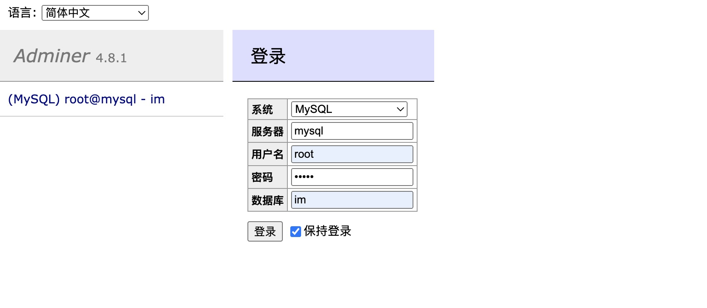

## 单机部署

### 部署limaoim通讯端

参考通讯端部署环节

### 部署limaoim业务端

1. 新建文件夹  ~/limao/server

```shell
mkdir -p ~/limao/server
```

2. 复制以下内容 到 ~/limao/server/docker-compose.yaml 文件内 （记得修改mysql的密码）

```shell

cd ~/limao/server && vi docker-compose.yaml

```

```yaml
version: '3.7'
services:
  redis:
    image: redis
    restart: always
    healthcheck:
      test: ["CMD", "redis-cli", "ping"]
      interval: 1s
      timeout: 3s
      retries: 30
    volumes:
      - ./redisdata:/data
  mysql:
    container_name: mysql
    image: mysql
    command: --default-authentication-plugin=mysql_native_password
    healthcheck:
      test: ["CMD", "mysqladmin" ,"ping", "-h", "localhost"]
    environment:
      TZ: Asia/Shanghai
      MYSQL_ROOT_PASSWORD: 2u75MhxMQGK9MxlE # mysql的密码 记得修改不要使用默认的，以防被恶意攻击
      MYSQL_DATABASE: im
    volumes:
      - ./mysqldata:/var/lib/mysql
  # redis-commander: # redis在线查看器
  #   image: rediscommander/redis-commander:latest
  #   restart: always
  #   environment:
  #     - REDIS_HOSTS=local:redis:6379
  #   ports:
  #     - "8088:8081"    
  # adminer:  # mysql在线查看器
  #   container_name: adminer
  #   image: adminer
  #   ports:
  #     - 8036:8080    
  limaoserver:
      image: limaoim/limaoserver:latest
      restart: always
      command: "api"
      healthcheck:
        test: "wget -q -Y off -O /dev/null http://localhost:8080/v1/ping > /dev/null 2>&1"
        interval: 10s
        timeout: 10s
        start_period: 4s
        retries: 3
      depends_on:
       - redis
       - mysql
      environment:
        - GODEBUG=netdns=go # 不配这个 有些linux会出现  device or resource busy 的错误
        - BaseURL=http://xxx:8080  # 部署好的api外网地址（客户端填写的那个api地址，需要一致如果不一致扫描加好友就扫描不出来）
        - IMURL=http://proxy:18029 # limao im proxy服务器地址（内网地址）或者 单机版 http://limao1:1516
        - RedisAddr=redis:6379  # redis连接地址
        - MySQLAddr=root:2u75MhxMQGK9MxlE@tcp(mysql)/im?charset=utf8mb4&parseTime=true&loc=Local # mysql数据库连接地址
        - Test=true # true为开启测试模式 如果开启测试模式短信验证码默认为123456，测试模式仅在测试的时候开启，正式环境请确保关闭
        - GRPCAddr=0.0.0.0:6979 # grpc监听地址，主要给通讯端的webhook调用
      ports:
        - "8080:8080" # api http 端口
        # - "1316:1316" # 压力测速api 端口 Test=true有效
        # - "1314:1314" # 与压力客户端tcp通讯用
networks:
  default:
    external:
     name: im_limao # 通过docker network ls可找到 limao为后缀的网络名 本例为 im_limao     
```

启动服务

```shell

docker-compose up -d

```


### 部署和配置MinIO文件服务

#### 部署MinIO


1. 新建文件夹  ~/limao/minio

```shell
mkdir -p ~/limao/minio
```

2. 复制以下内容 到 ~/limao/minio/docker-compose.yaml 文件内 （记得修改MINIO_ACCESS_KEY和MINIO_SECRET_KEY）

```shell

cd ~/limao/minio && vi docker-compose.yaml

```

```yaml

version: '3.7'
services:
  minio1:
    image: minio/minio:RELEASE.2022-06-20T23-13-45Z # use a remote image
    command: server /data --console-address ":9001"
    expose:
      - "9000"
      - "9001"
    environment:
      MINIO_ACCESS_KEY: UKBAIOSo94N17EPAKGLO # 记得修改
      MINIO_SECRET_KEY: wJAlrXUTNF8MINK9M9EGG/bPXRKOCYEXAVPLEK9Y # 记得修改
    healthcheck:
      test: ["CMD", "curl", "-f", "http://localhost:9000/minio/health/live"]
      interval: 30s
      timeout: 20s
      retries: 3
    volumes:
      - ./data:/data
  nginx:
    image: nginx:1.19.2-alpine
    volumes:
      - ./nginx.conf:/etc/nginx/nginx.conf:ro
    ports:
      - "9000:9000"
      - "9001:9001"
```

2. 在~/limao/minio下创建nginx.conf，复制nginx.conf配置内容

```shell

vi ~/limao/minio/nginx.conf

```

nginx.conf配置

```conf

user  nginx;
worker_processes  auto;

error_log  /var/log/nginx/error.log warn;
pid        /var/run/nginx.pid;

events {
    worker_connections  4096;
}

http {
    include       /etc/nginx/mime.types;
    default_type  application/octet-stream;

    log_format  main  '$remote_addr - $remote_user [$time_local] "$request" '
                      '$status $body_bytes_sent "$http_referer" '
                      '"$http_user_agent" "$http_x_forwarded_for"';

    access_log  /var/log/nginx/access.log  main;
    sendfile        on;
    keepalive_timeout  65;

    # include /etc/nginx/conf.d/*.conf;

    upstream minio {
        server minio1:9000;
    }

    upstream console {
        ip_hash;
        server minio1:9001;
    }

    server {
        listen       9000;
        listen  [::]:9000;
        server_name  localhost;

        # To allow special characters in headers
        ignore_invalid_headers off;
        # Allow any size file to be uploaded.
        # Set to a value such as 1000m; to restrict file size to a specific value
        client_max_body_size 0;
        # To disable buffering
        proxy_buffering off;
        proxy_request_buffering off;

        location / {
            proxy_set_header Host $http_host;
            proxy_set_header X-Real-IP $remote_addr;
            proxy_set_header X-Forwarded-For $proxy_add_x_forwarded_for;
            proxy_set_header X-Forwarded-Proto $scheme;

            proxy_connect_timeout 300;
            # Default is HTTP/1, keepalive is only enabled in HTTP/1.1
            proxy_http_version 1.1;
            proxy_set_header Connection "";
            chunked_transfer_encoding off;

            proxy_pass http://minio;
        }
    }

    server {
        listen       9001;
        listen  [::]:9001;
        server_name  localhost;

        # To allow special characters in headers
        ignore_invalid_headers off;
        # Allow any size file to be uploaded.
        # Set to a value such as 1000m; to restrict file size to a specific value
        client_max_body_size 0;
        # To disable buffering
        proxy_buffering off;
        proxy_request_buffering off;

        location / {
            proxy_set_header Host $http_host;
            proxy_set_header X-Real-IP $remote_addr;
            proxy_set_header X-Forwarded-For $proxy_add_x_forwarded_for;
            proxy_set_header X-Forwarded-Proto $scheme;
            proxy_set_header X-NginX-Proxy true;

            # This is necessary to pass the correct IP to be hashed
            real_ip_header X-Real-IP;

            proxy_connect_timeout 300;
            
            # To support websocket
            proxy_http_version 1.1;
            proxy_set_header Upgrade $http_upgrade;
            proxy_set_header Connection "upgrade";
            
            chunked_transfer_encoding off;

            proxy_pass http://console;
        }
    }
}

```

启动Minio服务

```shell

docker-compose up -d

```


#### 配置MinIO 

在 ~/limao/server/docker-compose.yaml文件内的limaoserver/environment下增加环境变量

```
 vi ~/limao/server/docker-compose.yaml
```

```yaml

limaoserver:
    ...
    environment:
      - MinioAccessKeyID=xxxx ## minio的key
      - MinioSecretAccessKey=xxxx ## minio的secret
      - UploadURL=http://xx.xxx.xxx.xx:9000 #文件上传地址
      - FileDownloadURL=http://xx.xxx.xxx.xx:9000 #文件下载地址

```

重启limaoserver服务

```shell

cd ~/limao/server && docker-compose up -d

```

### 配置数据源和Webhook


在 ~/limao/im/docker-compose.yaml文件内的limao[x]/environment下增加环境变量

```
 vi ~/limao/im/docker-compose.yaml
```

```yaml

limao1:
    ...
    environment:
       webhook_grpc: "limaoserver:6979"
       datasource: "http://limaoserver:8080/v1/datasource"
limao2:
    ....

```

重启limaoserver服务

```shell

cd ~/limao/server && docker-compose up -d

```


### 配置阿里云短信


在 ~/limao/server/docker-compose.yaml文件内的limaoserver/environment下增加环境变量

```
 vi ~/limao/server/docker-compose.yaml
```

```yaml

limaoserver:
    ...
    environment:
      - AliyunSMS.SignName=xxxx ## 阿里云短信签名的名字
      - AliyunSMS.AccessKeyID=xxxx ## 阿里云的accessKeyID
      - AliyunSMS.AccessSecret=xxx ## 阿里云的accessSecret
      - AliyunSMS.TemplateCode=xxx # 阿里云的短信模版code（国际版不需要）

```

重启limaoserver服务

```shell

cd ~/limao/server && docker-compose up -d

```

### 部署Work

### 配置默认头像

### 配置贴图商店

## 分布式部署

### 部署通讯端

参考通讯端部署环节

### 配置MinIO文件服务

### 配置阿里云短信

## 部署MinIO

详情参考：（https://docs.min.io/docs/deploy-minio-on-docker-compose.html）

单机

```yaml

version: '3.7'
services:
  minio1:
    image: minio/minio:RELEASE.2022-06-20T23-13-45Z # use a remote image
    command: server /data --console-address ":9001"
    expose:
      - "9000"
      - "9001"
    environment:
      MINIO_ACCESS_KEY: AKlAIOSF94N17EXAKVLO
      MINIO_SECRET_KEY: wJalrXUTnF8MINK7M9EGG/bPXRfOCYEXAMPLEKEY
    healthcheck:
      test: ["CMD", "curl", "-f", "http://localhost:9000/minio/health/live"]
      interval: 30s
      timeout: 20s
      retries: 3
    volumes:
      - ./data:/data
  nginx:
    image: nginx:1.19.2-alpine
    volumes:
      - ./nginx.conf:/etc/nginx/nginx.conf:ro
      - ./cert/:/etc/nginx/conf.d/
    ports:
      - "9000:9000"
      - "9001:9001"
```

nginx.conf


```

user  nginx;
worker_processes  auto;

error_log  /var/log/nginx/error.log warn;
pid        /var/run/nginx.pid;

events {
    worker_connections  4096;
}

http {
    include       /etc/nginx/mime.types;
    default_type  application/octet-stream;

    log_format  main  '$remote_addr - $remote_user [$time_local] "$request" '
                      '$status $body_bytes_sent "$http_referer" '
                      '"$http_user_agent" "$http_x_forwarded_for"';

    access_log  /var/log/nginx/access.log  main;
    sendfile        on;
    keepalive_timeout  65;

    # include /etc/nginx/conf.d/*.conf;

    upstream minio {
        server minio1:9000;
    }

    upstream console {
        ip_hash;
        server minio1:9001;
    }

    server {
        listen       9000;
        listen  [::]:9000;
        server_name  localhost;

        # To allow special characters in headers
        ignore_invalid_headers off;
        # Allow any size file to be uploaded.
        # Set to a value such as 1000m; to restrict file size to a specific value
        client_max_body_size 0;
        # To disable buffering
        proxy_buffering off;
        proxy_request_buffering off;

        location / {
            proxy_set_header Host $http_host;
            proxy_set_header X-Real-IP $remote_addr;
            proxy_set_header X-Forwarded-For $proxy_add_x_forwarded_for;
            proxy_set_header X-Forwarded-Proto $scheme;

            proxy_connect_timeout 300;
            # Default is HTTP/1, keepalive is only enabled in HTTP/1.1
            proxy_http_version 1.1;
            proxy_set_header Connection "";
            chunked_transfer_encoding off;

            proxy_pass http://minio;
        }
    }

    server {
        listen       9001;
        listen  [::]:9001;
        server_name  localhost;

        # To allow special characters in headers
        ignore_invalid_headers off;
        # Allow any size file to be uploaded.
        # Set to a value such as 1000m; to restrict file size to a specific value
        client_max_body_size 0;
        # To disable buffering
        proxy_buffering off;
        proxy_request_buffering off;

        location / {
            proxy_set_header Host $http_host;
            proxy_set_header X-Real-IP $remote_addr;
            proxy_set_header X-Forwarded-For $proxy_add_x_forwarded_for;
            proxy_set_header X-Forwarded-Proto $scheme;
            proxy_set_header X-NginX-Proxy true;

            # This is necessary to pass the correct IP to be hashed
            real_ip_header X-Real-IP;

            proxy_connect_timeout 300;
            
            # To support websocket
            proxy_http_version 1.1;
            proxy_set_header Upgrade $http_upgrade;
            proxy_set_header Connection "upgrade";
            
            chunked_transfer_encoding off;

            proxy_pass http://console;
        }
    }
}

```

分布式

```yaml
version: '3.7'

# Settings and configurations that are common for all containers
x-minio-common: &minio-common
  image: quay.io/minio/minio:RELEASE.2022-08-22T23-53-06Z
  command: server --console-address ":9001" http://minio{1...4}/data{1...2}
  expose:
    - "9000"
    - "9001"
  # environment:
    # MINIO_ROOT_USER: minioadmin
    # MINIO_ROOT_PASSWORD: minioadmin
  healthcheck:
    test: ["CMD", "curl", "-f", "http://localhost:9000/minio/health/live"]
    interval: 30s
    timeout: 20s
    retries: 3

# starts 4 docker containers running minio server instances.
# using nginx reverse proxy, load balancing, you can access
# it through port 9000.
services:
  minio1:
    <<: *minio-common
    hostname: minio1
    volumes:
      - data1-1:/data1
      - data1-2:/data2

  minio2:
    <<: *minio-common
    hostname: minio2
    volumes:
      - data2-1:/data1
      - data2-2:/data2

  minio3:
    <<: *minio-common
    hostname: minio3
    volumes:
      - data3-1:/data1
      - data3-2:/data2

  minio4:
    <<: *minio-common
    hostname: minio4
    volumes:
      - data4-1:/data1
      - data4-2:/data2

  nginx:
    image: nginx:1.19.2-alpine
    hostname: nginx
    volumes:
      - ./nginx.conf:/etc/nginx/nginx.conf:ro
    ports:
      - "9000:9000"
      - "9001:9001"
    depends_on:
      - minio1
      - minio2
      - minio3
      - minio4

## By default this config uses default local driver,
## For custom volumes replace with volume driver configuration.
volumes:
  data1-1:
  data1-2:
  data2-1:
  data2-2:
  data3-1:
  data3-2:
  data4-1:
  data4-2:

```

nginx.conf

```
user  nginx;
worker_processes  auto;

error_log  /var/log/nginx/error.log warn;
pid        /var/run/nginx.pid;

events {
    worker_connections  4096;
}

http {
    include       /etc/nginx/mime.types;
    default_type  application/octet-stream;

    log_format  main  '$remote_addr - $remote_user [$time_local] "$request" '
                      '$status $body_bytes_sent "$http_referer" '
                      '"$http_user_agent" "$http_x_forwarded_for"';

    access_log  /var/log/nginx/access.log  main;
    sendfile        on;
    keepalive_timeout  65;

    # include /etc/nginx/conf.d/*.conf;

    upstream minio {
        server minio1:9000;
        server minio2:9000;
        server minio3:9000;
        server minio4:9000;
    }

    upstream console {
        ip_hash;
        server minio1:9001;
        server minio2:9001;
        server minio3:9001;
        server minio4:9001;
    }

    server {
        listen       9000;
        listen  [::]:9000;
        server_name  localhost;

        # To allow special characters in headers
        ignore_invalid_headers off;
        # Allow any size file to be uploaded.
        # Set to a value such as 1000m; to restrict file size to a specific value
        client_max_body_size 0;
        # To disable buffering
        proxy_buffering off;
        proxy_request_buffering off;

        location / {
            proxy_set_header Host $http_host;
            proxy_set_header X-Real-IP $remote_addr;
            proxy_set_header X-Forwarded-For $proxy_add_x_forwarded_for;
            proxy_set_header X-Forwarded-Proto $scheme;

            proxy_connect_timeout 300;
            # Default is HTTP/1, keepalive is only enabled in HTTP/1.1
            proxy_http_version 1.1;
            proxy_set_header Connection "";
            chunked_transfer_encoding off;

            proxy_pass http://minio;
        }
    }

    server {
        listen       9001;
        listen  [::]:9001;
        server_name  localhost;

        # To allow special characters in headers
        ignore_invalid_headers off;
        # Allow any size file to be uploaded.
        # Set to a value such as 1000m; to restrict file size to a specific value
        client_max_body_size 0;
        # To disable buffering
        proxy_buffering off;
        proxy_request_buffering off;

        location / {
            proxy_set_header Host $http_host;
            proxy_set_header X-Real-IP $remote_addr;
            proxy_set_header X-Forwarded-For $proxy_add_x_forwarded_for;
            proxy_set_header X-Forwarded-Proto $scheme;
            proxy_set_header X-NginX-Proxy true;

            # This is necessary to pass the correct IP to be hashed
            real_ip_header X-Real-IP;

            proxy_connect_timeout 300;
            
            # To support websocket
            proxy_http_version 1.1;
            proxy_set_header Upgrade $http_upgrade;
            proxy_set_header Connection "upgrade";
            
            chunked_transfer_encoding off;

            proxy_pass http://console;
        }
    }
}
```

## 部署业务端

### docker部署

```yaml
version: '3.7'
services:
  redis:
    image: redis
    restart: always
    healthcheck:
      test: ["CMD", "redis-cli", "ping"]
      interval: 1s
      timeout: 3s
      retries: 30
    volumes:
      - ./redisdata:/data
  mysql:
    container_name: mysql
    image: mysql
    command: --default-authentication-plugin=mysql_native_password
    healthcheck:
      test: ["CMD", "mysqladmin" ,"ping", "-h", "localhost"]
    environment:
      TZ: Asia/Shanghai
      MYSQL_ROOT_PASSWORD: 1u75MhxKQGhomxlE # mysql的密码 记得修改不要使用默认的，以防被恶意攻击
      MYSQL_DATABASE: im
    volumes:
      - ./mysqldata:/var/lib/mysql
  # redis-commander: # redis在线查看器
  #   image: rediscommander/redis-commander:latest
  #   restart: always
  #   environment:
  #     - REDIS_HOSTS=local:redis:6379
  #   ports:
  #     - "8088:8081"    
  # adminer:  # mysql在线查看器
  #   container_name: adminer
  #   image: adminer
  #   ports:
  #     - 8036:8080    
  limaoserver:
      image: limaoim/limaoserver:latest
      restart: always
      command: "api"
      healthcheck:
        test: "wget -q -Y off -O /dev/null http://localhost:8080/v1/ping > /dev/null 2>&1"
        interval: 10s
        timeout: 10s
        start_period: 4s
        retries: 3
      depends_on:
       - redis
       - mysql
      environment:
        - GODEBUG=netdns=go
        - BaseURL=http://xxx:8080  # 部署好的api基地址
        - IMURL=http://proxy:18029 # limao im proxy服务器地址（内网地址）或者 单机版 http://limao1:1516
        - RedisAddr=redis:6379  # redis连接地址
        - MySQLAddr=root:1u75MhxKQGhomxlE@tcp(mysql)/im?charset=utf8mb4&parseTime=true&loc=Local # mysql数据库连接地址
        - Test=false # true为开启测试模式 如果开启测试模式短信验证码默认为123456，测试模式仅在测试的时候开启，正式环境请确保关闭
        - GRPCAddr=0.0.0.0:6979 # grpc监听地址，主要给通讯端的webhook调用
        # - APIAddr=http://xxx:1316/v1  # 当前服务的外网api地址，这个主要给压测端使用
      ports:
        - "8080:8080" # api http 端口
        - "1316:1316" # 压力测速api 端口 Test=true有效
        - "1314:1314" # 与压力客户端tcp通讯用
networks:
  default:
    external:
     name: im_limao # 通过docker network ls可找到 limao为后缀的网络名 本例为 im_limao     
```

### 源码调试

运行依赖测试环境

```
# docker-compose -f ./testenv/docker-compose.yaml up -d
```

运行源码

```

# go run cmd/app/main.go

```

## 发布镜像

```
# make deploy
```


## 项目结构说明

```
├── cmd
├── configs
|  ├── config.toml
├── docs
├── internal
|  ├── api
|  |  ├── api.go
|  |  ├── base
|  |  ├── channel
|  |  ├── common
|  |  ├── conversation
|  |  ├── favorite
|  |  ├── file
|  |  ├── group
|  |  ├── label
|  |  ├── limaopay
|  |  ├── message
|  |  ├── moments
|  |  ├── pay
|  |  ├── qrcode
|  |  ├── redpacket
|  |  ├── report
|  |  ├── robot
|  |  ├── rtc
|  |  ├── source
|  |  ├── statistics
|  |  ├── sticker
|  |  ├── transfer
|  |  ├── user
|  |  └── webhook
|  ├── common
|  ├── config
|  └── worker
├── pkg
└── testenv
   ├── docker-compose.yaml

```

```
cmd：为应用入口文件目录
docs：文档目录
pkg：通用公开方法
testenv： 测试环境部署
internal：内部文件
  api： api模块目录
    user：用户模块
    group：群聊模块
    pay：通用支付模块
    limaopay：狸猫支付模块
    redpacket：红包模块
    transfer：转账模块
    moments：朋友圈模块
    message：消息模块
    sticker：表情商店模块
    file：文件模块
    robot：机器人模块
    webhook：处理通讯端的webhook逻辑
```

## 连接mysql数据

打开 http://xxx.xxx.xxx.xxx:8036/




服务器：mysql

用户名：root

密码：xxxx (密码查看 vi ~/limao/server/docker-compose.yaml里的 MYSQL_ROOT_PASSWORD字段)

数据库：im


## 更换默认群聊的头像和名字

#### 群聊头像修改

替换LiMaoServer项目里的 configs/assets/g_avatar.jpeg

然后重新制作镜像发布，服务器更新镜像即可

#### 群名字修改

[连接到mysql](./fulldemo.html#连接mysql数据)

执行SQL：

```sql
update `group` set name='xxxx' where group_no='g_10000'
```

## 数据备份

#### 备份通讯端聊天记录

备份目录 ～/limao/im/limaodata-x（例如，limaodata-1，limaodata-2，limaodata-3） 

备份目录 ～/limao/im/proxydata 目录

#### 备份系统内的所有文件，比如聊天文件，用户头像等等

备份目录 ～/limao/minio/data 即可

#### 备份业务相关的mysql数据（比如：用户资料，群资料，群设置等等）和redis缓存

备份目录 ～/limao/server/mysqldata

备份目录 ～/limao/server/redisdata

## 清除数据

#### 清除通讯端聊天记录

```shell
## 进入目录
cd ~/limao/im
## 停止服务
docker-compose stop

## 删除目录
rm -rf ～/limao/im/proxydata 
rm -rf ～/limao/im/limaodata-1
rm -rf ～/limao/im/limaodata-2
rm -rf ～/limao/im/limaodata-3
...

```

#### 删除系统内的所有文件，比如聊天文件，用户头像等等

```shell

## 进入目录
cd ~/limao/minio
## 停止服务
docker-compose stop

## 删除目录
rm -rf ～/limao/minio/data

```

#### 删除业务相关的mysql数据（比如：用户资料，群资料，群设置等等）和redis缓存

```shell

## 进入目录
cd ~/limao/server
## 停止服务
docker-compose stop

## 删除目录
rm -rf ～/limao/server/mysqldata
rm -rf ～/limao/server/redisdata

```