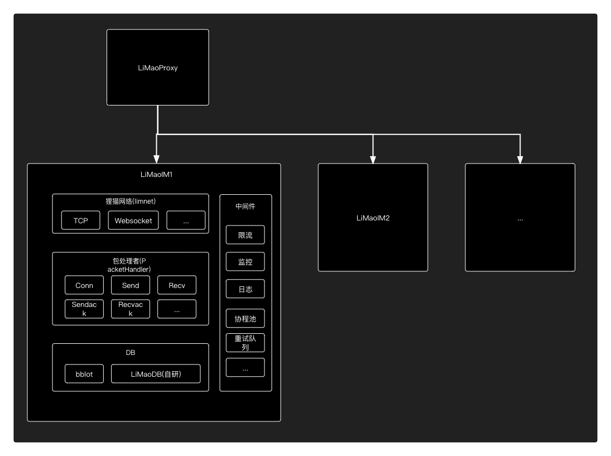

## 说明

已有服务端集成通讯端，有些业务场景只需要狸猫IM的通讯能力，不需要聊天软件的一些复杂功能，比如物联网设备通讯，RTC的信令服务器和一些APP的推送服务等
这些服务只需要部署通讯端，服务端通过通讯端的api发送消息 客户端通过狸猫sdk接收消息即可，已有服务端与通讯端和客户端sdk的交互流程如下：


## 部署通讯端

### 说明

通讯端主要负责消息的投递，频道，频道成员，频道设置的维护。

狸猫IM默认都是集群部署，部署架构图如下：




### docker部署

#### 安装docker-compose

```

# sudo curl -L "https://github.com/docker/compose/releases/download/1.25.4/docker-compose-$(uname -s)-$(uname -m)" -o /usr/local/bin/docker-compose
# sudo chmod +x /usr/local/bin/docker-compose

```

#### 部署狸猫IM

1. 新建文件 docker-compose.yaml

2. 复制以下内容到新建的docker-compose.yaml内 （以下yaml仅做为测试，正式环境建议将节点部署在不同物理机上）


```yaml

version: '3.7'
services:
  proxy:
    image: limaoim/limaoim:latest
    restart: always
    command: "proxy"
    hostname: proxy
    ports:
      - 18029:18029
    volumes:
        - ./proxydata:/home/proxydata
    environment:
      replica: 0 # 副本数量
  limao1: # 节点1
    image: limaoim/limaoim:latest
    restart: always
    hostname: limaoim
    volumes:
      - ./limaodata-1:/home/limaodata-1
    environment:
      nodeID: 1   # 节点编号 范围 1-1024
      appID: limaodemo  # 测试使用，正式的请找官方购买
      appKey: 8sTRZCZgPV2v6QZG # 测试使用，正式的请找官方购买
      mode: "debug"  # 模式
      proxy: "proxy:16666"
      nodeRaftAddr: "limao1:6000"
      nodeRPCAddr: "limao1:6001"
      nodeAPIAddr: "http://limao1:1516"
      addr: "tcp://0.0.0.0:7676"
      wsAddr: "0.0.0.0:2121"
      webhook: "http://xxxx/v2/webhook" # webhook 见webhook章节
      datasource: "http://xxxx/v1/datasource" # 数据源 见数据源章节 （非必需）
      monitorOn: 0
    ports:
      - 7676:7676  # tcp连接端口
      - 2121:2121  # websocket连接端口
  limao2: # 节点2
    image: limaoim/limaoim:latest
    restart: always
    hostname: limaoim
    volumes:
      - ./limaodata-2:/home/limaodata-2
    environment:
      nodeID: 2   # 节点编号 范围 1-1024
      appID: limaodemo  # 测试使用，正式的请找官方购买
      appKey: 8sTRZCZgPV2v6QZG # 测试使用，正式的请找官方购买
      mode: "debug"  # 模式
      proxy: "proxy:16666"
      nodeRaftAddr: "limao2:6000"
      nodeRPCAddr: "limao2:6001"
      nodeAPIAddr: "http://limao2:1516"
      addr: "tcp://0.0.0.0:7677"
      wsAddr: "0.0.0.0:2122"
      webhook: "http://xxxx/v2/webhook" # webhook 见webhook章节
      datasource: "http://xxxx/v1/datasource" # 数据源 见数据源章节 （非必需）
      monitorOn: 0
    ports:
      - 7677:7677  # tcp连接端口
      - 2122:2122  # websocket连接端口

```

3. 打开 http://IP:18029/cluster 返回类似如下内容，slot_state和state都为1 则表示集群就绪 

```json

[
    {
        vaild_count: 128,
        vaild_slots: "0-127",
        version: 18,
        slot_count: 256,
        cluster_id: 1,  // 这里状态需要为 1
        state: 1,
        slots: "/////////////z8AAAAAAAAAAAAAAAAAAAAAAAAAAAA=",
        nodes: [
            {
            node_id: 2,
            node_raft_addr: "limao2:6000",
            node_api_addr: "http://limao2:1516",
            node_rpc_addr: "limao2:6001",
            tcp_addr: "xx.xxx.xxx.xx:7677",
            ws_addr: "xx.xxx.xxx.xx:2122"
            }
        ],
        leader_id: 2,
        slot_state: 1  // 这里状态需要为 1
    },
    {
        vaild_count: 128,
        vaild_slots: "128-256",
        version: 17,
        slot_count: 256,
        cluster_id: 2,
        state: 1,  // 这里状态需要为 1
        slots: "AAAAAAAAAAAAAAAAAAAAAP////////////8fAAAAAAA=",
        nodes: [
            {
                node_id: 1,
                node_raft_addr: "limao1:6000",
                node_api_addr: "http://limao1:1516",
                node_rpc_addr: "limao1:6001",
                tcp_addr: "xx.xxx.xxx.xx:7676",
                ws_addr: "xx.xxx.xxx.xx:2121"
            }
        ],
        leader_id: 1,
        slot_state: 1  // 这里状态需要为 1
    },
]

```

### 二进制部署

待完善

### webhook

狸猫IM的一些数据将通过webhook的形式回调给第三方应用，比如用户在线状态，需要推送的消息，所有消息等等，所有webhook都是POST请求，事件名通过query参数传入，
比如 第三方的服务器提供的webhook地址为 http://example/webhook 那么在线状态的webhook为

```
http://example/webhook?event=user.onlinestatus

body的数据类似为： [uid1-0-1,uid2-1-0]

```
以下为具体webhook详情

**用户在线状态**

每个用户的上线和下线都会通过此webhook通知给第三方服务器

事件名：user.onlinestatus

事件数据：[用户ID-设备标识-在线状态]  例如 [uid1-1-0,uid2-1-1]

数据说明：  设备标识 0.为app 1.为web端  在线状态 0.离线 1.在线

**离线消息通知**

离线消息通知主要是将需要通过离线推送的消息通知给第三方服务器，第三方服务器收到此webhook后需要将此消息内容调用手机厂商推送接口，将消息推给ToUIDs列表的用户

事件名：msg.offline

事件数据：消息数组

```go

type MessageResp struct {
	Header       MessageHeader `json:"header"`        // 消息头
	Setting      uint8         `json:"setting"`       // 设置
	MessageID    int64         `json:"message_id"`    // 服务端的消息ID(全局唯一)
	MessageIDStr string        `json:"message_idstr"` // 服务端的消息ID(全局唯一)
	ClientMsgNo  string        `json:"client_msg_no"` // 客户端消息唯一编号
	MessageSeq   uint32        `json:"message_seq"`   // 消息序列号 （用户唯一，有序递增）
	FromUID      string        `json:"from_uid"`      // 发送者UID
	ChannelID    string        `json:"channel_id"`    // 频道ID
	ChannelType  uint8         `json:"channel_type"`  // 频道类型
	Timestamp    int32         `json:"timestamp"`     // 服务器消息时间戳(10位，到秒)
	Payload      []byte        `json:"payload"`       // base64消息内容
    ToUIDs       []string      `json:"to_uids"`       // 接收用户列表
}

```

**所有消息**

狸猫IM会将所有消息推送给第三方服务器（为了降低第三方服务器的压力，并不是一条一条推送，做了延迟处理，默认是500毫秒批量推送一次，这个可自己视情况配置），第三方服务器可视情况保存或不保存（有一些业务需要保存，比如将消息存入ElasticSearch，给客户端做搜索使用）不管保不保存，狸猫IM通讯端都会保存用户的消息。

事件名：msg.notify

数据说明：  消息数组

```go

type MessageResp struct {
	Header       MessageHeader `json:"header"`        // 消息头
	Setting      uint8         `json:"setting"`       // 设置
	MessageID    int64         `json:"message_id"`    // 服务端的消息ID(全局唯一)
	MessageIDStr string        `json:"message_idstr"` // 服务端的消息ID(全局唯一)
	ClientMsgNo  string        `json:"client_msg_no"` // 客户端消息唯一编号
	MessageSeq   uint32        `json:"message_seq"`   // 消息序列号 （用户唯一，有序递增）
	FromUID      string        `json:"from_uid"`      // 发送者UID
	ChannelID    string        `json:"channel_id"`    // 频道ID
	ChannelType  uint8         `json:"channel_type"`  // 频道类型
	Timestamp    int32         `json:"timestamp"`     // 服务器消息时间戳(10位，到秒)
	Payload      []byte        `json:"payload"`       // base64消息内容
}

```

### 数据源

数据解决的问题主要是一些现有系统里已有群成员和一些其他数据，需要无缝对接到狸猫IM通讯里，那么就可以通过数据源的形式对接

狸猫IM会调用 datasource配置的api地址，通过POST的方式进行请求

请求数据格式如下：

```json

{
    "cmd":"xxx", // 请求指令
    "data": {} // 请求参数
}

```

详情如下：

**获取订阅者(群成员)**

当狸猫IM通讯端需要获取订阅者列表的时候就会调用此cmd进行获取

请求参数

```json

{
    "cmd":"getSubscribers",
    "data": {
        "channel_id":"xxx", // 频道ID（群ID）
        "channel_type": 2 // 默认为2 2表示群聊
    }
}

```

返回结果

```json
[uid1,uid2,...] // 当前频道的成员用户id列表
```

**获取黑名单**

如果不允许频道成员内某个人收不到消息，可以返回黑名单


请求参数

```json

{
    "cmd":"getBlacklist",
    "data": {
        "channel_id":"xxx", // 频道ID（群ID）
        "channel_type": 1 // 频道类型 1.单聊 2.群聊 
    }
}

```

返回结果

```json
[uid1,uid2,...] // 黑明单成员用户id集合
```


**获取白名单**

如果只允许频道内某些人收到消息，则返回收到消息的成员用户id列表。
比如实现群禁言，那么可以返回群主和管理员的uid，这样其他群成员将无法发送消息，只有群主和管理能发送消息
比如实现只有好友才能发送消息，那么返回用户的好友列表则不是好友将无法发送消息


请求参数

```json

{
    "cmd":"getWhitelist",
    "data": {
        "channel_id":"xxx", // 频道ID（群ID）
        "channel_type": 1 // 频道类型 1.单聊 2.群聊 
    }
}

```

返回结果

```json
[uid1,uid2,...] // 白名单成员用户id集合
```


**获系统账号**

系统账号不受黑名单白名单限制，而且系统账号不在某个频道内也可以发送消息，也就是对发送消息无如何限制


请求参数

```json

{
    "cmd":"getSystemUIDs"
}

```

返回结果

```json
[uid1,uid2,...] // 系统账号用户id集合
```


### API文档

## 部署业务端

### docker部署

### 二进制部署

### 配置说明

## 部署Web端

### docker部署

### 二进制部署

### 配置说明
