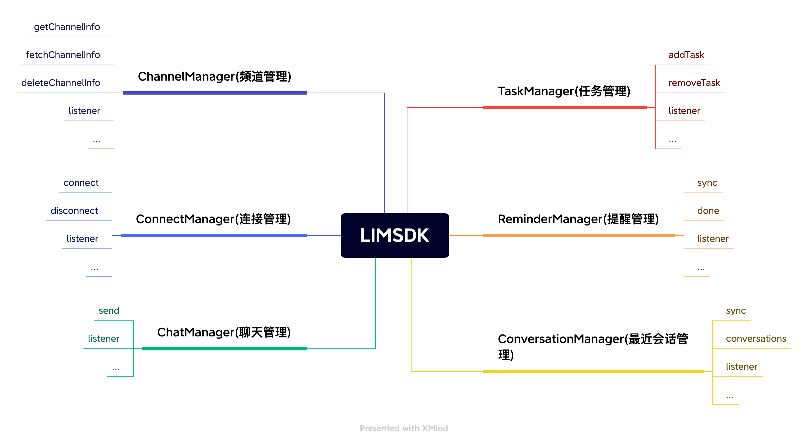

## 入门

#### 设计理念

像设计书的目录一样设计api, 通过LIMSDK.shared().xxxManager 我们可以访问到所有需要的功能，例如发送消息 **LIMSDK.shared().chatManager send(xxx)** 

#### 结构说明




``` ts

// 聊天管理者
// 负责消息相关的增删改查操作 比如发送消息，删除消息，撤回消息，聊天消息的监听等等
LIMSDK.shared().chatManager

// 连接管理者 
// 负责与IM建立连接或断开连接 监听IM连接状态等等
LIMSDK.shared().connectionManager

// 频道管理者
// 负责频道数据的获取和缓存和一些频道的设置，比如置顶，免打扰，禁言等等
LIMSDK.shared().channelManager

// 最近会话管理者
// 负责维护最近会话的相关数据，比如未读数量，草稿，@我，最后一条消息等等
LIMSDK.shared().conversationManager

// 提醒管理者
// 负责最近会话的提醒事项维护
LIMSDK.shared().reminderManager

```

## 集成

#### npm或yarn引入

```
$ npm i limao
```
或者

```
$ yarn add limao
```

#### CDN引入

```ts

<script src="https://cdn.jsdelivr.net/npm/limao"></script>

```

## 基础使用

### 初始化

```ts

// 集群模式通过此方法获取连接地址
LIMSDK.shared().config.provider.connectAddrCallback = async (callback: ConnectAddrCallback) => {
    const addr = await xxxx // addr 格式为 ip:port
    callback(addr)
}

// 单机模式可以直接设置地址
LIMSDK.shared().config.addr = "IP:PORT"
// 认证信息
LIMSDK.shared().config.uid = "xxxx"  // 用户uid（需要在狸猫通讯端注册过）
LIMSDK.shared().config.token = "xxxx" // 用户token （需要在狸猫通讯端注册过）

// 更多配置,查看：
LIMSDK.shared().config

```

### 连接与断开

```ts
// 连接
LIMSDK.shared().connect()

// 断开
LIMSDK.shared().disconnect()

```

### 在线消息收发

###### 数据操作

```ts
 /**
  *  发送消息
  * @param content  消息内容
  * @param channel 频道对象 个人频道，群频道
  * @param setting  发送设置 比如：已读未读回执，端对端加密
  * @returns 完整消息对象
*/
LIMSDK.shared().send(content: MessageContent, channel: Channel, setting?: Setting)

// 例如发送文本消息hello给用户A

const text = new MessageText("hello")
LIMSDK.shared().send(text,new Channel("A",ChannelTypePerson))

```

###### 数据监听

```ts
// 消息发送状态监听
LIMSDK.shared().addMessageStatusListener((packet:SendackPacket)=>{
   console.log("消息clientSeq->",packet.clientSeq) // 客户端序号用来匹配对应的发送的消息
     if(packet.reasonCode === 1) { 
        // 发送成功
     }else {
        // 发送失败     
     }
})

// 消息监听
LIMSDK.shared().addMessageListener((message:Message)=>{

})

```


### 离线消息接收

在狸猫IM中为了应付海量离线消息，采用了按需拉取的机制，比如 10个会话一个会话10万条消息，狸猫IM不会把这个10*10万=100万条消息都拉取到本地。 而是采用拉取这10个会话的信息和对应的最新20条消息，也就是实际只拉取了200条消息 相对100万条消息来说大大提高了离线拉取速度。用户点进对应的会话才会去按需拉取这个会话的消息。 这些机制SDK内部都已做好了封装，使用者其实不需要关心。使用者只需要关心最近会话的变化

###### 数据源设置

```ts

// 提供最近会话同步的数据源
LIMSDK.shared().config.provider.syncConversationsCallback = async (): Promise<Array<Conversation>> => {
  let conversations = new Array<Conversation>();
  conversations = await request(...)
  return conversations
})

// 提供频道内消息同步的数据源
LIMSDK.shared().config.provider.syncMessagesCallback = async(channel:Channel,opts:SyncOptions):Promise<Array<Message>>=> {
  let messages = new Array<Message>();
  messages = await request(...)
  return messages
}

```

###### 数据操作

```ts
// 同步最近会话
 const conversations = await LIMSDK.shared().conversationManager.sync({})

// 同步频道的消息
 const messages = LIMSDK.shared().syncMessages(channel,opts)


```

###### 数据监听

```ts

// 监听最近会话数据
LIMSDK.shared().addConversationListener((conversation: Conversation, action: ConversationAction)=>{

})

```


### 文本消息

``` ts
class MessageText extends MessageContent {
    text?: string
}
```

### 图片消息

```ts

class ImageContent extends MediaMessageContent {
    width!: number  // 图片宽度
    height!: number // 图片高度
    url!: string // 图片远程地址
    constructor(file?: File,width?:number,height?:number) {
        super()
        this.file = file
        this.width = width || 0
        this.height = height || 0
    }
}

```

### 语音消息

web 语音消息暂只支持收不支持发送

```ts

class VoiceContent extends MediaMessageContent {
    url!:string // 语音文件下载地址
    timeTrad!:number // 语音秒长
    waveform!:string // 语音波纹 base64编码
}

```

### 小视频消息

web语小视频消息暂只支持收不支持发送

```ts

class VideoContent extends MessageContent {
    url!: string // 小视频下载地址
    cover!: string // 小视频封面图片下载地址
    size:number = 0 // 小视频大小 单位byte
    width!:number // 小视频宽度
    height!:number // 小视频高度
    second!:number // 小视频秒长

}

```

### 名片消息

```ts

class Card extends MessageContent {
    name!: string // 好友名字
    uid!: string // 好友uid
    vercode!: string // 好友验证码
}
```

### 位置消息

```ts

class LocationContent extends MessageContent {
    lng: number = 0 // 纬度
    lat: number = 0 // 经度
    title!: string // 位置标题
    address!: string // 具体地址
    img!: string // 封面图远程地址
}

```

### CMD消息

cmd消息由服务端下发客户端解析执行。

```ts

class CMDContent extends MessageContent {
    cmd!:string // cmd的指令
    param:any // 指令对应的参数

}

```

### 最近会话

最近会话用于表示会话列表页的数据模型。当用户发送，收取及删除消息时，都会同时去修改最近会话。

当收到或者一条消息时，会自动生成这个消息对应的最近会话。但值得注意的是最近会话和会话并不是一一对应的关系，删除最近会话并不会影响会话

最近会话主要属性

```ts

class Conversation {
   channel!: Channel; // 频道
   unread!: number; // 未读消息
   lastMessage?: Message; // 最后一条消息
   extra?: any // 扩展数据（用户自定义的数据）
   remoteExtra!: ConversationExtra // 远程扩展数据
   reminders = new Array<Reminder>() // 提醒项
   ...
}

```

### 频道管理(置顶,免打扰等等)

[什么是频道](/unifying.html#什么是频道channel)

频道是狸猫IM里比较重要的一个抽象概念，发送消息都是先发送给频道，频道根据自己的配置规则进行投递消息，频道分频道和频道详情

频道的属性

```ts

// 频道
class Channel {
    channelID!: string; // 频道ID 个人频道为用户uid，群频道为群ID
    channelType!: number; // 频道类型 1.个人频道 2.群聊频道

}

```

```ts
// 频道详情
class ChannelInfo {
    channel!: Channel; // 频道
    title!: string; // 频道标题
    logo!: string; // 频道logo
    mute!: boolean; // 是否免打扰
    top!: boolean; // 是否置顶
    online:boolean = false // 是否在线
    lastOffline:number = 0 // 最后一次离线时间
    orgData: any; // 频道原始数据由第三方自定义
}

```

###### 数据源设置

```ts
  // 频道详情获取数据源提供
 LIMSDK.shared().config.provider.channelInfoCallback = async function (channel: Channel): Promise<ChannelInfo> {
  let channelInfo:ChannelInfo
  channelInfo = await request(...)
  return channelInfo
 }

// 订阅者获取数据源提供者
 LIMSDK.shared().config.provider.syncSubscribersCallback = async function (channel: Channel, version: number): Promise<Array<Subscriber>> {
     let subscribers:Subscriber[]
    subscribers = await request(...)
    return subscribers
 }

```

###### 数据操作

```ts
// 获取频道详情(不会触发数据源的远程获取)
const channelInfo = LIMSDK.shared().channelManager.getChannelInfo(channel)

// 获取频道的订阅者(不会触发数据源的远程获取)
const subscribes =  LIMSDK.shared().channelManager.getSubscribes(channel)

// 从远程提取频道详情（会触发数据源的远程获取和频道信息监听，是异步过程）
LIMSDK.shared().channelManager.fetchChannelInfo(channel)

// 从远程提取频道列表（会触发数据源的远程获取和订阅者的监听，是异步过程）
LIMSDK.shared().channelManager.syncSubscribes(channel)


```

###### 数据监听

```ts

// 监听频道详情
LIMSDK.shared().channelManager.addListener((channelInfo: ChannelInfo)=>{

})

```

## 进阶使用


### 消息附件上传设置

所有带附件的消息的上传都会通过此任务上传

伪代码如下：


```ts

// 实现四个方法  initWithMessage  resume cancel suspend
class MediaMessageUploadTask extends MessageTask {

- (instancetype)initWithMessage:(LIMMessage *)message {
    self = [super initWithMessage:message];
    if(self) {
        [self initTask];
    }
    return self;
}

 async start(): Promise<void> {
   const mediaContent = this.message.content as MediaMessageContent
   const param = new FormData();
   param.append("file", mediaContent.file);
   const resp = await axios.post(uploadURL,param,{
        headers: { "Content-Type": "multipart/form-data" },
        cancelToken: new axios.CancelToken((c: Canceler) => {
                this.canceler = c
        }),
        onUploadProgress: e => {
            // 更新任务进度
            var completeProgress = ((e.loaded / e.total) | 0);
            this._progress = completeProgress
            this.update()
          }
        }).catch(error => {
          // 更新任务错误
            console.log('文件上传失败！->', error);
            this.status = TaskStatus.fail
            this.update()
    })
    if(resp) {
        if(resp.data.path) {
              // 更新任务成功
            const mediaContent = this.message.content as MediaMessageContent
            mediaContent.remoteUrl = resp.data.path
            this.status = TaskStatus.success
            this.update()
        }
    }
 }


// 任务取消
cancel(): void {
      this.status = TaskStatus.cancel
        if(this.canceler) {
            this.canceler()
        }
        this.update()
}

// 任务进度
progress(): number {
    return this._progress??0
}

@end

```

注册上传任务

```ts
   LIMSDK.shared().config.provider.messageUploadTaskCallback = (message: Message): MessageTask => {
      return new MediaMessageUploadTask(message)
   }
```


### 自定义普通消息

我们以自定义一个gif消息为例。

####   第一步继承 MessageContent和定义gif消息的正文结构

```ts
class GifContent extends MessageContent {
  width!: number // gif宽度
  height!: number // gif高度
  url!: string // gif远程下载地址

}

```

#### 第二步 编码解码

```ts

最终传递的消息内容为 {"type":3,"url":"xxxx","width":xxx,"height":xxx}

class GifContent extends MessageContent {
  width!: number // gif宽度
  height!: number // gif高度
  url!: string // gif远程下载地址

  // 解码
  decodeJSON(content: any) {
    this.width = content["width"] || 0
    this.height = content["height"] || 0
    this.url = content["url"] 
  }
  // 编码
  encodeJSON() {
    return { "width": this.width, "height": this.height, "url": this.url }
  }

}

```

####  第三步 注册

```ts
 LIMSDK.shared().register(MessageContentTypeConst.gif, () => new GifContent()) // gif动图
```

### 自定义附件消息

自定义附件消息的流程与普通消息差异不大，我们以图片消息为例

#### 第一步继承MediaMessageContent
注意这里是继承MediaMessageContent不是MessageContent，当发送附件消息的时候，sdk会调用[上传任务](/web/onlysdk.html#消息附件上传设置),将本地的文件上传到服务器，然后再进行消息的编码和发送

最终传递的消息内容为 {"type":4,"url":"xxxx","width":xxx,"height":xxx}

```ts

class ImageContent : MediaMessageContent {
  width!: number // gif宽度
  height!: number // gif高度
  url!: string // gif远程下载地址
}
```

#### 第二步编码解码

```ts

class ImageContent : MediaMessageContent {
  width!: number // gif宽度
  height!: number // gif高度
  url!: string // gif远程下载地址

  constructor(file?: File,width?:number,height?:number) {
      super()
      this.file = file // File为要上传的图片文件对象
      this.width = width || 0
      this.height = height || 0
  }
  // 附件file上传成功后会得到 this.remoteUrl这个远程下载地址，这时可以将此地址编码到消息内
   encodeJSON() {
      return { "width": this.width || 0, "height": this.height || 0, "url": this.remoteUrl || "" }
    }

    // 解码消息
    decodeJSON(content: any) {
        this.width = content["width"] || 0
        this.height = content["height"] || 0
        this.url = content["url"] || ''
    }
}

```

####  第三步 注册

```ts
LIMSDK.shared().register(MessageContentTypeConst.image, () => new ImageContent()) 
```


### 消息扩展

待开发


### 消息编辑

待开发

### 消息回应(点赞)

待开发

### 已读未读管理

待开发

### 端对端加密

web不支持端对端加密

### 会话提醒管理

会话提醒目前只支持服务端下发指令，客户端同步提醒然后显示提醒，会话提醒由 LIMSDK.shared().reminderManager管理


```ts
class Reminder {
    channel!:Channel
    reminderID!:number  // 提醒ID
    messageID!:string
    messageSeq!:number
    reminderType!:ReminderType //  提醒类型
    text?:string // 文本提示
    data?:any // 提醒包含的自定义数据
    isLocate:boolean = false // 是否需要进行消息定位
    version:number = 0 // 数据版本
    done:boolean = false // 用户是否完成提醒
}
```

###### 数据源设置

```ts
 // 提供提醒项列表的数据源设置
 LIMSDK.shared().config.provider.syncRemindersCallback = async (version:number):Reminder[] => {
    let reminders:Reminder[]
    reminders = request(...)
    return reminders
 }

 // 提供提醒项完成的数据源
 LIMSDK.shared().config.provider.reminderDoneCallback = async (ids: number[]) => {
   request(...)
 }

```

###### 数据操作

```ts
// 同步提醒
LIMSDK.shared().reminderManager.sync()

// 提醒项已处理完成
LIMSDK.shared().reminderManager.done(ids); 
```
###### 数据监听

```ts
// 提醒项的更新会触发对应的最近会话的更新
LIMSDK.shared().conversationManager.addConversationListener((conversation: Conversation, action: ConversationAction)=>{
    console.log("conversation.reminders-->",conversation.reminders)
})

```
