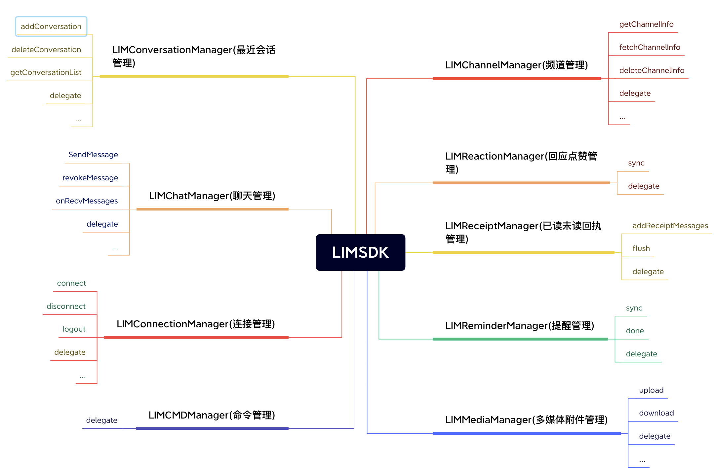
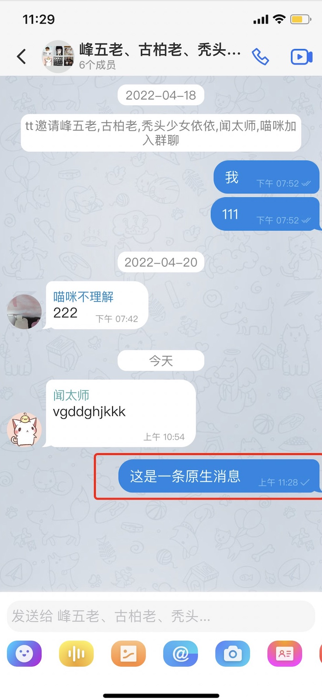
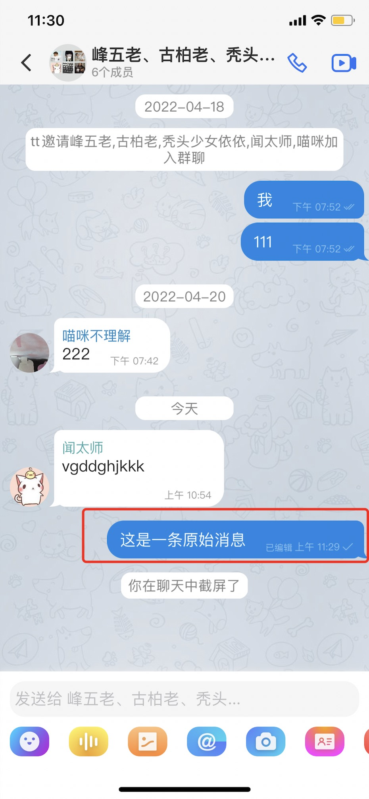

## 入门


#### 设计理念

像设计书的目录一样设计api, 通过LIMSDK.shared.xxxManager 我们可以访问到所有需要的功能，例如发送消息 **[LIMSDK.shared.chatManager sendMessage:xxx]** 


#### 结构说明




``` objc

// 聊天管理者
// 负责消息相关的增删改查操作 比如发送消息，删除消息，撤回消息，聊天消息的监听等等
LIMSDK.shared.chatManager

// 连接管理者 
// 负责与IM建立连接或断开连接 监听IM连接状态等等
LIMSDK.shared.connectionManager

// 频道管理者
// 负责频道数据的获取和缓存和一些频道的设置，比如置顶，免打扰，禁言等等
LIMSDK.shared.channelManager

// 最近会话管理者
// 负责维护最近会话的相关数据，比如未读数量，草稿，@我，最后一条消息等等
LIMSDK.shared.conversationManager

// 回应管理者
// 负责点赞数据的维护
LIMSDK.shared.reactionManager

// cmd管理者
// 负责监听服务端下发的命令类的消息
LIMSDK.shared.cmdManager

// 消息回执管理者
// 负责维护消息的已读未读状态
LIMSDK.shared.receiptManager

// 提醒管理者
// 负责最近会话的提醒项，比如 有人@我，入群申请等等 还可以自定义一些提醒，比如类似微信的 [红包] [转账] 列表都会有提醒
LIMSDK.shared.reminderManager

// 多媒体管理者
// 负责消息的多媒体文件的上传下载，比如图片消息，视频消息等等带附件的消息
LIMSDK.shared.mediaManager

```

#### SDK与已有APP交互原则


sdk与已有APP交互的整体流程就是 已有APP调用SDK对应的方法->产生数据变化->通过delegate回调给已有APP

比如常用的发送消息->消息状态变化->通知已有APP更新UI上的发送状态标记

```objc

// 通过操作chatMananger发送消息
[LIMSDK.shared.chatManager sendMessage:xxx]

// chatManagerDelegate 通过chatManager的chatManagerDelegate监听消息的状态变化
-(void) onMessageUpdate:(LIMMessage*) message  {
    if(message.status == SUCCESS) {
      [self updateItemUIWithSuccess:message];
    }else {
       [self updateItemUIWithFail:message];
    }
}

```

## 集成

###  通过 CocoaPods 集成

```
pod 'LiMaoIMSDK'
```

###  通过二进制集成
（后续完善）

## 基础使用

使用之前需要明白[什么是频道](/unifying.html#什么是频道)

### 初始化

#### 基础

```objc
[LIMSDK shared].options.host = @"48.135.49.152"; // IM通信端的IP
[LIMSDK shared].options.port = 6666; // IM通信端的TCP端口

 // 设置IM连接认证信息
[LIMSDK shared].options.connectInfoCallback = ^LIMConnectInfo * _Nonnull{
    LIMConnectInfo *connectInfo = [LIMConnectInfo new];
    connectInfo.uid = "xxxx"; // 用户uid （业务服务端在IM通讯端登记了的uid）
    connectInfo.token = "xxxx"; // 用户的token （业务服务端在IM通讯端登记了的token）
    return  connectInfo;
};

```

更多配置请查看 ***[LIMSDK shared].options***

### 连接与断开

#### 数据操作

```objc
// 开始连接 
 [[LIMSDK shared].connectionManager connect];

 // 断开连接 NO: SDK保持重连机制  YES: SDK将不再进行重连
 [[LIMSDK shared].connectionManager disconnect:NO];

```

#### 数据监听

```objc

// ---------- LIMConnectionManagerDelegate ----------

/**
 连接状态监听
 */
-(void) onConnectStatus:(LIMConnectStatus)status reasonCode:(LIMReason)reasonCode {
  if(status == LIMConnetced) {
    NSLog(@"连接成功！");
  }
}

```

### 在线消息收发

#### 数据操作

发送消息

```objc
/**
 发送消息 (发送并保存消息)

 @param content 消息正文
 @param channel 投递的频道（个人频道，群频道，客服频道等等）
 */
[[LIMSDK shared].chatManager sendMessage:(LIMMessageContent*)content channel:(LIMChannel*)channel];


```

```objc
// 例如给用户A发送消息hello
LIMChannel *channel =  [[LIMChannel alloc] initWith:@"A" channelType:LIM_PERSON];

LIMTextContent *content = [[LIMTextContent alloc] initWithContent:@"hello"];

[[LIMSDK shared].chatManager sendMessage:content channel:channel];
```

#### 数据监听

接收消息

```objc

// ------ LIMChatManagerDelegate  ------
/**
 收到消息通知
 
 @param message 收到的消息
 @param left 消息剩余数量 ，可当left为0时再刷新UI,避免频繁刷新UI导致卡顿
 */
- (void)onRecvMessages:(LIMMessage*)message left:(NSInteger)left;

/**
 消息更新通知
 
 @param message 变化的消息
 */
-(void) onMessageUpdate:(LIMMessage*) message;

...

```

消息类核心属性

```objc

@interface LIMMessage : NSObject

@property(nonatomic,strong) LIMMessageHeader *header; // 消息头

@property(nonatomic,strong) LIMSetting *setting; // 消息设置

@property(nonatomic,strong) LIMChannel *channel; // 聊天频道

@property(nonatomic,copy) NSString *fromUid; // 发送者uid

@property(nonatomic,strong) LIMMessageContent *content; // 消息正文

@property(nonatomic,assign) NSInteger timestamp; // 消息时间（服务器时间,单位秒）

@property(nonatomic,strong) NSMutableDictionary *extra; // 消息本地扩展数据

@property(nonatomic,strong) LIMMessageExtra *remoteExtra; // 消息远程扩展

...

@end

```

消息正文核心属性

```objc

@interface LIMMessageContent : NSObject<NSCopying>

/**
 你自定义的消息类型，在各个平台上需要保持一致
 @return 正文类型
 */
+(NSInteger) contentType;

// 上层无需实现encode 实现此方法即可
-(NSDictionary*) encodeWithJSON;

// 上层无序实现decode 实现此方法即可
-(void) decodeWithJSON:(NSDictionary*)contentDic;

// 消息中的@提醒信息
@property (nonatomic, strong) LIMMentionedInfo *mentionedInfo;


/// 回复内容
@property(nonatomic,strong) LIMReply *reply;

...

@end

```

### 离线消息接收

在狸猫IM中为了应付海量离线消息，采用了按需拉取的机制，比如 10个会话一个会话10万条消息，狸猫IM不会把这个10*10万=100万条消息都拉取到本地。
而是采用拉取这10个会话的信息和对应的最新20条消息，也就是实际只拉取了200条消息 相对100万条消息来说大大提高了离线拉取速度。用户点进对应的会话才会去按需拉取这个会话的消息。
这些机制SDK内部都已做好了封装，使用者其实不需要关心。使用者只需要关心最近会话的变化

最近会话的变化可以通过LIMConversationManager进行监听

```objc
// 添加委托
[[LIMSDK shared].conversationManager addDelegate:self];


// ---------- LIMConversationManagerDelegate ----------
/**
  当最近会话被新增的时候会调用此方法

 @param conversation 最近会话对象
 @param left 会话剩余数量 UI层可以判断left == 0 的时候才刷新 避免频繁刷新UI导致卡顿
 */
- (void)onConversationAdd:(LIMConversation*)conversation left:(NSInteger)left;


/**
 当最近会话对象更新的时候会调用此方法

 @param conversation 最近会话对象
 @param left 会话剩余数量 UI层可以判断left == 0 的时候才刷新 避免频繁刷新UI导致卡顿
 */
- (void)onConversationUpdate:(LIMConversation*)conversation left:(NSInteger)left;

/**
 最近会话未读数发送改变
 
 @param channel 频道
 @param unreadCount 未读数量
 */
- (void)onConversationUnreadCountUpdate:(LIMChannel*)channel unreadCount:(NSInteger)unreadCount;

...

```

LIMConversation类的核心属性

```objc

/**
 频道
 */
@property(nonatomic,strong) LIMChannel *channel;
/**
 *  频道资料，可能为空，如果为空可以调用LIMChannelManager fetchChannelInfo:completion 触发频道信息变更委托
 */
@property(nullable,nonatomic,strong,readonly) LIMChannelInfo *channelInfo;

/**
 最后一条消息 （如果内存没有则去数据库查询）
 */
@property(nonatomic,strong) LIMMessage *lastMessage;
/**
 未读消息数量
 */
@property(nonatomic,assign) NSInteger unreadCount;

...

```

#### 数据操作

```objc

/**
  查询某个频道最新的消息 （一般是第一次进入会话页面查询首屏消息时调用此方法）
 @param channel 频道
 @param limit 消息数量限制
 @param complete 查询回调
 */
[[LIMSDK shared].chatManager pullLastMessages:(LIMChannel*)channel limit:(int)limit complete:(void(^)(NSArray<LIMMessage*> *messages,NSError *error))complete];

 /**
  下拉加载消息
 @param channel 频道
 @param startOrderSeq 起始的orderSeq 比如需要查询 100以上的10条消息 那么startOrderSeq就是100 查询出来的数据为 90 91 92 93 94 95 96 97 98 99
 @param limit 消息数量限制
 @param complete 查询回调
 */
[[LIMSDK shared].chatManager pullDown:(LIMChannel*)channel startOrderSeq:(uint32_t)startOrderSeq limit:(int)limit complete:(void(^)(NSArray<LIMMessage*> *messages,NSError *error))complete];

/**
 上拉加载消息
 @param startOrderSeq 起始的orderSeq 比如需要查询 100以下的10条消息 那么startOrderSeq就是100 查询出来的数据为 101 102 103 104 105 106 107 108 109 110
 @param limit 消息数量限制
 @param complete 查询回调
 */
[[LIMSDK shared].chatManager pullUp:(LIMChannel*)channel startOrderSeq:(uint32_t)startOrderSeq limit:(int)limit complete:(void(^)(NSArray<LIMMessage*> *messages,NSError *error))complete];

/**
 查询指定orderSeq周围的消息 上5条下5条 ，比如 orderSeq 为 20 则查询 16 17 18 19 20 21 22 23 24 25 主要使用在定位消息
 @param channel 频道
 @param orderSeq 以此OrderSeq查询周围的消息
 */
[[LIMSDK shared].chatManager pullAround:(LIMChannel*)channel orderSeq:(uint32_t)orderSeq  limit:(int)limit complete:(void(^)(NSArray<LIMMessage*> *messages,NSError *error))complete];


```

### 文本消息

```objc
@interface LIMTextContent : LIMMessageContent

- (instancetype)initWithContent:(NSString*)content;

@property(nonatomic,copy) NSString *content;

@end
```

### 图片消息

```objc

@interface LIMImageContent : LIMMediaMessageContent


@property(nonatomic,assign) CGFloat width; // 图片宽度
 
@property(nonatomic,assign) CGFloat height; // 图片高度

/*!
 初始化图片消息

 @param image   原始图片
 @return        图片消息对象
 */
+ (instancetype)initWithImage:(UIImage *)image;


/// 通过data初始化
/// @param data 图片数据
/// @param width 图片宽度
/// @param height 图片高度
+ (instancetype)initWithData:(NSData *)data width:(CGFloat)width height:(CGFloat)height;


/// 初始化
/// @param data 原图data
/// @param width 原图宽度
/// @param height 原图高度
/// @param thumbData 缩略图data （如果传了缩略图的data数据，sdk将不再生成缩略图数据）
+ (instancetype)initWithData:(NSData *)data width:(CGFloat)width height:(CGFloat)height thumbData:( nullable NSData*)thumbData;


/*!
 是否发送原图
 
 @discussion 在发送图片的时候，是否发送原图，默认值为NO。
 */
@property (nonatomic, getter=isFull) BOOL full;

@end

```

### 语音消息

```objc

@interface LIMVoiceContent : LIMMediaMessageContent


/**
 初始化

 @param voiceData 音频数据
 @param second 音频秒长
 @param waveform  音频波浪数据 （可选参数）
 @return <#return value description#>
 */
+ (instancetype)initWithData:(NSData *)voiceData second:(int)second waveform:(NSData*)waveform;


// 音频数据
@property(nonatomic,strong) NSData *voiceData;

// 音频长度（单位秒）
@property(nonatomic,assign) NSInteger second;
// 音频波浪数据 （可选参数）
@property(nonatomic,strong)  NSData *waveform;

@end

```


### 位置消息

```objc
@interface LIMLocationContent : LIMMediaMessageContent

///  位置消息
/// @param lng 经度
/// @param lat 纬度
/// @param title 位置标题
/// @param address 位置地址
/// @param image 地图图片
+(LIMLocationContent*) locationContent:(CGFloat)lng lat:(CGFloat)lat title:(NSString*)title address:(NSString*)address img:(UIImage*)image;


@property(nonatomic,assign) CGFloat lng; // 经度
@property(nonatomic,assign) CGFloat lat; // 纬度
@property(nonatomic,copy) NSString *title; // 位置标题
@property(nonatomic,copy) NSString *address; // 位置地址
@property(nonatomic,copy) NSString *img; // 地图图片


/// 地图图片
@property(nonatomic,strong,readonly) UIImage *mapImage;


@end

```

### CMD消息

cmd消息由服务端下发客户端解析。

```objc
@interface LIMCMDContent : LIMMessageContent


/**
 cmd
 */
@property(nonatomic,copy) NSString *cmd;

/**
 cmd参数
 */
@property(nonatomic,copy) id param;

// cmd验证字段 ，校验是否是服务端下发
@property(nonatomic,copy) NSString *sign;

@end
```

### 最近会话

最近会话用于表示会话列表页的数据模型。当用户发送，收取及删除消息时，都会同时去修改最近会话。

当收到或者一条消息时，会自动生成这个消息对应的最近会话。但值得注意的是最近会话和会话并不是一一对应的关系，删除最近会话并不会影响会话

最近会话主要属性

```objc

@interface LIMConversation : NSObject

/**
会话频道
**/
@property(nonatomic,strong) LIMChannel *channel; 
/**
 最后一条消息 （如果内存没有则去数据库查询）
 */
@property(nonatomic,strong) LIMMessage *lastMessage;
/**
 最新一条消息时间 （10位时间戳到秒）
 */
@property(nonatomic,assign) NSInteger lastMsgTimestamp;

/**
 未读消息数量
 */
@property(nonatomic,assign) NSInteger unreadCount;

/**
 提醒项
 */
@property(nonatomic,strong) NSArray<LIMReminder*> *reminders;

/**
 本地扩展数据
 */
@property(nonatomic,strong) NSDictionary *extra;

// 服务端扩展数据
@property(nonatomic,strong) LIMConversationExtra *remoteExtra;

...

```

#### 数据操作

```objc

// 获取最近会话列表
[[LIMSDK shared].conversationManager getConversationList];

// 添加最近会话
[[LIMSDK shared].conversationManager addConversation:(LIMConversation*)conversation];

/// 设置未读数
/// @param channel 频道
/// @param unread 未读数量
[[LIMSDK shared].conversationManager setConversationUnreadCount:(LIMChannel*)channel unread:(NSInteger)unread];

...

```

#### 数据监听

```objc


// ---------- LIMConversationManagerDelegate ----------

/**
  当最近会话被新增的时候会调用此方法

 @param conversation 最近会话对象
 @param left 会话剩余数量 UI层可以判断left == 0 的时候才刷新 避免频繁刷新UI导致卡顿
 */
- (void)onConversationAdd:(LIMConversation*)conversation left:(NSInteger)left;


/**
 当最近会话对象更新的时候会调用此方法

 @param conversation 最近会话对象
 @param left 会话剩余数量 UI层可以判断left == 0 的时候才刷新 避免频繁刷新UI导致卡顿
 */
- (void)onConversationUpdate:(LIMConversation*)conversation left:(NSInteger)left;

/**
 最近会话未读数发送改变
 
 @param channel 频道
 @param unreadCount 未读数量
 */
- (void)onConversationUnreadCountUpdate:(LIMChannel*)channel unreadCount:(NSInteger)unreadCount;

...


```

### 频道管理(置顶,免打扰等等)

[什么是频道](/unifying.html#什么是频道channel)

频道是狸猫IM里比较重要的一个抽象概念，发送消息都是先发送给频道，频道根据自己的配置规则进行投递消息，频道分频道和频道详情

频道的属性

```objc

@interface LIMChannel : NSObject<NSCopying>
// 频道ID
@property(nonatomic,copy) NSString *channelId;
// 频道类型 1.为单聊 2.为群聊
@property(nonatomic,assign) uint8_t channelType;

@end

```

```objc

@interface LIMChannelInfo : NSObject<NSCopying>

// 频道
@property(nonatomic,strong) LIMChannel *channel;

/**
 频道名字
 */
@property(nonatomic,copy) NSString *name;

/**
 频道logo
 */
@property(nonatomic,copy) NSString *logo;

/**
 是否置顶
 */
@property(nonatomic,assign) BOOL stick;


/**
 是否免打扰
 */
@property(nonatomic,assign) BOOL mute;


/// 是否全员禁言
@property(nonatomic,assign) BOOL forbidden;

/**
 是否已关注 0.未关注（陌生人） 1.已关注（好友）
 */
@property(nonatomic,assign) LIMChannelInfoFollow follow;

/**
 扩展字段
 */
@property(nonatomic,strong) NSMutableDictionary<LIMChannelExtraKey,id> *extra;

...

```

#### 数据操作

```objc

// 获取频道（先从缓存获取，如果没有再从数据库获取）
[[LIMSDK shared].channelManager getChannelInfo:channel];

// 从远程服务器提取频道
[[LIMSDK shared].channelManager fetchChannelInfo:(LIMChannel*) channel  completion:(_Nullable LIMChannelInfoBlock)channelInfoBlock];

```

#### 数据监听

```objc

// ---------- LIMChannelManagerDelegate ----------

// 频道更新触发
-(void) channelInfoUpdate:(LIMChannelInfo*)channelInfo oldChannelInfo:(LIMChannelInfo* __nullable)oldChannelInfo {

}

```


## 进阶使用

### 消息附件上传设置

所有带附件的消息的上传都会通过此任务上传

伪代码如下：

```objc

// 继承LIMMessageFileDownloadTask
@interface LIMFileUploadTask : LIMMessageFileUploadTask

@end

```

```objc

// 实现四个方法  initWithMessage  resume cancel suspend
@implementation LIMFileUploadTask

- (instancetype)initWithMessage:(LIMMessage *)message {
    self = [super initWithMessage:message];
    if(self) {
        [self initTask];
    }
    return self;
}

-(void) initTask {
  LIMMediaContent *mediaContent = (LIMMediaContent*)self.message.content;

  NSString *fileLocalPath =  mediaContent.localPath;  // 附件本地路径

  // 以下为上传伪代码
  NSURLSessionDataTask *task = [serverAPI upload:fileLocalPath].progress(^(progress){
        self.progress = progress; // 内部方法 更新任务进度
        self.status = LIMTaskStatusProgressing; // 内部方法  更新任务状态
        [self update]; // 内部方法 通知更新
  }).success(^{
      self.status = LIMTaskStatusSuccess; // 内部方法  更新任务状态
      [self update]; // 内部方法 通知更新
  }).catch(^(NSError *error){
       self.status = LIMTaskStatusError;  // 内部方法  更新任务状态
       self.error = error;  // 内部方法  更新错误信息
        [self update]; // 内部方法 通知更新
  });
  self.task = task;
}

// 任务恢复
-(void) resume {
    [self.task resume];
}

// 任务取消
-(void) cancel {
     [self.task cancel];
}

// 任务挂起
- (void)suspend {
   [self.task suspend];
}

@end

```

注册上传任务

```objc
  [[LIMSDK shared].mediaManager setUploadTaskProvider:^id<LIMTaskProto> _Nonnull(LIMMessage * _Nonnull message) {
        return [[LIMFileUploadTask alloc] initWithMessage:message];
  }];
```


### 消息附件下载设置

所有带附件消息的下载都会通过此下载任务进行下载

伪代码如下：

```objc

// 继承LIMMessageFileDownloadTask
@interface LIMFileDownloadTask : LIMMessageFileDownloadTask

@end

```

```objc

// 实现四个方法  initWithMessage  resume cancel suspend
@implementation LIMFileDownloadTask

- (instancetype)initWithMessage:(LIMMessage *)message {
    self = [super initWithMessage:message];
    if(self) {
        [self initTask];
    }
    return self;
}

-(void) initTask {
  LIMMediaContent *mediaContent = (LIMMediaContent*)self.message.content;

  NSString *downloadURL =  mediaContent.remoteUrl;  // 附件下载地址

  // 以下为下载伪代码
  NSURLSessionDownloadTask *task = [serverAPI download:downloadURL].progress(^(progress){
        self.progress = progress; // 内部方法 更新任务进度
        self.status = LIMTaskStatusProgressing; // 内部方法  更新任务状态
        [self update]; // 内部方法 通知更新
  }).success(^{
      self.status = LIMTaskStatusSuccess; // 内部方法  更新任务状态
      [self update]; // 内部方法 通知更新
  }).catch(^(NSError *error){
       self.status = LIMTaskStatusError;  // 内部方法  更新任务状态
       self.error = error;  // 内部方法  更新错误信息
        [self update]; // 内部方法 通知更新
  });
  self.task = task;
}

// 任务恢复
-(void) resume {
    [self.task resume];
}

// 任务取消
-(void) cancel {
     [self.task cancel];
}

// 任务挂起
- (void)suspend {
   [self.task suspend];
}

@end

```

注册下载任务

```objc
  [[LIMSDK shared].mediaManager setDownloadTaskProvider:^id<LIMTaskProto> _Nonnull(LIMMessage * _Nonnull message) {
        return [[LIMFileDownloadTask alloc] initWithMessage:message];
  }];

```


### 自定义普通消息

我们以自定义一个gif消息为例。

####   第一步继承 LIMMessageContent和定义gif消息的正文结构

```objc
@interface LIMGIFContent : LIMMessageContent

//GIF的地址
@property(nonatomic,copy) NSString *url;
// 宽度
@property(nonatomic,assign) NSInteger width;
// 高度
@property(nonatomic,assign) NSInteger height;

@end

```

#### 第二步 编码解码

```objc

最终传递的消息内容为 {"type":3,"url":"xxxx","width":xxx,"height":xxx}

@implementation LIMGIFContent

// 定义消息正文类型
+(NSInteger) contentType {
    return 3;
}

// 发送消息时对消息内容编码 
- (NSDictionary *)encodeWithJSON {
    NSMutableDictionary *dataDict = [NSMutableDictionary dictionary];
    [dataDict setObject:self.url?:@"" forKey:@"url"];
    [dataDict setObject:@(self.width) forKey:@"width"];
    [dataDict setObject:@(self.height) forKey:@"height"];
    return dataDict;
}

// 收到消息时对消息内容解码
- (void)decodeWithJSON:(NSDictionary *)contentDic {
    self.url = contentDic[@"url"];
    self.width = contentDic[@"width"]?[contentDic[@"width"] integerValue]:100;
    self.height = contentDic[@"height"]?[contentDic[@"height"] integerValue]:100;
}

// 最近会话显示的内容
- (NSString *)conversationDigest {
    return @"[gif表情]"
}

@end


```

####  第三步 注册

```objc
[[LIMSDK shared] registerMessageContent:LIMGIFContent.class];
```

### 自定义附件消息

自定义附件消息的流程与普通消息差异不大，我们以图片消息为例

#### 第一步继承LIMMediaMessageContent
注意这里时继承LIMMediaMessageContent不是LIMMessageContent

最终传递的消息内容为 {"type":4,"url":"xxxx","width":xxx,"height":xxx}

```objc

@interface LIMImageContent : LIMMediaMessageContent


@property(nonatomic,assign) CGFloat width; // 图片宽度
 
@property(nonatomic,assign) CGFloat height; // 图片高度

@property(nonatomic,strong) NSData imageData; // 图片数据

@end
```

#### 第二步编码解码和将需要上传的数据写入本地路径

```objc
@implementation LIMImageContent

// 定义消息正文类型
+(NSInteger) contentType {
    return 4;
}

// 将图片数据写入到本地路径，这样后面的上传任务会将此路径的附件上传到服务器
- (void) writeDataToLocalPath {
    [super writeDataToLocalPath];
    [self.imageData writeToFile:self.localPath atomically:YES];
}

// 附件消息当附件上传成功后 会获取到上传后的self.remoteUrl下载地址，我们只需要将此下载地址编码到json里，附件的上传任务进度管理请查看 [LIMSDK shared].mediaManager
- (NSDictionary *)encodeWithJSON {
    NSMutableDictionary *dataDict = [NSMutableDictionary dictionary];
    [dataDict setObject:self.remoteUrl?:@"" forKey:@"url"];
    [dataDict setObject:@(self.width) forKey:@"width"];
    [dataDict setObject:@(self.height) forKey:@"height"];
    return dataDict;
}
// 当收到消息需要解码，这时候我们只需要将下载地址url 赋值给self.remoteUrl后 下载任务会通过self.remoteUrl的下载地址进行下载附件 附件的下载任务进度管理请查看 [LIMSDK shared].mediaManager
- (void)decodeWithJSON:(NSDictionary *)contentDic {
    self.remoteUrl = contentDic[@"url"];
    self.width = contentDic[@"width"]?[contentDic[@"width"] floatValue]:0;
    self.height = contentDic[@"height"]?[contentDic[@"height"] floatValue]:0;
}


@end

```

####  第三步 注册

```objc
[[LIMSDK shared] registerMessageContent:LIMImageContent.class];
```


### 消息扩展

消息扩展是对现有消息字段一个补充,消息扩展分本地扩展和远程扩展，本地扩展只在当前app本地生效，卸载后重装将丢失，
远程扩展是服务器保存，卸载后重装将恢复，本地扩展没什么好讲的，主要讲远程扩展


#### 数据源设置

```objc
// 设置更新消息扩展的数据源， 消息远程扩展数据发生变化，sdk会调用此提供者，此提供者需要将扩展数据上传到服务器存储
[[LIMSDK shared].chatManager setUpdateMessageExtraProvider:^(LIMMessageExtra *newExtra,LIMMessageExtra *oldExtra,callback){
   // api请求
   ...
   // 回调
   callback(error);
}];


```

```objc

// 消息扩展类
@interface LIMMessageExtra : NSObject

@property(nonatomic,assign) uint64_t messageID; // 消息id
@property(nonatomic,copy)   NSString *channelID; // 频道id
@property(nonatomic,assign) NSInteger channelType; // 频道类型


@property(nonatomic,copy) NSDictionary *extra; // 扩展数据，远程保存

...

@end

```

```objc

@interface LIMMessage 

...

@property(nonatomic,strong) NSMutableDictionary *extra; // 消息本地扩展数据


@property(nonatomic,strong) LIMMessageExtra *remoteExtra; // 消息远程扩展

...

@end

```

#### 数据操作

```objc
// 更新消息远程扩展
 [[LIMSDK shared].chatManager updateMessageRemoteExtra:message];
```

```objc
// 收到同步扩展消息的cmd后调用同步方法进行扩展同步
 [[LIMSDK shared].chatManager syncMessageExtra:channel];
```

#### 数据监听

```objc

// 当前消息扩展发送变化，会触发消息更新的委托
// ---------- LIMChatManagerDelegate ----------

-(void) onMessageUpdate:(LIMMessage*) message left:(NSInteger)left {
    message.remoteExtra.extra
}

```

### 消息编辑

当我们发现发送的消息内容有误后，我们无需撤回后再编辑再发送，狸猫IM提供直接在发出去的消息上进行编辑的功能

例如：

&nbsp;&nbsp;


#### 数据源设置

```objc

 // 提交编辑内容。
 [[[LIMSDK shared] chatManager] setMessageEditProvider:^(LIMMessageExtra * _Nonnull extra, LIMMessageEditCallback  _Nonnull callback) {

     NSData  *editContentData =   extra.contentEditData; // 编辑后的正文数据

    // 请求自己的app服务端
     ....

    // 结果回调
    callback(result);
  }];

```

#### 操作数据

```objc

// message 未原始消息对象
// newContent 为修改后的正文
// 返回编辑后的消息对象
LIMMessage *messageEditAfter = [[LIMSDK shared].chatManager editMessage:(LIMMessage*)message newContent:(LIMMessageContent*)newContent];

```

#### 监听数据

如果别人编辑了消息或自己编辑了消息都会触发LIMChatManagerDelegate的消息更新事件, 在此事件里我们通过message.remoteExtra.contentEdit对象可以获取到编辑后的正文

```objc

// ---------- LIMChatManagerDelegate ----------

-(void) onMessageUpdate:(LIMMessage*) message left:(NSInteger)left {
   LIMMessageContent *orgContent =  message.content; // 原始正文
   LIMMessageContent *editContent = message.remoteExtra.contentEdit; // 编辑后的正文
}

```


### 消息回应(点赞)

如果你不理解消息回应请查看[什么是消息回应](/unifying.html#什么是消息回应)

#### 操作数据

```objc

/**
 添加或取消回应,如果同一个用户存在reactionName的回应则取消回应
 @param reactionName 回应的名称，一般是emoji或本地emoji图片的名称
 @param messageID 回应消息的ID
 @param complete 结果回掉
 */
[[LIMSDK shared].reactionManager addOrCancelReaction:(NSString*)reactionName messageID:(uint64_t)messageID complete:(void(^_Nullable)(NSError  * _Nullable error))complete];

```
当点击某个会话的时候需要增量同步一下当前会话的回应

```objc

[[LIMSDK shared].reactionManager sync:channel];

```

#### 监听数据

如果有别人回应(点赞)，我们可以通过LIMReactionManagerDelegate监听到

```objc

// ---------- LIMReactionManagerDelegate  ----------

-(void) reactionManagerChange:(LIMReactionManager*)reactionManager reactions:(NSArray<LIMReaction*>*)reactions channel:(LIMChannel*)channel {

}

```

### 已读未读管理

已读未读又称为回执，由[LIMSDK shared].receiptManager 回执管理者管理


```objc
LIMSetting *setting = [LIMSetting new];
setting.receiptEnabled = true // 开启端消息回执 
[[LIMSDK shared].chatManager sendMessage:(LIMMessageContent*)content channel:(LIMChannel*)channel setting:setting]

```


#### 数据源设置

```objc
 // 设置上传消息已读数据源。
 [[[LIMSDK shared] receiptManager] setMessageReadedProvider:^(LIMChannel *channel,NSArray<LIMMessage *> * _Nonnull messages, LIMMessageReadedCallback  _Nonnull callback) {

    // 请求自己的app服务端
     ....

    // 结果回调
    callback(result);

 }];

```

#### 数据操作

```objc
// 添加已读的消息，此方法会调用 messageReadedProvider数据将已读相关消息传递给服务器
[[LIMSDK shared].receiptManager addReceiptMessages:(LIMChannel*)channel messages:(NSArray<LIMMessage*>*)messages];
```

#### 数据监听

```objc

// ---------- LIMChatManagerDelegate  ----------

/**
 消息更新
 
 @param message <#message description#>
 @param left 消息剩余数量 ，可当left为0时再刷新UI
 */
-(void) onMessageUpdate:(LIMMessage*) message left:(NSInteger)left {
    if(message.remoteExtra.readed) {
      NSLog(@"消息已读");
    }
}

```

### 端对端加密

```objc
LIMSetting *setting = [LIMSetting new];
setting.signal = true // 开启端对端加密 （目前只有个人频道才有效，群频道暂不支持）
[[LIMSDK shared].chatManager sendMessage:(LIMMessageContent*)content channel:(LIMChannel*)channel setting:setting]

```

### 会话提醒管理

会话提醒目前只支持服务端下发指令，客户端同步提醒然后显示提醒，会话提醒由 [LIMSDK shared].reminderManager管理


```objc
@interface LIMReminder : NSObject<NSCopying>

@property(nonatomic,assign) int64_t reminderID; // 提醒唯一ID
@property(nonatomic,assign) uint64_t messageId; // 消息ID
@property(nonatomic,assign)  uint32_t messageSeq; // 消息序列号（用户唯一，有序）
@property(nonatomic,strong) LIMChannel *channel; // 频道
@property(nonatomic,assign) LIMReminderType type; //  提醒类型

@property(nonatomic,copy) NSString *text; // 提醒文本

@property(nonatomic,strong) NSDictionary *data; //  提醒包含的数据
 
@property(nonatomic,assign) BOOL isLocate; // 是否需要进行消息定位
@property(nonatomic,assign) int64_t version;

@property(nonatomic,assign) BOOL done; // 用户是否完成提醒


...

@end
```

#### 数据操作

```objc
// 同步提醒
[[LIMSDK shared].reminderManager sync]; 

// 提醒项已处理完成
[[LIMSDK shared].reminderManager done:(NSArray<NSNumber*>*)ids]; 
```
#### 数据监听

```objc

// ---------- LIMReminderManagerDelegate ----------

// 某个频道的reminders发生变化
-(void) reminderManager:(LIMReminderManager*)manager didChange:(LIMChannel*)channel reminders:(NSArray<LIMReminder*>*) reminders {

}

```


