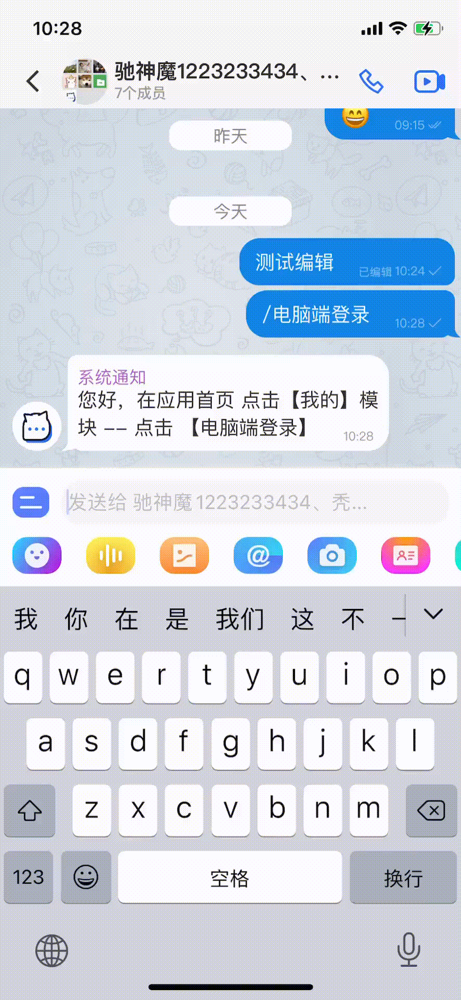
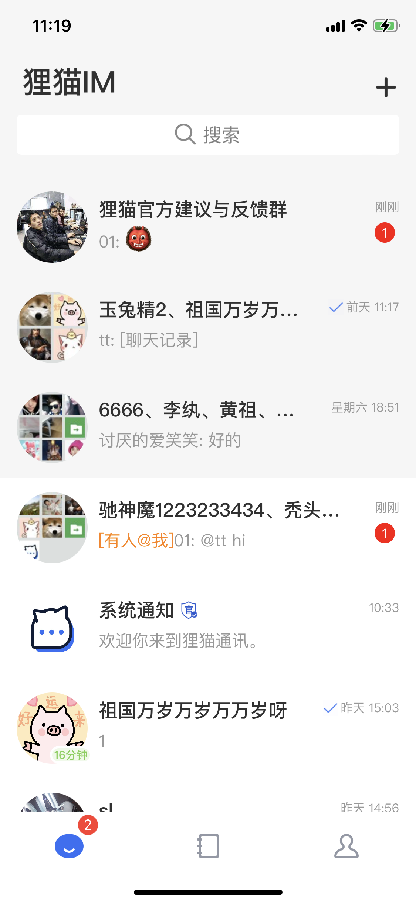
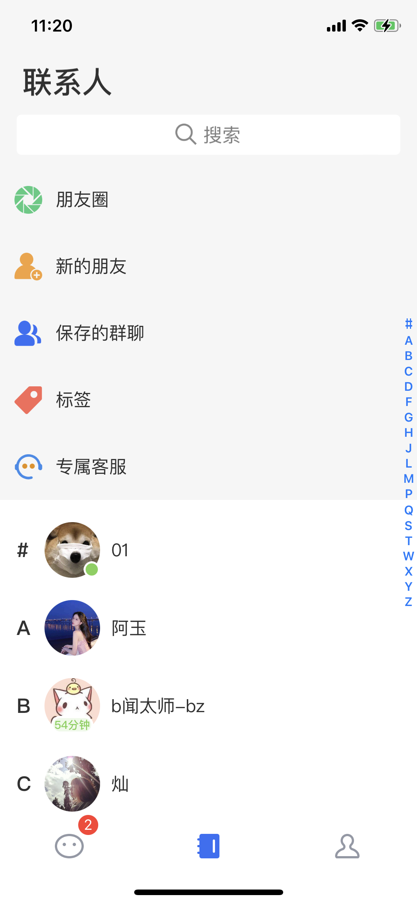
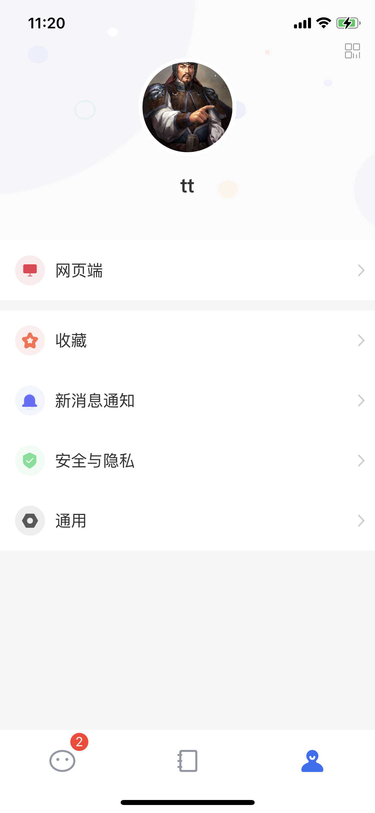
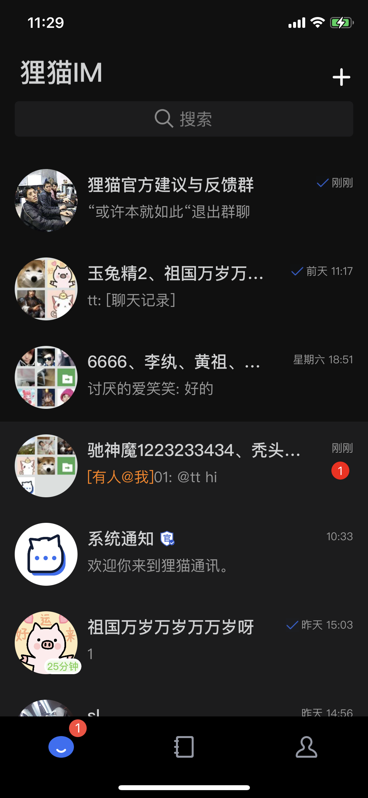
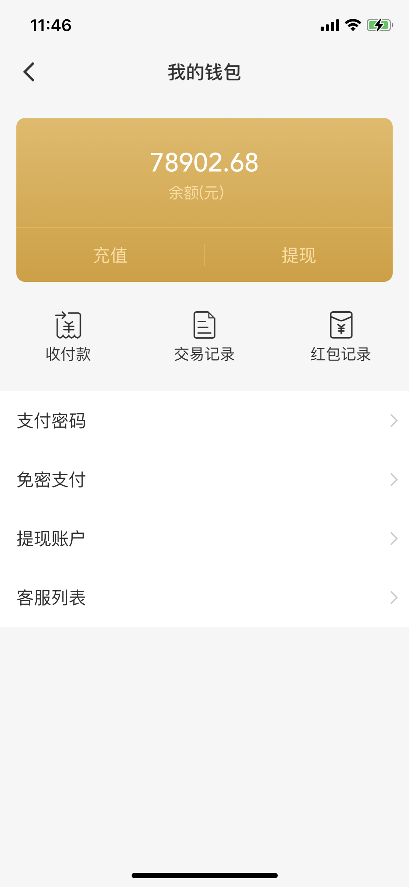
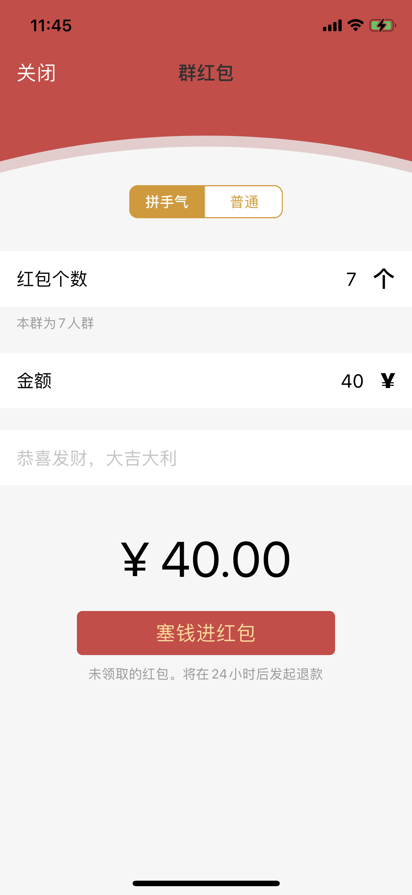
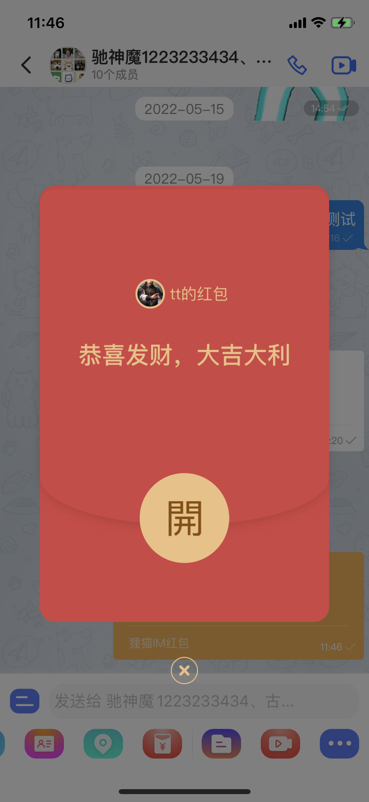
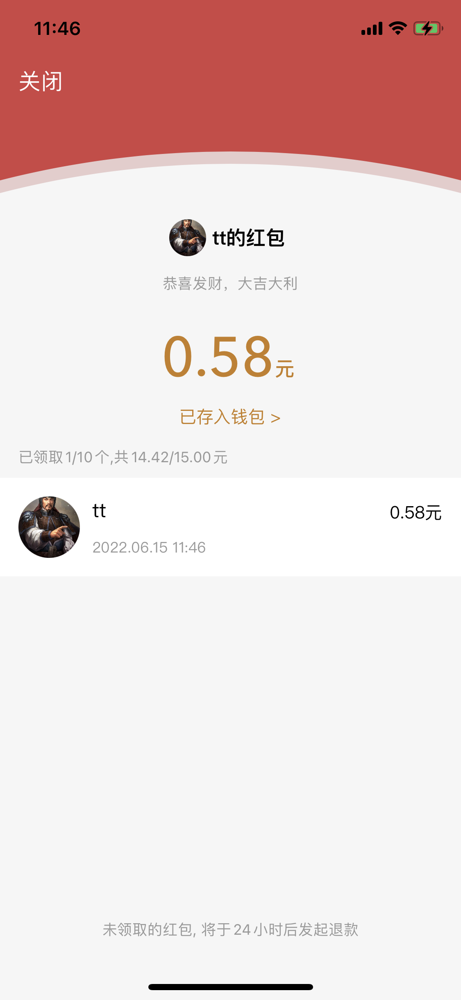

## 什么是狸猫IM

狸猫IM是一款**轻量级**，**高性能**，**重安全**专注于**私有化部署**的即时通讯系统。
#### 特性

1. 群人数无限制，业务场景更广阔
2. 支持端对端加密，聊天内容只有你和她/他知道
3. 支持消息编辑，消息点赞聊天更丰富
4. 自研消息数据库，轻轻松松支持消息永久存储
5. 自研物联网级别的二进制通讯协议，更省电和流量
6. 专注私有化部署，企业自己的数据自己完全拥有
7. 全平台支持，iOS，Android，Windows，MAC，Web


## 狸猫IM的组成

狸猫IM由 客户端，服务端，运营端，运维端组成

**客户端**

主要是用户端使用 包括：iOS，Android，Web，PC

**服务端**

给客户端调用的后端系统 包括：通讯端，业务端

**运营端**

给运营人员使用的后台管理系统，可查看注册人数，人活，周活，月活等等数据

**运维端**

给运维人员使用，可对各个系统进行全方位的监控。


## 为什么选择狸猫

### 比较


厂商 | Demo二开成本 | Web端同步 | 群人数 | 存储 | 端对端加密
---|--- |--- |--- |---  |--- 
<label style="color:red">狸猫IM</label> | <label style="color:red">运营级Demo，换个皮就能直接上线运营</label> | <label style="color:red">所有操作实时同步 </label> | <label style="color:red">无限制</label>  | <label style="color:red">永久</label>(自研消息数据库加持) | <label style="color:red">支持 </label>
网易云信  | Demo简单，很多功能都只是做演示 | 无法同步 | 小于5000  | 30天/免费版 1年/专业版 | 不支持 
融云  | Demo简单，离运营级还有距离 | 消息同步，设置不能同步 | 3000 | 7天 | 不支持 
环信  | Demo超简单，开发成运营级产品成本高 | app与web互踢  | 3000 | 7天（需联系商务） | 不支持
腾讯云IM | Demo简单，离运营级还有距离  | 大部分能实时同步 | 付费后最多扩展到6000人 | 30天/旗舰版 | 不支持


### 价格

**一次性付费永久使用**

市场上的即时通讯(腾讯云，网易云信，融云等等)大部分按量，按月付费价格计算复杂，跟爱奇艺的vip，svip，付费点播一样的套路防不胜防。

狸猫IM专注于私有化部署，价格美丽，一次性付费永久使用。

**全国统一价格，无套路营销**

[价格明细表](/introduce.html#价格明细)

### 安全性

**自研协议**

自研二进制消息协议，数据传输更加私密。


**端对端加密**

狸猫IM是国内唯一采用[端对端加密](/unifying.html#什么是端对端加密)提供私有化部署的厂商，采用国际通用的端对端加密算法signal（telegram，WhatsApp,Facebook等国外知名聊天软件都是采用的此加密技术）目前还无人能破解此算法


### 性能

**自研协议**

自研物联网级别的二进制协议，包⼤⼩极⼩，最⼩⼼跳包只 有1byte，耗电⼩，流量⼩，传输速度更快。

**自研分布式消息数据库**

针对于大量消息存储问题，市面上的mysql，mongodb之类的数据库性能远远达不到我们的要求，因此根据消息的特点自研消息数据库，性能大幅度的提高。

**压测数据说话**

狸猫IM做了一系例的性能压力测试工具来保证性能优异，对消息可靠性，消息有序性，消息吞吐量，消息延迟性，同时用户在线量全方位模拟压测。

详情查看 [压力测试](/introduce.html#压力测试)

**APP端性能**

APP端全使用原生语言编写（Android采用Java，iOS采用Objc），性能和体验要比React Native和Flutter这些非原生框架高出许多。

### 运营级

**线上真实案例**

狸猫IM是运营级别的私有化即时通讯系统，合作客户中有运营5年之久，100万以上用户，线上稳定运用至今。

**压测模拟**

狸猫IM通过实战和强大的压测工具链来保障客户产品平稳上线。

### 售后

* 一年免费升级
* 一个月一对一技术服务

## Demo体验

### iOS下载


### Android下载


### Web

https://im.limaoim.cn

## 联系方式

下载注册我们的Demo 然后联系客服


## 压力测试

主要测试指标：消息吞吐量,同时用户在线量,消息可靠性，消息有序性，大量离线消息收取，

**消息吞吐量**

```objc
goos: darwin
goarch: amd64
cpu: Intel(R) Core(TM) i7-7700HQ CPU @ 2.80GHz

SEND: 2021/06/29 15:05:49 duration: 10.605478656s - 12.096mb/s - 63420.051ops/s - 15.768us/op
```

在本人MAC笔记本 i7-7700HQ CPU @ 2.80GHz 下 达到每秒63420条消息的吞吐量，接近redis的压测数据！

**同时用户在线量**

测试一百万用户同时在线, 20台压测机，一台im服务器，每台压测机器模拟5万用户在线

im服务器配置： 	12 vCPU 24 GiB 

压测机： 8 vCPU 16 GiB


20台机器模拟客户端在线，一台机器模拟5万

<video width="960"  controls>
  <source src="/video/stress.mp4" type="video/mp4">
    您的浏览器不支持Video标签。
</video>

100万连接后，im服务器 内存，cpu使用情况如下


阿里云的监控图如下：


结论： 100万同时在线持续两个小时，内存使用不超过7G，cpu在 25%以下


**消息可靠性**

 100个用户每个用户发送100个消息，重复许多次消息不丢。

<video width="320"  controls>
  <source src="/video/reliability.mp4" type="video/mp4">
    您的浏览器不支持Video标签。
</video>


**消息有序性**

2个用户每个用户快速发送1万条消息，反复测试，观察序号是否有序，如果程序这么快的速度都没有乱序，真实发消息场景下就更加不可能乱序

<video width="320"  controls>
  <source src="/video/orderliness.mp4" type="video/mp4">
    您的浏览器不支持Video标签。
</video>


**大量离线消息收取**

100个用户 每个用户发送1000条消息。测试离线收取速度，结果：秒级收取速度

<video width="320"  controls>
  <source src="/video/offline.mp4" type="video/mp4">
    您的浏览器不支持Video标签。
</video>

## 价格明细

<table>
  <tr>
    <th>一级</th>
    <th>二级</th>
    <th>三级</th>
     <th>基础版</th>
     <th>商业版</th>
     <th>专业版</th>
  </tr>
  <tr>
    <td colspan="3"></td>
     <td style="text-align:center">xxx元</td>
     <td style="text-align:center">xxx元</th>
     <td style="text-align:center;color:red">xxx元</td>
  </tr>

  <!--  会话  -->

   <tr >
      <td rowspan="66">会话</td>
       <td rowspan="3">文本消息</td>
       <td >显示普通文本</td>
       <td style="text-align:center">✅ </td>
        <td style="text-align:center">✅ </td>
       <td style="text-align:center">✅ </td>
       
  </tr>
  <tr>
     <td >识别文本中链接并显示主页标题及介绍，识别手机号点击提示拨号或保存到系统电话薄</td>
     <td style="text-align:center">✅ </td>
        <td style="text-align:center">✅ </td>
       <td style="text-align:center">✅ </td>
  </tr>
  <tr>
     <td >显示系统emoji、自定义emoji图片</td>
     <td style="text-align:center">✅ </td>
        <td style="text-align:center">✅ </td>
       <td style="text-align:center">✅ </td>
  </tr>
  <tr>
     <td rowspan="5">图片消息</td>
     <td >发送时可选择相册图片（最多选择9张同时发送），拍摄照片</td>
     <td style="text-align:center">✅ </td>
        <td style="text-align:center">✅ </td>
       <td style="text-align:center">✅ </td>
  </tr>
  <tr>
     <td >支持选择照片原图发送</td>
     <td style="text-align:center">✅ </td>
        <td style="text-align:center">✅ </td>
       <td style="text-align:center">✅ </td>
  </tr>
  <tr>
     <td >聊天中显示图片发送进度</td>
     <td style="text-align:center">✅ </td>
        <td style="text-align:center">✅ </td>
       <td style="text-align:center">✅ </td>
  </tr>
  <tr>
     <td >查看图片大图，双击放大、缩小等</td>
     <td style="text-align:center">✅ </td>
        <td style="text-align:center">✅ </td>
       <td style="text-align:center">✅ </td>
  </tr>
  <tr>
     <td >长按图片可发转到其他会话，保存到相册</td>
     <td style="text-align:center">✅ </td>
        <td style="text-align:center">✅ </td>
       <td style="text-align:center">✅ </td>
  </tr>
  
   <tr>
     <td rowspan="4">语音消息</td>
      <td >长按录制语音松手发送到聊天</td>
     <td style="text-align:center">✅ </td>
        <td style="text-align:center">✅ </td>
       <td style="text-align:center">✅ </td>
  </tr>
   <tr>
     <td >最长录制60秒消息</td>
     <td style="text-align:center">✅ </td>
        <td style="text-align:center">✅ </td>
       <td style="text-align:center">✅ </td>
  </tr>
   <tr>
     <td >播放语音消息支持声贝动画</td>
     <td style="text-align:center">✅ </td>
        <td style="text-align:center">✅ </td>
       <td style="text-align:center">✅ </td>
  </tr>
  <tr>
     <td >点击未下载语音，显示下载进度。下载完成后播放该语音</td>
     <td style="text-align:center">✅ </td>
        <td style="text-align:center">✅ </td>
       <td style="text-align:center">✅ </td>
  </tr>

  <tr>
     <td rowspan="4">位置消息</td>
     <td >选择发送当前位置到会话</td>
     <td style="text-align:center">✅ </td>
        <td style="text-align:center">✅ </td>
       <td style="text-align:center">✅ </td>
  </tr>
   <tr>
     <td >搜索位置信息发送</td>
     <td style="text-align:center">✅ </td>
        <td style="text-align:center">✅ </td>
       <td style="text-align:center">✅ </td>
  </tr>
   <tr>
     <td >查看对方发送的位置信息</td>
     <td style="text-align:center">✅ </td>
        <td style="text-align:center">✅ </td>
       <td style="text-align:center">✅ </td>
  </tr>
   <tr>
     <td >显示位置截图图片</td>
     <td style="text-align:center">✅ </td>
        <td style="text-align:center">✅ </td>
       <td style="text-align:center">✅ </td>
  </tr>
   <tr>
     <td rowspan="2">名片消息</td>
     <td >选择联系人发送到会话</td>
     <td style="text-align:center">✅ </td>
        <td style="text-align:center">✅ </td>
       <td style="text-align:center">✅ </td>
  </tr>
  <tr>
     <td >查看名片联系人</td>
     <td style="text-align:center">✅ </td>
        <td style="text-align:center">✅ </td>
       <td style="text-align:center">✅ </td>
  </tr>
  <tr>
     <td rowspan="5">文件消息</td>
     <td >选择最近聊天文件发送</td>
     <td style="text-align:center">❌</td>
        <td style="text-align:center">✅</td>
       <td style="text-align:center">✅</td>
  </tr>
   <tr>
     <td >选择系统文件发送</td>
     <td style="text-align:center">❌</td>
        <td style="text-align:center">✅</td>
       <td style="text-align:center">✅</td>
  </tr>
  <tr>
     <td >显示发送文件上传进度</td>
     <td style="text-align:center">❌</td>
        <td style="text-align:center">✅</td>
       <td style="text-align:center">✅</td>
  </tr>
  <tr>
     <td >消息中显示文件大小及文件类型</td>
     <td style="text-align:center">❌</td>
        <td style="text-align:center">✅</td>
       <td style="text-align:center">✅</td>
  </tr>
  <tr>
     <td >可查看聊天文件并下载到本地</td>
     <td style="text-align:center">❌</td>
        <td style="text-align:center">✅</td>
       <td style="text-align:center">✅</td>
  </tr>
  <tr>
     <td rowspan="5">小视频消息</td>
     <td >录制小视频（15秒），选择相册视频发送</td>
     <td style="text-align:center">❌</td>
        <td style="text-align:center">✅</td>
       <td style="text-align:center">✅</td>
  </tr>
   <tr>
     <td >播放视频消息</td>
     <td style="text-align:center">❌</td>
        <td style="text-align:center">✅</td>
       <td style="text-align:center">✅</td>
  </tr>
   <tr>
     <td >消息中显示视频大小</td>
     <td style="text-align:center">❌</td>
        <td style="text-align:center">✅</td>
       <td style="text-align:center">✅</td>
  </tr>
   <tr>
     <td >保存小视频到本地</td>
     <td style="text-align:center">❌</td>
        <td style="text-align:center">✅</td>
       <td style="text-align:center">✅</td>
  </tr>
   <tr>
     <td >点击未下载视频，显示下载进度，下载完成后播放该视频</td>
     <td style="text-align:center">❌</td>
        <td style="text-align:center">✅</td>
       <td style="text-align:center">✅</td>
  </tr>
  <tr>
     <td rowspan="2">合并转发消息</td>
     <td >长按消息选择多选最多100条消息。可合并转发或逐条转发</td>
     <td style="text-align:center">❌</td>
        <td style="text-align:center">✅</td>
       <td style="text-align:center">✅</td>
  </tr>
  <tr>
     <td >查看合并转发消息详情</td>
     <td style="text-align:center">❌</td>
        <td style="text-align:center">✅</td>
       <td style="text-align:center">✅</td>
  </tr>
  <tr>
     <td rowspan="3">正在输入消息</td>
     <td >单聊对方输入时会提醒到会话中</td>
     <td style="text-align:center">❌</td>
        <td style="text-align:center">✅</td>
       <td style="text-align:center">✅</td>
  </tr>
  <tr>
     <td >群聊某人正在输入会提醒到会话，多人同时输入会更新最后输入用户</td>
     <td style="text-align:center">❌</td>
        <td style="text-align:center">✅</td>
       <td style="text-align:center">✅</td>
  </tr>
   <tr>
     <td >用户输入8秒未发送或取消发送，取消正在输入提醒</td>
     <td style="text-align:center">❌</td>
        <td style="text-align:center">✅</td>
       <td style="text-align:center">✅</td>
  </tr>
  <tr>
     <td rowspan="10">群系统消息</td>
     <td >创建群聊系统消息</td>
     <td style="text-align:center">✅</td>
        <td style="text-align:center">✅</td>
       <td style="text-align:center">✅</td>
  </tr>
   <tr>
     <td >添加或移除群成员系统消息</td>
     <td style="text-align:center">✅</td>
        <td style="text-align:center">✅</td>
       <td style="text-align:center">✅</td>
  </tr>
  <tr>
     <td >注销用户无法添加到群聊系统消息</td>
     <td style="text-align:center">✅</td>
        <td style="text-align:center">✅</td>
       <td style="text-align:center">✅</td>
  </tr>
   <tr>
     <td >更改群名称消息</td>
     <td style="text-align:center">✅</td>
        <td style="text-align:center">✅</td>
       <td style="text-align:center">✅</td>
  </tr>
  <tr>
     <td >修改群公告消息</td>
     <td style="text-align:center">✅</td>
        <td style="text-align:center">✅</td>
       <td style="text-align:center">✅</td>
  </tr>
   <tr>
     <td >开启/关闭群邀请确认消息</td>
     <td style="text-align:center">✅</td>
        <td style="text-align:center">✅</td>
       <td style="text-align:center">✅</td>
  </tr>
   <tr>
     <td >群主转让消息</td>
     <td style="text-align:center">✅</td>
        <td style="text-align:center">✅</td>
       <td style="text-align:center">✅</td>
  </tr>
   <tr>
     <td >开启/关闭全员禁言消息</td>
     <td style="text-align:center">✅</td>
        <td style="text-align:center">✅</td>
       <td style="text-align:center">✅</td>
  </tr>
  <tr>
     <td >进群审核消息</td>
     <td style="text-align:center">✅</td>
        <td style="text-align:center">✅</td>
       <td style="text-align:center">✅</td>
  </tr>
  <tr>
     <td >静止群内互加好友消息</td>
     <td style="text-align:center">✅</td>
        <td style="text-align:center">✅</td>
       <td style="text-align:center">✅</td>
  </tr>
  <tr>
     <td rowspan="2">单聊系统消息</td>
     <td >通过好友验证打招呼系统消息</td>
     <td style="text-align:center">✅</td>
        <td style="text-align:center">✅</td>
       <td style="text-align:center">✅</td>
  </tr>
  <tr>
     <td >非好友发送消息时提醒消息</td>
     <td style="text-align:center">✅</td>
        <td style="text-align:center">✅</td>
       <td style="text-align:center">✅</td>
  </tr>
   <tr>
     <td rowspan="1">消息撤回</td>
     <td >撤回消息。自己发送的消息在3分钟内可撤回，群主或管理员可永久撤回成员消息</td>
     <td style="text-align:center">✅</td>
        <td style="text-align:center">✅</td>
       <td style="text-align:center">✅</td>
  </tr>
   <tr>
     <td rowspan="2">消息转发</td>
     <td >转发消息。可将长按消息转发到其他会话</td>
     <td style="text-align:center">✅</td>
        <td style="text-align:center">✅</td>
       <td style="text-align:center">✅</td>
  </tr>
  <tr>
     <td >多选消息可合并转发/逐条转发（最多100条）到其他会话</td>
     <td style="text-align:center">✅</td>
        <td style="text-align:center">✅</td>
       <td style="text-align:center">✅</td>
  </tr>
   <tr>
     <td rowspan="1">消息复制</td>
     <td >可复制长按文本消息</td>
     <td style="text-align:center">✅</td>
        <td style="text-align:center">✅</td>
       <td style="text-align:center">✅</td>
  </tr>
  <tr>
     <td rowspan="1">消息收藏</td>
     <td >可收藏图片/文本消息</td>
     <td style="text-align:center">✅</td>
        <td style="text-align:center">✅</td>
       <td style="text-align:center">✅</td>
  </tr>
  <tr>
     <td rowspan="1">消息编辑</td>
     <td >可对发送出去的消息进行编辑修改</td>
     <td style="text-align:center">❌</td>
        <td style="text-align:center">✅</td>
       <td style="text-align:center">✅</td>
  </tr>
  <tr>
     <td rowspan="2">消息点赞</td>
     <td >消息点赞。选择一个表情对长按消息点赞</td>
     <td style="text-align:center">❌</td>
        <td style="text-align:center">✅</td>
       <td style="text-align:center">✅</td>
  </tr>
  <tr>
     <td >点击消息回应可查看消息回应列表</td>
     <td style="text-align:center">❌</td>
        <td style="text-align:center">✅</td>
       <td style="text-align:center">✅</td>
  </tr>
  <tr>
     <td rowspan="3">消息回复</td>
     <td >消息回复。对长按消息回复一句话</td>
     <td style="text-align:center">❌</td>
        <td style="text-align:center">✅</td>
       <td style="text-align:center">✅</td>
  </tr>
  <tr>
     <td >禁言中点击回复消息提醒用户禁言中无法回复</td>
     <td style="text-align:center">❌</td>
        <td style="text-align:center">✅</td>
       <td style="text-align:center">✅</td>
  </tr>
  <tr>
     <td >点击回复消息可跳转到被回复消息位置</td>
     <td style="text-align:center">❌</td>
        <td style="text-align:center">✅</td>
       <td style="text-align:center">✅</td>
  </tr>
   <tr>
     <td rowspan="3">查看历史消息</td>
     <td >下拉可查看历史消息</td>
     <td style="text-align:center">✅</td>
        <td style="text-align:center">✅</td>
       <td style="text-align:center">✅</td>
  </tr>
  <tr>
     <td >浏览历史消息时可点击回到底部</td>
     <td style="text-align:center">✅</td>
        <td style="text-align:center">✅</td>
       <td style="text-align:center">✅</td>
  </tr>
  <tr>
     <td >浏览消息时退出会话，下次进入当前会话停留在上次预览位置</td>
     <td style="text-align:center">✅</td>
        <td style="text-align:center">✅</td>
       <td style="text-align:center">✅</td>
  </tr>
  <tr>
     <td rowspan="5">常用事件</td>
     <td >群聊中长按用户头像@某用户或聊天中输入@选择提醒用户</td>
     <td style="text-align:center">✅</td>
        <td style="text-align:center">✅</td>
       <td style="text-align:center">✅</td>
  </tr>
  <tr>
     <td >点击发送失败消息，提示重发该消息</td>
     <td style="text-align:center">✅</td>
        <td style="text-align:center">✅</td>
       <td style="text-align:center">✅</td>
  </tr>
  <tr>
     <td >不是好友消息点击申请按钮，申请加好友</td>
     <td style="text-align:center">✅</td>
        <td style="text-align:center">✅</td>
       <td style="text-align:center">✅</td>
  </tr>
  <tr>
     <td >点击贴图表情消息，显示贴图详情</td>
     <td style="text-align:center">✅</td>
        <td style="text-align:center">✅</td>
       <td style="text-align:center">✅</td>
  </tr>
  <tr>
     <td >点击消息头像查看用户资料</td>
     <td style="text-align:center">✅</td>
        <td style="text-align:center">✅</td>
       <td style="text-align:center">✅</td>
  </tr>
  <tr>
     <td rowspan="2">在线状态</td>
     <td >群聊中，标题显示成员总数及在线人数</td>
     <td style="text-align:center">❌</td>
        <td style="text-align:center">✅</td>
       <td style="text-align:center">✅</td>
  </tr>
   <tr>
     <td >单聊中显示对方在线状态</td>
     <td style="text-align:center">❌</td>
        <td style="text-align:center">✅</td>
       <td style="text-align:center">✅</td>
  </tr>

  <!--  会话列表  -->
   <tr>
     <td rowspan="32">会话列表</td>
     <td rowspan="7">基础信息</td>
     <td >显示会话头像，会话时间</td>
     <td style="text-align:center">✅</td>
      <td style="text-align:center">✅</td>
      <td style="text-align:center">✅</td>
  </tr>
  <tr>
     <td >显示会话名称。优先显示备注名称</td>
     <td style="text-align:center">✅</td>
        <td style="text-align:center">✅</td>
       <td style="text-align:center">✅</td>
  </tr>
   <tr>
     <td >消息时间。同一天分系统12小时制/24小时制显示，同周显示星期，同月显示月份，不同年显示年份</td>
     <td style="text-align:center">✅</td>
        <td style="text-align:center">✅</td>
       <td style="text-align:center">✅</td>
  </tr>
   <tr>
     <td >群聊非登录用户显示发送者名称和最后一条内容</td>
     <td style="text-align:center">✅</td>
        <td style="text-align:center">✅</td>
       <td style="text-align:center">✅</td>
  </tr>
   <tr>
     <td >按会话时间排序</td>
     <td style="text-align:center">✅</td>
        <td style="text-align:center">✅</td>
       <td style="text-align:center">✅</td>
  </tr>
   <tr>
     <td >显示一行最后一条消息内容，超过一行末尾用"..."显示</td>
     <td style="text-align:center">✅</td>
        <td style="text-align:center">✅</td>
       <td style="text-align:center">✅</td>
  </tr>
  <tr>
     <td >如果开启聊天密码最后一条内容则显示“****”</td>
     <td style="text-align:center">✅</td>
        <td style="text-align:center">✅</td>
       <td style="text-align:center">✅</td>
  </tr>
  <tr>
     <td rowspan="1">在线状态</td>
     <td >单聊用户在线状态显示。一小时内在线显示时常</td>
     <td style="text-align:center">❌</td>
        <td style="text-align:center">✅</td>
       <td style="text-align:center">✅</td>
  </tr>
   <tr>
     <td rowspan="3">消息红点</td>
     <td >消息红点。超过100条显示99+</td>
     <td style="text-align:center">✅</td>
        <td style="text-align:center">✅</td>
       <td style="text-align:center">✅</td>
  </tr>
  <tr>
     <td >消息tab显示总共未读消息数量超过100条显示99+</td>
     <td style="text-align:center">✅</td>
        <td style="text-align:center">✅</td>
       <td style="text-align:center">✅</td>
  </tr>
  <tr>
     <td >免打扰消息红点灰色提醒</td>
     <td style="text-align:center">✅</td>
        <td style="text-align:center">✅</td>
       <td style="text-align:center">✅</td>
  </tr>
  <tr>
     <td rowspan="2">会话设置</td>
     <td >置顶会话效果</td>
     <td style="text-align:center">✅</td>
        <td style="text-align:center">✅</td>
       <td style="text-align:center">✅</td>
  </tr>
  <tr>
     <td >消息免打扰</td>
     <td style="text-align:center">✅</td>
        <td style="text-align:center">✅</td>
       <td style="text-align:center">✅</td>
  </tr>
  <tr>
     <td rowspan="3">消息强提醒</td>
     <td >@消息提醒</td>
     <td style="text-align:center">✅</td>
        <td style="text-align:center">✅</td>
       <td style="text-align:center">✅</td>
  </tr>
  <tr>
     <td >消息草稿提醒</td>
     <td style="text-align:center">✅</td>
        <td style="text-align:center">✅</td>
       <td style="text-align:center">✅</td>
  </tr>
  <tr>
     <td >群内有新进群审核消息提醒</td>
     <td style="text-align:center">✅</td>
        <td style="text-align:center">✅</td>
       <td style="text-align:center">✅</td>
  </tr>
  <tr>
     <td rowspan="4">消息状态</td>
     <td >消息发送状态</td>
     <td style="text-align:center">✅</td>
        <td style="text-align:center">✅</td>
       <td style="text-align:center">✅</td>
  </tr>
   <tr>
     <td >消息已读状态</td>
     <td style="text-align:center">❌</td>
        <td style="text-align:center">✅</td>
       <td style="text-align:center">✅</td>
  </tr>
   <tr>
     <td >会话禁言中状态</td>
     <td style="text-align:center">❌</td>
        <td style="text-align:center">✅</td>
       <td style="text-align:center">✅</td>
  </tr>
  <tr>
     <td >会话中有人正在输入显示</td>
     <td style="text-align:center">❌</td>
        <td style="text-align:center">✅</td>
       <td style="text-align:center">✅</td>
  </tr>
  <tr>
     <td rowspan="2">用户标识</td>
     <td >官方账号标识</td>
     <td style="text-align:center">✅</td>
        <td style="text-align:center">✅</td>
       <td style="text-align:center">✅</td>
  </tr>
  <tr>
     <td >机器人账号标识</td>
     <td style="text-align:center">❌</td>
        <td style="text-align:center">✅</td>
       <td style="text-align:center">✅</td>
  </tr>

  <tr>
     <td rowspan="1">其他设备连接状态</td>
     <td >web/pc登录显示状态</td>
     <td style="text-align:center">✅</td>
        <td style="text-align:center">✅</td>
       <td style="text-align:center">✅</td>
  </tr>
  <tr>
     <td rowspan="2">网络状态</td>
     <td >无网络，未连接显示</td>
     <td style="text-align:center">✅</td>
        <td style="text-align:center">✅</td>
       <td style="text-align:center">✅</td>
  </tr>
  <tr>
     <td >连接中、同步消息中状态显示</td>
     <td style="text-align:center">✅</td>
        <td style="text-align:center">✅</td>
       <td style="text-align:center">✅</td>
  </tr>
  <tr>
     <td rowspan="5">常用事件</td>
     <td >全局搜索。搜索联系人、群聊、聊天记录</td>
     <td style="text-align:center">✅</td>
        <td style="text-align:center">✅</td>
       <td style="text-align:center">✅</td>
  </tr>
  <tr>
     <td >长按会话可关闭/打开通知、开启/取消置顶、删除聊天</td>
     <td style="text-align:center">✅</td>
        <td style="text-align:center">✅</td>
       <td style="text-align:center">✅</td>
  </tr>
   <tr>
     <td >点击加号可弹出创建群聊、添加好友、扫一扫选项</td>
     <td style="text-align:center">✅</td>
        <td style="text-align:center">✅</td>
       <td style="text-align:center">✅</td>
  </tr>
   <tr>
     <td >点击会话进入聊天页面。如果是加密聊天需输入聊天密码。</td>
     <td style="text-align:center">✅</td>
        <td style="text-align:center">✅</td>
       <td style="text-align:center">✅</td>
  </tr>
   <tr>
     <td >创建群时默认生成头像和名称</td>
     <td style="text-align:center">✅</td>
        <td style="text-align:center">✅</td>
       <td style="text-align:center">✅</td>
  </tr>
  <tr>
     <td rowspan="2">添加群/联系人</td>
     <td >扫一扫可扫描个人/群二维码</td>
     <td style="text-align:center">✅</td>
        <td style="text-align:center">✅</td>
       <td style="text-align:center">✅</td>
  </tr>
   <tr>
     <td >添加好友可通过手机通讯录匹配</td>
     <td style="text-align:center">✅</td>
        <td style="text-align:center">✅</td>
       <td style="text-align:center">✅</td>
  </tr>
  
  <!--  会话设置  -->
  <tr>
    <td rowspan="43">会话设置</td>
    <td rowspan="23">群聊设置</td>
    <td >标题显示总成员数量</td>
    <td style="text-align:center">✅</td>
    <td style="text-align:center">✅</td>
    <td style="text-align:center">✅</td>
  </tr>
   <tr>
     <td >默认显示前20位群成员</td>
     <td style="text-align:center">✅</td>
        <td style="text-align:center">✅</td>
       <td style="text-align:center">✅</td>
  </tr>
  <tr>
     <td >可查看所有群成员</td>
     <td style="text-align:center">✅</td>
        <td style="text-align:center">✅</td>
       <td style="text-align:center">✅</td>
  </tr>
   <tr>
     <td >群主/管理员显示删除群成员按钮</td>
     <td style="text-align:center">✅</td>
        <td style="text-align:center">✅</td>
       <td style="text-align:center">✅</td>
  </tr>
   <tr>
     <td >群主/管理员可修改群名称</td>
     <td style="text-align:center">✅</td>
        <td style="text-align:center">✅</td>
       <td style="text-align:center">✅</td>
  </tr>
   <tr>
     <td >群内二维码。开启群邀请时二维码不可见。未开启时二维码七天内有效</td>
     <td style="text-align:center">✅</td>
        <td style="text-align:center">✅</td>
       <td style="text-align:center">✅</td>
  </tr>
  <tr>
     <td >群公告。普通用户可查看群公告，群主/管理员可编辑群公告</td>
     <td style="text-align:center">✅</td>
        <td style="text-align:center">✅</td>
       <td style="text-align:center">✅</td>
  </tr>
  <tr>
     <td >成员可对该群设置备注</td>
     <td style="text-align:center">✅</td>
        <td style="text-align:center">✅</td>
       <td style="text-align:center">✅</td>
  </tr>
  <tr>
     <td >成员可设置在群内昵称</td>
     <td style="text-align:center">✅</td>
        <td style="text-align:center">✅</td>
       <td style="text-align:center">✅</td>
  </tr>
   <tr>
     <td >是否显示群内昵称</td>
     <td style="text-align:center">✅</td>
        <td style="text-align:center">✅</td>
       <td style="text-align:center">✅</td>
  </tr>
  <tr>
     <td >消息免打扰</td>
     <td style="text-align:center">✅</td>
        <td style="text-align:center">✅</td>
       <td style="text-align:center">✅</td>
  </tr>
  <tr>
     <td >会话置顶</td>
     <td style="text-align:center">✅</td>
        <td style="text-align:center">✅</td>
       <td style="text-align:center">✅</td>
  </tr>
  <tr>
     <td >保存到通讯录</td>
     <td style="text-align:center">✅</td>
        <td style="text-align:center">✅</td>
       <td style="text-align:center">✅</td>
  </tr>
  <tr>
     <td >聊天密码。开启后进入会话需输入聊天密码才能进入。并且会话列表会以“***”代替最后一条消息内容</td>
     <td style="text-align:center">❌</td>
        <td style="text-align:center">✅</td>
       <td style="text-align:center">✅</td>
  </tr>
  <tr>
     <td >消息回执。开启后发送消息会显示已读未读状态</td>
     <td style="text-align:center">❌</td>
        <td style="text-align:center">✅</td>
       <td style="text-align:center">✅</td>
  </tr>
  <tr>
     <td >清空远程和本地聊天记录</td>
     <td style="text-align:center">✅</td>
        <td style="text-align:center">✅</td>
       <td style="text-align:center">✅</td>
  </tr>
   <tr>
     <td >成员可投诉本群</td>
     <td style="text-align:center">✅</td>
        <td style="text-align:center">✅</td>
       <td style="text-align:center">✅</td>
  </tr>
  <tr>
     <td >查找消息记录。可查找群成员、按日期，图片，视频，文件、红包、转账等查找</td>
     <td style="text-align:center">❌</td>
        <td style="text-align:center">✅</td>
       <td style="text-align:center">✅</td>
  </tr>
  <tr>
     <td >点击查找消息内容可跳转到会话并提醒对应消息</td>
     <td style="text-align:center">❌</td>
        <td style="text-align:center">✅</td>
       <td style="text-align:center">✅</td>
  </tr>
  <tr>
     <td >群主/管理员有群管理入口</td>
     <td style="text-align:center">❌</td>
        <td style="text-align:center">✅</td>
       <td style="text-align:center">✅</td>
  </tr>
  <tr>
     <td >截屏通知。开启后用户截屏后会在聊天中显示截屏系统通知</td>
     <td style="text-align:center">❌</td>
        <td style="text-align:center">✅</td>
       <td style="text-align:center">✅</td>
  </tr>
   <tr>
     <td >撤回通知。开启后撤回消息时聊天中会显示撤回消息通知</td>
     <td style="text-align:center">❌</td>
        <td style="text-align:center">✅</td>
       <td style="text-align:center">✅</td>
  </tr>
  <tr>
     <td >删除退出群聊。群主退出会指定第二位进群成员为群主</td>
     <td style="text-align:center">❌</td>
        <td style="text-align:center">✅</td>
       <td style="text-align:center">✅</td>
  </tr>
  <tr>
     <td rowspan="9">群管理（群主/群管理员）</td>
     <td >开启/关闭邀请确认</td>
     <td style="text-align:center">❌</td>
        <td style="text-align:center">✅</td>
       <td style="text-align:center">✅</td>
  </tr>
  <tr>
     <td >开启/关闭全员禁言</td>
     <td style="text-align:center">❌</td>
        <td style="text-align:center">✅</td>
       <td style="text-align:center">✅</td>
  </tr>
  <tr>
     <td >点击成员头像查看资料。单独设置禁言及禁言时常</td>
     <td style="text-align:center">❌</td>
        <td style="text-align:center">✅</td>
       <td style="text-align:center">✅</td>
  </tr>
  <tr>
     <td >禁止群内互加好友</td>
     <td style="text-align:center">❌</td>
        <td style="text-align:center">✅</td>
       <td style="text-align:center">✅</td>
  </tr>
  <tr>
     <td >是否允许新成员查看历史消息</td>
     <td style="text-align:center">❌</td>
        <td style="text-align:center">✅</td>
       <td style="text-align:center">✅</td>
  </tr>
  <tr>
     <td >设置群成员黑名单</td>
     <td style="text-align:center">❌</td>
        <td style="text-align:center">✅</td>
       <td style="text-align:center">✅</td>
  </tr>
   <tr>
     <td >群主可添加群管理员</td>
     <td style="text-align:center">❌</td>
        <td style="text-align:center">✅</td>
       <td style="text-align:center">✅</td>
  </tr>
  <tr>
     <td >群管理员列表</td>
     <td style="text-align:center">❌</td>
        <td style="text-align:center">✅</td>
       <td style="text-align:center">✅</td>
  </tr>
  <tr>
     <td >群头像</td>
     <td style="text-align:center">❌</td>
        <td style="text-align:center">✅</td>
       <td style="text-align:center">✅</td>
  </tr>
   <tr>
     <td rowspan="11">单聊设置</td>
     <td >显示用户信息，可通过加号创建群聊，默认添加该用户</td>
     <td style="text-align:center">✅</td>
        <td style="text-align:center">✅</td>
       <td style="text-align:center">✅</td>
  </tr>
  <tr>
     <td >点击用户头像可查看用户资料</td>
     <td style="text-align:center">✅</td>
        <td style="text-align:center">✅</td>
       <td style="text-align:center">✅</td>
  </tr>
  <tr>
     <td >查找消息记录。可按日期，图片，视频，文件、红包、转账等分类查找</td>
     <td style="text-align:center">❌</td>
        <td style="text-align:center">✅</td>
       <td style="text-align:center">✅</td>
  </tr>
  <tr>
     <td >会话置顶</td>
     <td style="text-align:center">✅</td>
        <td style="text-align:center">✅</td>
       <td style="text-align:center">✅</td>
  </tr>
  <tr>
     <td >消息免打扰</td>
     <td style="text-align:center">✅</td>
        <td style="text-align:center">✅</td>
       <td style="text-align:center">✅</td>
  </tr>
   <tr>
     <td >消息回执。开启后发送消息会显示已读未读状态</td>
     <td style="text-align:center">✅</td>
        <td style="text-align:center">✅</td>
       <td style="text-align:center">✅</td>
  </tr>
   <tr>
     <td >聊天密码。开启后进入会话需输入聊天密码才能进入。并且会话列表会以“***”代替最后一条消息内容</td>
     <td style="text-align:center">✅</td>
        <td style="text-align:center">✅</td>
       <td style="text-align:center">✅</td>
  </tr>
   <tr>
     <td >投诉用户</td>
     <td style="text-align:center">✅</td>
        <td style="text-align:center">✅</td>
       <td style="text-align:center">✅</td>
  </tr>
  <tr>
     <td >截屏通知。开启后用户截屏后会在聊天中显示截屏系统通知</td>
     <td style="text-align:center">❌</td>
        <td style="text-align:center">✅</td>
       <td style="text-align:center">✅</td>
  </tr>
  <tr>
     <td >撤回通知。开启后撤回消息时聊天中会显示撤回消息通知</td>
     <td style="text-align:center">❌</td>
        <td style="text-align:center">✅</td>
       <td style="text-align:center">✅</td>
  </tr>
  <tr>
     <td >清空远程和本地聊天记录</td>
     <td style="text-align:center">✅</td>
        <td style="text-align:center">✅</td>
       <td style="text-align:center">✅</td>
  </tr>

  <!-- 表情商店 -->
  <tr>
    <td rowspan="14">表情商店</td>
    <td rowspan="6">消息面板</td>
    <td >聊天tab中显示表情入口</td>
    <td style="text-align:center">❌</td>
    <td style="text-align:center">✅</td>
    <td style="text-align:center">✅</td>
  </tr>
  <tr>
    <td >显示搜索入口、emoji分类和收藏分类默认选项</td>
    <td style="text-align:center">❌</td>
    <td style="text-align:center">✅</td>
    <td style="text-align:center">✅</td>
  </tr>
  <tr>
    <td >如果用户添加了一组表情则显示在分类后面</td>
    <td style="text-align:center">❌</td>
    <td style="text-align:center">✅</td>
    <td style="text-align:center">✅</td>
  </tr>
   <tr>
    <td >点击emoji分类可查看所有emoji表情</td>
    <td style="text-align:center">❌</td>
    <td style="text-align:center">✅</td>
    <td style="text-align:center">✅</td>
  </tr>
  <tr>
    <td >点击收藏分类可查看用户收藏的表情</td>
    <td style="text-align:center">❌</td>
    <td style="text-align:center">✅</td>
    <td style="text-align:center">✅</td>
  </tr>
  <tr>
    <td >收藏分类下第一个显示制作表情入口</td>
    <td style="text-align:center">❌</td>
    <td style="text-align:center">✅</td>
    <td style="text-align:center">✅</td>
  </tr>

  <tr>
     <td rowspan="3">制作表情</td>
     <td >显示自定义表情列表</td>
     <td style="text-align:center">❌</td>
        <td style="text-align:center">✅</td>
       <td style="text-align:center">✅</td>
  </tr>
  <tr>
     <td >制作一个表情。从相册选择图片点击保存制作</td>
     <td style="text-align:center">❌</td>
        <td style="text-align:center">✅</td>
       <td style="text-align:center">✅</td>
  </tr>
  <tr>
     <td >整理自定义表情。排序/删除选中的自定义表情</td>
     <td style="text-align:center">❌</td>
        <td style="text-align:center">✅</td>
       <td style="text-align:center">✅</td>
  </tr>


  <tr>
     <td rowspan="5">平台表情</td>
     <td >点击搜索分类进入表情商店列表</td>
     <td style="text-align:center">❌</td>
        <td style="text-align:center">✅</td>
       <td style="text-align:center">✅</td>
  </tr>
  <tr>
     <td >可在表情商店列表添加一组表情</td>
     <td style="text-align:center">❌</td>
        <td style="text-align:center">✅</td>
       <td style="text-align:center">✅</td>
  </tr>
  <tr>
     <td >点击某项可查看表情详情，详情中可点击“添加”按钮添加一组表情</td>
     <td style="text-align:center">❌</td>
        <td style="text-align:center">✅</td>
       <td style="text-align:center">✅</td>
  </tr>
  <tr>
     <td >我的表情页面可移除添加的一组表情</td>
     <td style="text-align:center">❌</td>
        <td style="text-align:center">✅</td>
       <td style="text-align:center">✅</td>
  </tr>
  <tr>
     <td >表情管理。可排序添加的一组表情</td>
     <td style="text-align:center">❌</td>
        <td style="text-align:center">✅</td>
       <td style="text-align:center">✅</td>
  </tr>

  
   <!-- 通讯录 -->
  <tr>
    <td rowspan="36">通讯录</td>
    <td rowspan="8">新朋友</td>
    <td >新的加好友消息显示消息红点</td>
    <td style="text-align:center">✅</td>
    <td style="text-align:center">✅</td>
    <td style="text-align:center">✅</td>
  </tr>

   <tr>
     <td >新朋友列表，申请记录</td>
     <td style="text-align:center">✅</td>
        <td style="text-align:center">✅</td>
       <td style="text-align:center">✅</td>
  </tr>
   <tr>
     <td >通过/拒绝好友申请</td>
     <td style="text-align:center">✅</td>
        <td style="text-align:center">✅</td>
       <td style="text-align:center">✅</td>
  </tr>
   <tr>
     <td >通过好友申请可设置好友备注</td>
     <td style="text-align:center">✅</td>
        <td style="text-align:center">✅</td>
       <td style="text-align:center">✅</td>
  </tr>
   <tr>
     <td >添加好友入口</td>
     <td style="text-align:center">✅</td>
        <td style="text-align:center">✅</td>
       <td style="text-align:center">✅</td>
  </tr>
  <tr>
     <td >可通过扫一扫、手机通讯录添加</td>
     <td style="text-align:center">✅</td>
        <td style="text-align:center">✅</td>
       <td style="text-align:center">✅</td>
  </tr>
  <tr>
     <td >匹配手机通讯录添加好友、邀请用户</td>
     <td style="text-align:center">✅</td>
        <td style="text-align:center">✅</td>
       <td style="text-align:center">✅</td>
  </tr>
  <tr>
     <td >通过手机号搜索用户添加</td>
     <td style="text-align:center">✅</td>
        <td style="text-align:center">✅</td>
       <td style="text-align:center">✅</td>
  </tr>


  <tr>
    <td rowspan="2">保存的群聊</td>
    <td >会话设置保存的群聊列表。点击可进入会话</td>
    <td style="text-align:center">✅</td>
    <td style="text-align:center">✅</td>
    <td style="text-align:center">✅</td>
  </tr>
  <tr>
     <td >新建群聊入口</td>
     <td style="text-align:center">✅</td>
      <td style="text-align:center">✅</td>
      <td style="text-align:center">✅</td>
  </tr>


  <tr>
    <td rowspan="5">标签</td>
    <td >标签列表</td>
    <td style="text-align:center">❌</td>
    <td style="text-align:center">✅</td>
    <td style="text-align:center">✅</td>
  </tr>
  <tr>
     <td >无标签提示信息</td>
     <td style="text-align:center">❌</td>
      <td style="text-align:center">✅</td>
      <td style="text-align:center">✅</td>
  </tr>
  <tr>
     <td >选择联系人新建标签</td>
     <td style="text-align:center">❌</td>
      <td style="text-align:center">✅</td>
      <td style="text-align:center">✅</td>
  </tr>
  <tr>
     <td >标签详情可编辑/删除标签</td>
     <td style="text-align:center">❌</td>
      <td style="text-align:center">✅</td>
      <td style="text-align:center">✅</td>
  </tr>
  <tr>
     <td >标签列表可长按某项进行删除/编辑操作</td>
     <td style="text-align:center">❌</td>
      <td style="text-align:center">✅</td>
      <td style="text-align:center">✅</td>
  </tr>


  <tr>
    <td rowspan="6">联系人</td>
    <td >通过拼音排序联系人</td>
    <td style="text-align:center">✅</td>
    <td style="text-align:center">✅</td>
    <td style="text-align:center">✅</td>
  </tr>
  <tr>
     <td >显示总共联系人数量</td>
     <td style="text-align:center">✅</td>
      <td style="text-align:center">✅</td>
      <td style="text-align:center">✅</td>
  </tr>
  <tr>
     <td >显示联系人在线状态、离线一小时内显示离线时长</td>
     <td style="text-align:center">✅</td>
      <td style="text-align:center">✅</td>
      <td style="text-align:center">✅</td>
  </tr>
  <tr>
     <td >标识联系人官方或机器人分类</td>
     <td style="text-align:center">❌</td>
      <td style="text-align:center">✅</td>
      <td style="text-align:center">✅</td>
  </tr>
  <tr>
     <td >点击联系人查看资料</td>
     <td style="text-align:center">✅</td>
      <td style="text-align:center">✅</td>
      <td style="text-align:center">✅</td>
  </tr>
  <tr>
     <td >长按联系人可快速进入发消息/设置备注</td>
     <td style="text-align:center">✅</td>
      <td style="text-align:center">✅</td>
      <td style="text-align:center">✅</td>
  </tr>


  <tr>
    <td rowspan="15">个人名片</td>
    <td >显示用户头像</td>
    <td style="text-align:center">✅</td>
    <td style="text-align:center">✅</td>
    <td style="text-align:center">✅</td>
  </tr>
  <tr>
     <td >如果设置了备注显示备注和昵称。未设置备注则显示昵称</td>
     <td style="text-align:center">✅</td>
      <td style="text-align:center">✅</td>
      <td style="text-align:center">✅</td>
  </tr>
  <tr>
     <td >用户平台短号</td>
     <td style="text-align:center">✅</td>
      <td style="text-align:center">✅</td>
      <td style="text-align:center">✅</td>
  </tr>
  <tr>
     <td >从群内进入显示群内昵称</td>
     <td style="text-align:center">❌</td>
      <td style="text-align:center">✅</td>
      <td style="text-align:center">✅</td>
  </tr>
  <tr>
     <td >从群内进入显示入群方式及入群时间</td>
     <td style="text-align:center">❌</td>
      <td style="text-align:center">✅</td>
      <td style="text-align:center">✅</td>
  </tr>
  <tr>
     <td >从群内进入。如果群主/管理员开启群内不能互加好友。不是好友时不显示加好友和平台短号</td>
     <td style="text-align:center">❌</td>
      <td style="text-align:center">✅</td>
      <td style="text-align:center">✅</td>
  </tr>
  <tr>
     <td >用户性别</td>
     <td style="text-align:center">✅</td>
      <td style="text-align:center">✅</td>
      <td style="text-align:center">✅</td>
  </tr>
  <tr>
     <td >设置备注入口</td>
     <td style="text-align:center">✅</td>
      <td style="text-align:center">✅</td>
      <td style="text-align:center">✅</td>
  </tr>
  <tr>
     <td >朋友圈最新内容</td>
     <td style="text-align:center">❌</td>
      <td style="text-align:center">✅</td>
      <td style="text-align:center">✅</td>
  </tr>
  <tr>
     <td >朋友圈和状态。不看他/不让他看我</td>
     <td style="text-align:center">❌</td>
      <td style="text-align:center">✅</td>
      <td style="text-align:center">✅</td>
  </tr>
  <tr>
     <td >好友关系显示解除好友关系</td>
     <td style="text-align:center">✅</td>
      <td style="text-align:center">✅</td>
      <td style="text-align:center">✅</td>
  </tr>
  <tr>
     <td >非好友显示申请加好友</td>
     <td style="text-align:center">✅</td>
      <td style="text-align:center">✅</td>
      <td style="text-align:center">✅</td>
  </tr>
   <tr>
     <td >好友关系显示发送消息</td>
     <td style="text-align:center">✅</td>
      <td style="text-align:center">✅</td>
      <td style="text-align:center">✅</td>
  </tr>
  <tr>
     <td >拉入/拉出黑名单</td>
     <td style="text-align:center">❌</td>
      <td style="text-align:center">✅</td>
      <td style="text-align:center">✅</td>
  </tr>
  <tr>
     <td >显示好友来源</td>
     <td style="text-align:center">❌</td>
      <td style="text-align:center">✅</td>
      <td style="text-align:center">✅</td>
  </tr>
 

   <!-- 朋友圈 -->
  <tr>
    <td rowspan="26">朋友圈</td>
    <td rowspan="9">发布朋友圈</td>
    <td >选择图片/视频/文本任意一种发布</td>
    <td style="text-align:center">✅</td>
    <td style="text-align:center">✅</td>
    <td style="text-align:center">✅</td>
  </tr>
  
  <tr>
     <td >可选择位置、搜索位置</td>
     <td style="text-align:center">❌</td>
      <td style="text-align:center">✅</td>
      <td style="text-align:center">✅</td>
  </tr>
  <tr>
     <td >提醒某人查看</td>
     <td style="text-align:center">❌</td>
      <td style="text-align:center">✅</td>
      <td style="text-align:center">✅</td>
  </tr>
   <tr>
     <td >朋友圈权限。公开（所有人可看）、私有（仅自己可见）、部分可见（选中朋友可见）、不给谁看（选中朋友不可见）</td>
     <td style="text-align:center">❌</td>
      <td style="text-align:center">✅</td>
      <td style="text-align:center">✅</td>
  </tr>
   <tr>
     <td >选择朋友可从通讯录选择或标签中选择</td>
     <td style="text-align:center">❌</td>
      <td style="text-align:center">✅</td>
      <td style="text-align:center">✅</td>
  </tr>
  <tr>
     <td >发布图片时最多选择9张图片并可拖动排序</td>
     <td style="text-align:center">❌</td>
      <td style="text-align:center">✅</td>
      <td style="text-align:center">✅</td>
  </tr>
  <tr>
     <td >发布视频时只能发布一个视频</td>
     <td style="text-align:center">❌</td>
      <td style="text-align:center">✅</td>
      <td style="text-align:center">✅</td>
  </tr>
  <tr>
     <td >文本支持emoji输入</td>
     <td style="text-align:center">❌</td>
      <td style="text-align:center">✅</td>
      <td style="text-align:center">✅</td>
  </tr>
  <tr>
     <td >上传图片/视频时显示进度和上传结果</td>
     <td style="text-align:center">❌</td>
      <td style="text-align:center">✅</td>
      <td style="text-align:center">✅</td>
  </tr>


  <tr>
    <td rowspan="17">朋友圈列表</td>
    <td >当前登录用户列表可点击设置相册封面（从相册或拍摄图片）</td>
    <td style="text-align:center">✅</td>
    <td style="text-align:center">✅</td>
    <td style="text-align:center">✅</td>
  </tr>
  <tr>
     <td >显示登录用户名称和头像</td>
     <td style="text-align:center">❌</td>
      <td style="text-align:center">✅</td>
      <td style="text-align:center">✅</td>
  </tr>
  <tr>
     <td >显示发布者名称优先显示用户备注</td>
     <td style="text-align:center">❌</td>
      <td style="text-align:center">✅</td>
      <td style="text-align:center">✅</td>
  </tr>
  <tr>
     <td >显示发布者头像</td>
     <td style="text-align:center">❌</td>
      <td style="text-align:center">✅</td>
      <td style="text-align:center">✅</td>
  </tr>
  <tr>
     <td >发布时间</td>
     <td style="text-align:center">❌</td>
      <td style="text-align:center">✅</td>
      <td style="text-align:center">✅</td>
  </tr>
  <tr>
     <td >显示自己好友的评论及点赞</td>
     <td style="text-align:center">❌</td>
      <td style="text-align:center">✅</td>
      <td style="text-align:center">✅</td>
  </tr>
  <tr>
     <td >设置了发布地址则显示地址信息</td>
     <td style="text-align:center">❌</td>
      <td style="text-align:center">✅</td>
      <td style="text-align:center">✅</td>
  </tr>
  <tr>
     <td >登录用户发布时显示删除按钮</td>
     <td style="text-align:center">❌</td>
      <td style="text-align:center">✅</td>
      <td style="text-align:center">✅</td>
  </tr>
  <tr>
     <td >提醒用户如果包含属于登录用户好友则显示提醒用户</td>
     <td style="text-align:center">❌</td>
      <td style="text-align:center">✅</td>
      <td style="text-align:center">✅</td>
  </tr>
  <tr>
     <td >长按文本可复制内容或收藏内容</td>
     <td style="text-align:center">❌</td>
      <td style="text-align:center">✅</td>
      <td style="text-align:center">✅</td>
  </tr>
  <tr>
     <td >点击图片可查看大图，并可转发到其他会话或保存到本地</td>
     <td style="text-align:center">❌</td>
      <td style="text-align:center">✅</td>
      <td style="text-align:center">✅</td>
  </tr>
  <tr>
     <td >长按图片可发转到其他会话，收藏</td>
     <td style="text-align:center">❌</td>
      <td style="text-align:center">✅</td>
      <td style="text-align:center">✅</td>
  </tr>
  <tr>
     <td >点击视频可播放视频</td>
     <td style="text-align:center">❌</td>
      <td style="text-align:center">✅</td>
      <td style="text-align:center">✅</td>
  </tr>
  <tr>
     <td >点击更多弹出点赞/评论选项</td>
     <td style="text-align:center">❌</td>
      <td style="text-align:center">✅</td>
      <td style="text-align:center">✅</td>
  </tr>
  <tr>
     <td >点击发布者头像可查看该用户朋友圈</td>
     <td style="text-align:center">❌</td>
      <td style="text-align:center">✅</td>
      <td style="text-align:center">✅</td>
  </tr>
  <tr>
     <td >朋友圈新消息入口显示</td>
     <td style="text-align:center">❌</td>
      <td style="text-align:center">✅</td>
      <td style="text-align:center">✅</td>
  </tr>
  <tr>
     <td >点击朋友圈新消息进入消息列表</td>
     <td style="text-align:center">❌</td>
      <td style="text-align:center">✅</td>
      <td style="text-align:center">✅</td>
  </tr>

   <!-- 设置 -->
  <tr>
    <td rowspan="22">设置</td>
    <td rowspan="8">登录用户信息</td>
    <td >显示用户头像</td>
    <td style="text-align:center">✅</td>
    <td style="text-align:center">✅</td>
    <td style="text-align:center">✅</td>
  </tr>
  <tr>
     <td >修改头像</td>
     <td style="text-align:center">✅</td>
      <td style="text-align:center">✅</td>
      <td style="text-align:center">✅</td>
  </tr>
  <tr>
     <td >用户头像保存在本地</td>
     <td style="text-align:center">✅</td>
      <td style="text-align:center">✅</td>
      <td style="text-align:center">✅</td>
  </tr>
  <tr>
     <td >修改昵称信息</td>
     <td style="text-align:center">✅</td>
      <td style="text-align:center">✅</td>
      <td style="text-align:center">✅</td>
  </tr>
  <tr>
     <td >修改平台短号。只允许修改一次</td>
     <td style="text-align:center">✅</td>
      <td style="text-align:center">✅</td>
      <td style="text-align:center">✅</td>
  </tr>
   <tr>
     <td >用户二维码展示</td>
     <td style="text-align:center">✅</td>
      <td style="text-align:center">✅</td>
      <td style="text-align:center">✅</td>
  </tr>
   <tr>
     <td >可将二维码保存在本地</td>
     <td style="text-align:center">✅</td>
      <td style="text-align:center">✅</td>
      <td style="text-align:center">✅</td>
  </tr>
  <tr>
     <td >用户性别，可编辑性别信息</td>
     <td style="text-align:center">✅</td>
      <td style="text-align:center">✅</td>
      <td style="text-align:center">✅</td>
  </tr>

   <tr>
    <td rowspan="3">我的收藏</td>
    <td >收藏列表。显示收藏内容（图片/文字）来源用户头像，名称，收藏时间</td>
    <td style="text-align:center">❌</td>
    <td style="text-align:center">✅</td>
    <td style="text-align:center">✅</td>
  </tr>
  <tr>
     <td >收藏详情。文本显示全部信息长按可复制内容，图片可长按转发给好友和保存在本地</td>
     <td style="text-align:center">❌</td>
      <td style="text-align:center">✅</td>
      <td style="text-align:center">✅</td>
  </tr>
  <tr>
     <td >长按/侧滑列表某项可删除该项收藏</td>
     <td style="text-align:center">❌</td>
      <td style="text-align:center">✅</td>
      <td style="text-align:center">✅</td>
  </tr>

   <tr>
    <td rowspan="4">新消息通知</td>
    <td >开启/关闭新消息通知</td>
    <td style="text-align:center">❌</td>
    <td style="text-align:center">✅</td>
    <td style="text-align:center">✅</td>
  </tr>
  <tr>
     <td >开启/关闭通知消息详情</td>
     <td style="text-align:center">❌</td>
      <td style="text-align:center">✅</td>
      <td style="text-align:center">✅</td>
  </tr>
  <tr>
     <td >开启/关闭声音</td>
     <td style="text-align:center">❌</td>
      <td style="text-align:center">✅</td>
      <td style="text-align:center">✅</td>
  </tr>
  <tr>
     <td >开启/关闭震动</td>
     <td style="text-align:center">❌</td>
      <td style="text-align:center">✅</td>
      <td style="text-align:center">✅</td>
  </tr>


   <tr>
    <td rowspan="7">通用</td>
    <td >深色模式。默认跟随系统，可选择普通/深色模式</td>
    <td style="text-align:center">❌</td>
    <td style="text-align:center">✅</td>
    <td style="text-align:center">✅</td>
  </tr>
  <tr>
     <td >多语言。默认跟随系统，可选择英文/简体中文</td>
     <td style="text-align:center">❌</td>
      <td style="text-align:center">✅</td>
      <td style="text-align:center">✅</td>
  </tr>
  <tr>
     <td >字体大小。默认标准，可改变整个app字体大小</td>
     <td style="text-align:center">❌</td>
      <td style="text-align:center">✅</td>
      <td style="text-align:center">✅</td>
  </tr>
  <tr>
     <td >聊天背景。选择图片更改聊天中背景</td>
     <td style="text-align:center">❌</td>
      <td style="text-align:center">✅</td>
      <td style="text-align:center">✅</td>
  </tr>
  <tr>
     <td >清空缓存。计算app缓存并可点击清除</td>
     <td style="text-align:center">❌</td>
      <td style="text-align:center">✅</td>
      <td style="text-align:center">✅</td>
  </tr>
  <tr>
     <td >关于。用户协议和隐私政策，点击打开网页。检查新版本提示</td>
     <td style="text-align:center">❌</td>
      <td style="text-align:center">✅</td>
      <td style="text-align:center">✅</td>
  </tr>
  <tr>
     <td >退出登录。点击退出登录断开连接，退出到登录页面</td>
     <td style="text-align:center">✅</td>
      <td style="text-align:center">✅</td>
      <td style="text-align:center">✅</td>
  </tr>
  
<!-- 安全与隐私 -->
  <tr>
    <td rowspan="6"> 安全与隐私</td>
    <td rowspan="6"></td>
    <td >开启/关闭允许手机号搜索</td>
    <td style="text-align:center">❌</td>
    <td style="text-align:center">✅</td>
    <td style="text-align:center">✅</td>
  </tr>
   <tr>
     <td >开启关闭平台短号搜索</td>
     <td style="text-align:center">❌</td>
      <td style="text-align:center">✅</td>
      <td style="text-align:center">✅</td>
  </tr>
   <tr>
     <td >登录密码修改，通过手机短信验证码修改登录密码</td>
     <td style="text-align:center">✅</td>
      <td style="text-align:center">✅</td>
      <td style="text-align:center">✅</td>
  </tr>
   <tr>
     <td >设备锁。开启关闭设备锁，开启后换设备登录需验证手机号码，显示登录过设备列表</td>
     <td style="text-align:center">❌</td>
      <td style="text-align:center">✅</td>
      <td style="text-align:center">✅</td>
  </tr>
   <tr>
     <td >注销账号。通过短信验证码注销账号，注销后不能通过登录手机号登录，该账号可重新注册应用</td>
     <td style="text-align:center">❌</td>
      <td style="text-align:center">✅</td>
      <td style="text-align:center">✅</td>
  </tr>
   <tr>
     <td >黑名单。用户设置黑名单用户列表，可拉出黑名单用户</td>
     <td style="text-align:center">❌</td>
      <td style="text-align:center">✅</td>
      <td style="text-align:center">✅</td>
  </tr>
  
 <!-- 聊天安全 -->
  <tr>
    <td rowspan="5"> 聊天安全</td>
    <td rowspan="5"></td>
    <td >锁屏密码。开启/关闭锁屏，首次开启需设置6位数数字密码。下次进入app时需输入设置的锁屏密码，连续五次输入错误退出app，回到登录页面</td>
    <td style="text-align:center">❌</td>
    <td style="text-align:center">✅</td>
    <td style="text-align:center">✅</td>
  </tr>
   <tr>
     <td >断网保护。开启关闭断网保护，应用进入网络环境不稳定或无网络情况时，应用显示无网络页面并且用户不能使用其他功能</td>
     <td style="text-align:center">❌</td>
      <td style="text-align:center">✅</td>
      <td style="text-align:center">✅</td>
  </tr>
  <tr>
     <td >禁止截屏。开启/关闭禁止截屏，开启后app将无法截屏，录屏会显示黑屏信息，切换到后台无法查看应用信息，保护用户隐私</td>
     <td style="text-align:center">❌</td>
      <td style="text-align:center">✅</td>
      <td style="text-align:center">✅</td>
  </tr>
  <tr>
     <td >聊天密码。设置6位数聊天密码，设置成功后可在群/个人聊天设置中开启/关闭聊天密码。开启后进入会话需输入聊天密码。三次输入错误会清空该会话聊天记录</td>
     <td style="text-align:center">❌</td>
      <td style="text-align:center">✅</td>
      <td style="text-align:center">✅</td>
  </tr>
  <tr>
     <td >聊天加密。单聊中可开启/关闭端对端加密，开启后所发消息会显示”锁“标识该消息已加密。开启聊天加密后如果切换设备登录将无法查看加密消息</td>
     <td style="text-align:center">❌</td>
      <td style="text-align:center">✅</td>
      <td style="text-align:center">✅</td>
  </tr>

  <!-- 钱包 -->

  <tr>
    <td rowspan="7"> 钱包</td>
    <td rowspan="1">实名认证</td>
    <td >通过银行卡三元素实名认证</td>
    <td style="text-align:center">❌</td>
    <td style="text-align:center">❌</td>
    <td style="text-align:center">✅</td>
  </tr>

   <tr>
    <td rowspan="2">充值/提现</td>
     <td >充值。支付方式：微信/支付宝。充值钱需实名认证</td>
     <td style="text-align:center">❌</td>
      <td style="text-align:center">❌</td>
      <td style="text-align:center">✅</td>
  </tr>
  <tr>
     <td >提现。提现到微信（企业微信付款接口）。提现前需实名认证</td>
     <td style="text-align:center">❌</td>
      <td style="text-align:center">❌</td>
      <td style="text-align:center">✅</td>
  </tr>

   <tr>
    <td rowspan="3">交易记录</td>
     <td >交易记录。发红包记录，领红包记录，红包回收记录。</td>
     <td style="text-align:center">❌</td>
      <td style="text-align:center">❌</td>
      <td style="text-align:center">✅</td>
  </tr>
  <tr>
     <td >交易详情可查看具体金额、交易时间、交易单号、剩余金额信息</td>
     <td style="text-align:center">❌</td>
      <td style="text-align:center">❌</td>
      <td style="text-align:center">✅</td>
  </tr>
  <tr>
     <td >红包记录。查看收到/发出的红包记录。通过年份查询，并统计该年总金额</td>
     <td style="text-align:center">❌</td>
      <td style="text-align:center">❌</td>
      <td style="text-align:center">✅</td>
  </tr>

  <tr>
    <td rowspan="1">安全</td>
    <td >设置支付密码。通过短信验证码设置6位数字支付密码</td>
    <td style="text-align:center">❌</td>
    <td style="text-align:center">❌</td>
    <td style="text-align:center">✅</td>
  </tr>

 <!-- 红包 -->
 <tr>
    <td rowspan="8"> 红包</td>
    <td rowspan="4">个人红包</td>
    <td >发红包前提是需实名认证和设置支付密码</td>
    <td style="text-align:center">❌</td>
    <td style="text-align:center">❌</td>
    <td style="text-align:center">✅</td>
  </tr>

  <tr>
     <td >个人红包。输入金额和祝福语（可填）弹出输入支付密码后发送给对方</td>
     <td style="text-align:center">❌</td>
      <td style="text-align:center">❌</td>
      <td style="text-align:center">✅</td>
  </tr>
   <tr>
     <td >领取个人红包。在聊天中点击红包消息弹出零红包页面即可领取，领取金额直接到余额。如果超过24小时后领取则显示红包已过期</td>
     <td style="text-align:center">❌</td>
      <td style="text-align:center">❌</td>
      <td style="text-align:center">✅</td>
  </tr>
  <tr>
     <td >个人红包详情。显示红包金额及领取状态，是否过期，祝福语等</td>
     <td style="text-align:center">❌</td>
      <td style="text-align:center">❌</td>
      <td style="text-align:center">✅</td>
  </tr>

   <tr>
    <td rowspan="4">群红包</td>
    <td >群普通红包。红包个数，单个红包金额不能低于0.01元，祝福语</td>
    <td style="text-align:center">❌</td>
   <td style="text-align:center">❌</td>
    <td style="text-align:center">✅</td>
  </tr>

   <tr>
    <td >群拼手气红包。红包个数，总金额，祝福语</td>
    <td style="text-align:center">❌</td>
   <td style="text-align:center">❌</td>
    <td style="text-align:center">✅</td>
  </tr>
   <tr>
    <td >群红包详情。发送者信息，祝福语，领取金额，领取个数，总金额和已领金额和领取记录</td>
    <td style="text-align:center">❌</td>
   <td style="text-align:center">❌</td>
    <td style="text-align:center">✅</td>
  </tr>
   <tr>
    <td >红包系统消息，在自己领取别人红包或别人领取自己发送的红包时，发送领取消息到会话，并可通过该消息跳转到红包详情</td>
    <td style="text-align:center">❌</td>
   <td style="text-align:center">❌</td>
    <td style="text-align:center">✅</td>
  </tr>

  <!-- 客服 -->
 <tr>
    <td rowspan="5"> 客服</td>
    <td rowspan="5"></td>
    <td >专属客服入口</td>
    <td style="text-align:center">❌</td>
    <td style="text-align:center">❌</td>
    <td style="text-align:center">✅</td>
  </tr>

  <tr>
    <td >客服身份标记</td>
    <td style="text-align:center">❌</td>
    <td style="text-align:center">❌</td>
    <td style="text-align:center">✅</td>
  </tr>
  <tr>
    <td >访客身份标记</td>
    <td style="text-align:center">❌</td>
    <td style="text-align:center">❌</td>
    <td style="text-align:center">✅</td>
  </tr>
  <tr>
    <td >客服欢迎词</td>
    <td style="text-align:center">❌</td>
    <td style="text-align:center">❌</td>
    <td style="text-align:center">✅</td>
  </tr>
  <tr>
    <td >访客资料详情</td>
    <td style="text-align:center">❌</td>
    <td style="text-align:center">❌</td>
    <td style="text-align:center">✅</td>
  </tr>

 <!-- 服务端 -->

 <tr>
    <td rowspan="3"> 服务端</td>
    <td rowspan="3"></td>
    <td >业务端Golang源码</td>
    <td style="text-align:center">✅</td>
    <td style="text-align:center">✅</td>
    <td style="text-align:center">✅</td>
  </tr>
  <tr>
    <td >IM通讯端部署文件</td>
    <td style="text-align:center">✅</td>
    <td style="text-align:center">✅</td>
    <td style="text-align:center">✅</td>
  </tr>
   <tr>
    <td >后台管理系统源码</td>
    <td style="text-align:center">✅</td>
    <td style="text-align:center">✅</td>
    <td style="text-align:center">✅</td>
  </tr>

   <!-- Android -->

 <tr>
    <td rowspan="2"> Android端</td>
    <td rowspan="2"></td>
    <td >IM SDK执行文件</td>
    <td style="text-align:center">✅</td>
    <td style="text-align:center">✅</td>
    <td style="text-align:center">✅</td>
  </tr>
  <tr>
    <td >UI端源码</td>
    <td style="text-align:center">✅</td>
    <td style="text-align:center">✅</td>
    <td style="text-align:center">✅</td>
  </tr>


   <!-- iOS -->

 <tr>
    <td rowspan="2"> iOS端</td>
    <td rowspan="2"></td>
    <td >IM SDK执行文件</td>
    <td style="text-align:center">✅</td>
    <td style="text-align:center">✅</td>
    <td style="text-align:center">✅</td>
  </tr>
  <tr>
    <td >UI端源码</td>
    <td style="text-align:center">✅</td>
    <td style="text-align:center">✅</td>
    <td style="text-align:center">✅</td>
  </tr>


   <!-- Web -->

 <tr>
    <td rowspan="2"> Web端</td>
    <td rowspan="2"></td>
    <td >IM SDK执行文件</td>
    <td style="text-align:center">✅</td>
    <td style="text-align:center">✅</td>
    <td style="text-align:center">✅</td>
  </tr>
  <tr>
    <td >UI端源码</td>
    <td style="text-align:center">✅</td>
    <td style="text-align:center">✅</td>
    <td style="text-align:center">✅</td>
  </tr>


   <!-- PC -->

 <tr>
    <td rowspan="2"> PC端</td>
    <td rowspan="2"></td>
    <td >IM SDK执行文件</td>
    <td style="text-align:center">✅</td>
    <td style="text-align:center">✅</td>
    <td style="text-align:center">✅</td>
  </tr>
  <tr>
    <td >UI端源码</td>
    <td style="text-align:center">✅</td>
    <td style="text-align:center">✅</td>
    <td style="text-align:center">✅</td>
  </tr>
  
</table>

## UI展示

### APP端

**特色功能**

<div style="display:flex;">
   <div style="display: flex;width: 400px;flex-direction: column;text-align: center;margin-right: 15px;">
      <label>消息点赞</label>
      
   </div>

   <div style="display: flex;width: 400px;flex-direction: column;text-align: center;margin-right: 15px;">
      <label>消息编辑</label>
      
   </div>

   <div style="display: flex;width: 400px;flex-direction: column;text-align: center;margin-right: 15px;">
      <label>菜单类机器人</label>
      
   </div>

   <div style="display: flex;width: 400px;flex-direction: column;text-align: center;margin-right: 15px;">
      <label>gif类机器人</label>
    
   </div>
</div>

**核心UI**

<div style="display:flex;">
   <div style="display: flex;width: 400px;flex-direction: column;text-align: center;margin-right: 15px;">
      <label>消息列表</label>
      
   </div>

   <div style="display: flex;width: 400px;flex-direction: column;text-align: center;margin-right: 15px;">
      <label>通讯录</label>
      
   </div>

   <div style="display: flex;width: 400px;flex-direction: column;text-align: center;margin-right: 15px;">
      <label>我的</label>
      
   </div>
   <div style="display: flex;width: 400px;flex-direction: column;text-align: center;margin-right: 15px;">
      <label>消息列表-黑暗模式</label>
      
   </div>
</div>

**钱包/红包**


<div style="display:flex;">
   <div style="display: flex;width: 400px;flex-direction: column;text-align: center;margin-right: 15px;">
      <label>钱包</label>
      
   </div>

   <div style="display: flex;width: 400px;flex-direction: column;text-align: center;margin-right: 15px;">
      <label>发红包</label>
      
   </div>
   <div style="display: flex;width: 400px;flex-direction: column;text-align: center;margin-right: 15px;">
      <label>领红包</label>
      
   </div>
   <div style="display: flex;width: 400px;flex-direction: column;text-align: center;margin-right: 15px;">
      <label>红包详情</label>
      
   </div>
   
</div>