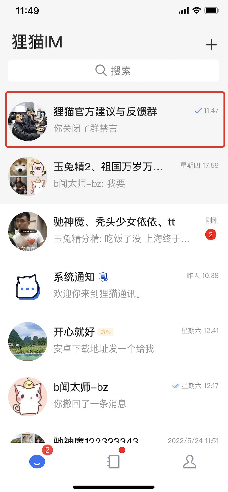
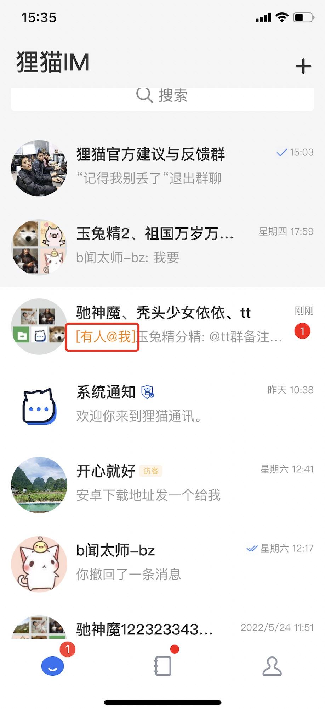
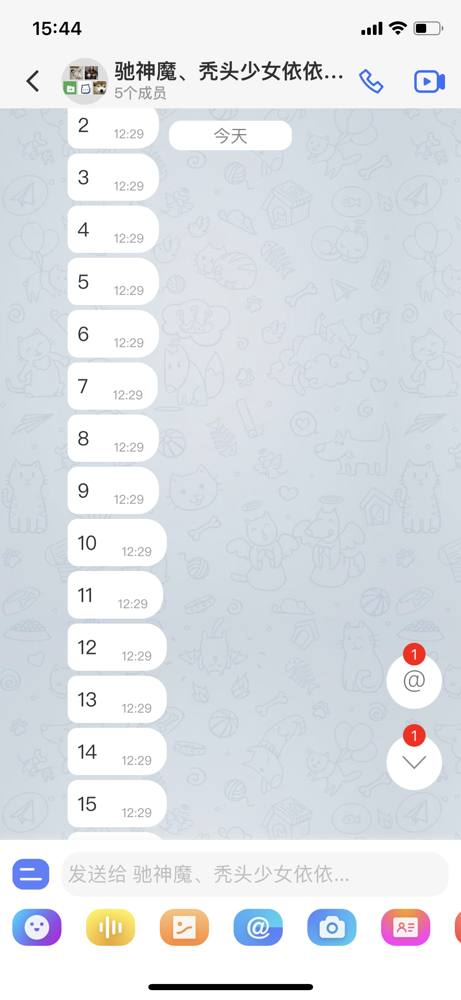
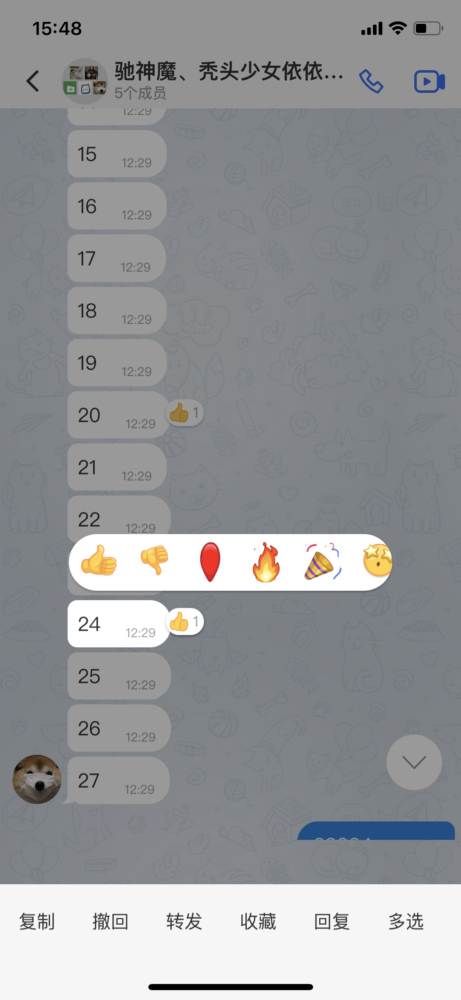

## 什么是频道(channel)

发送消息 个人->个人，个人->群->成员，个人->客服->系统分配  我们统一抽象为个人->频道->订阅者这种模式，频道有ID和类型 类型决定了频道的投递消息的规则

频道是狸猫IM里比较重要的一个概念设计。我们将个人给个人发消息， 个人给群发消息。都统一为个人给频道(channel)发消息,有点像订阅发布者的机制

一个频道下允许有多个订阅者(subscriber) 

群就是典型的订阅/发布的模式

```
群频道

                    | ------> subscriberA

A ---> [channel] -->| ------> subscriberB

                    | ------> subscriberC
```

个人与个人发消息如何抽象成订阅/发布的模式？其实很简单 就是频道ID以A+B的用户唯一ID命名这样A发送消息给B 还是B发送消息给A 都是同一个频道ID，这个特殊的频道下面订阅者就是A和B两个用户

```
个人频道


A ---> [channel(A-B)] ------> subscriberB

B ---> [channel(A-B)] ------> subscriberA

```

这样最终发送消息流程就是  消息->频道->订阅者，频道就是中间介质，这样的好处就是业务不会分叉，比如群有拉黑功能，个人也有拉黑功能，如果没有统一频道的概念，那么拉黑功能需要针对个人拉黑，针对群拉黑做两套判断。现在只需要对频道做个黑名单功能就行了，不能发消息的订阅者直接加入到频道黑名单列表里。


## 什么是最近会话(Conversation)

最近会话是指狸猫IM根据每条消息的发送方、接收方以及会话类型等信息，自动建立并维护的逻辑关系，是一种抽象概念。如下图：





## 什么是消息正文

消息正文是消息真正的内容，比如文本消息 伪代码如下：

```json

{
    "message_id": xxxx,
    "from_uid": "xxxx",
    "channel_id": "xxx",
    "channel_type":x,
    "payload": {
        "type": 1,
        "content": "hello"
    },
    ...
}

```

payload 部分才是真正的消息内容，其他都是协议层面的内容，payload部分我们就称为消息正文

## 什么是CMD消息

cmd消息是服务端给客户端下发的一种指令类的消息，不会显示在聊天界面内，客户端在后台根据不同指令做不同的逻辑运算，比如群头像更新了，服务端可以下发指令给群里的成员，成员客户端收到此指令，则清空原有头像缓存，这类型的消息称为cmd消息

## 什么是系统消息

系统消息显示在群聊里 但是不是用户主动发送的，一般是用户操作了某个功能，业务服务端发出的消息，比如：添加群成员入群，客户端调用服务端的添加群成员api，服务端添加成员成功后，会在此群里发一个“某某加入群聊”的消息，此消息称为系统消息

## 什么是消息提醒项

消息提醒项,如图：




## 什么是消息回应

消息回应同字面意思一样，对消息的一种回应，例如点赞,如图：



## 什么是写扩散和读扩散

**写扩散**

一个群内10人 往群内发一条消息，则会往每个成员队列里写一份消息，则为10份消息，这样目的方便每个人读取自己的消息，这种模式我们称为写扩散

**读扩散**

一个群内10人 往群内发一条消息，则只会存一份，读取消息的时候比写扩散麻烦点，这种模式称为读扩散

狸猫IM的cmd走的写扩散，普通消息走的读扩散

## 什么是端对端加密

端对端加密简单点说就是通讯双方都拥有对消息加解密的私钥，私钥各自都存在本地，当消息加密后发送给服务器，服务器也没办法解密消息，服务器只负责原样投递，中间人更没办法解密消息，只有接收者才能解密消息。
端对端加密意味着消息只有发送者和接收者知道内容，其他任何人，包括IM运营商都没办法解密消息。
狸猫IM采用的著名的signal 端对端算法，telegram，WhatsApp,Facebook等国外知名聊天软件都是采用的此加密算法